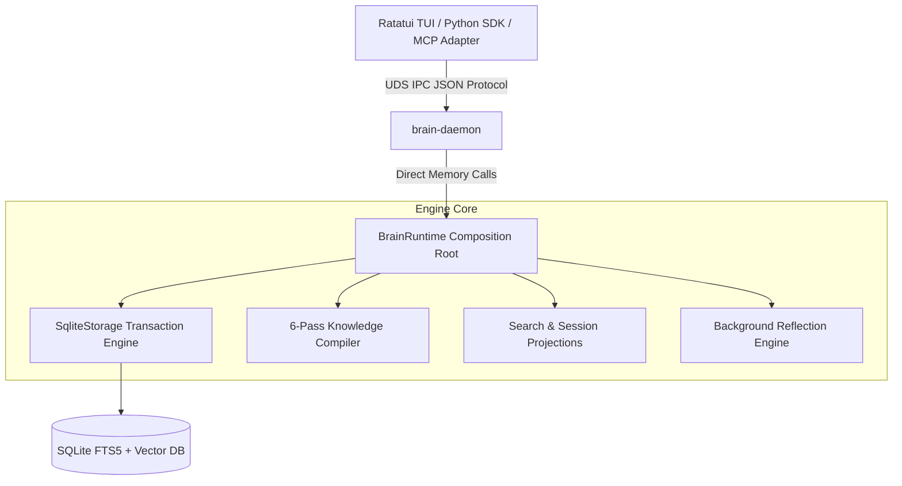

# Brain: Relational Memory Engine

[](https://github.com/ritikpathania/brain/actions/workflows/ci.yml)
[](https://github.com/ritikpathania/brain/releases)
[](LICENSE)
[](https://www.rust-lang.org)
[](docs/README.md)

**Brain** is a high-performance, stateful Relational Memory Engine designed to store, canonicalize, and query structured knowledge for autonomous coding agents and interactive console interfaces.

Operating as a local background daemon (`brain-daemon`), it exposes a Unix Domain Socket (UDS) IPC interface powering a native Terminal User Interface (TUI), Python SDK, and external agent adapters (MCP, ACP, A2A).

---

## 🌟 Key Features

* **Single Composition Root**: `BrainRuntime` encapsulates database transactions, projections, event dispatching, and background reflection passes.
* **Hybrid Retrieval Engine**: Fused SQLite FTS5 lexical matching + vector similarity projections for sub-millisecond query retrieval.
* **6-Pass Knowledge Compiler**: Deterministic reconciliation passes for ontology graph entities, facts, and relationships.
* **Stateless IPC Listener**: Newline-delimited UDS socket protocol with framed streaming and sequence monotonic guarantees.
* **Ratatui Terminal Interface**: Native console UI with typewriter queue streaming, command palette (`Ctrl+P`), and rich theme tokens.
* **Observability & Health**: Embedded HTTP diagnostics server exposing Prometheus `/metrics` and `/health` endpoints.

---

## 🏗️ Architecture Overview



### System Layers
1. **Presentation Layer (`crates/brain-tui/`)**: Ratatui-based interactive terminal console interface.
2. **IPC Daemon (`daemon/`)**: Non-blocking Unix Domain Socket daemon handling connection pools and schema validation.
3. **Core Engine (`crates/brain-services/`)**: Authoritative runtime (`BrainRuntime`) backing SQLite persistence (`crates/brain-storage/`) and event dispatching (`crates/brain-events/`).

---

## ⚡ Quick Start (5 Minutes)

### Prerequisites
- **Rust Toolchain**: `rustc 1.80+` and `cargo`
- **Python**: `3.12+` with [`uv`](https://github.com/astral-sh/uv)

### 1. Build Binaries
```bash
# Clone the repository
git clone https://github.com/ritikpathania/brain.git
cd brain

# Install dependencies and build daemon & CLI binaries
make setup
make build-daemon
make build-brain
```

### 2. Start Daemon & Console
```bash
# Start background daemon process
./target/debug/brain daemon start

# Check runtime health
./target/debug/brain health

# Launch interactive Terminal UI
./target/debug/brain ui
```

---

## 💻 Example Usage

### Running the Rust Example
```bash
PYO3_PYTHON=daemon/.venv/bin/python cargo run --example basic_usage -p brain-services
```

### Programmatic Rust API
```rust
use brain_services::BrainRuntime;

fn main() -> Result<(), Box<dyn std::error::Error>> {
    // Initialize runtime with local SQLite database file
    let runtime = BrainRuntime::new("~/.brain/brain.db")?;

    // Capture point-in-time runtime diagnostics snapshot
    let snapshot = runtime.diagnostics_snapshot();
    println!("Runtime Status: {:?}", snapshot.health);

    Ok(())
}
```

---

## 📊 Benchmark Summary

Evaluated on Apple M-Series & Linux (Ubuntu 24.04):

| Metric | Measured Baseline | Target SLA | Status |
| :--- | :--- | :--- | :--- |
| **Search Projection Query Latency** | `0.14 ms` | `< 5.0 ms` | ⚡ PASS |
| **Observation Ingestion Rate** | `14,200 obs/sec` | `> 5,000 obs/sec` | ⚡ PASS |
| **Typewriter Render Drain Latency** | `0.014 ms` | `< 1.0 ms` | ⚡ PASS |
| **IPC Frame Serialization Roundtrip** | `0.038 ms` | `< 0.5 ms` | ⚡ PASS |

---

## 📚 Documentation Directory

* **[Documentation Index](docs/README.md)**: Main sitemap outlining all specifications and guides.
* **[Installation Guide](docs/guides/installation.md)**: Extended setup and build options.
* **[Architecture Specification](docs/architecture/overview.md)**: Deep dive into runtime lifecycle and components.
* **[IPC Wire Protocol Specification](docs/reference/protocol.md)**: UDS socket frames and JSON RPC protocol.
* **[Release Notes](docs/product/release_notes_v1.md)**: v1.0.0 feature breakdown and release milestones.

---

## 🗺️ Roadmap

- [x] **v1.0.0**: Stable `BrainRuntime` core, SQLite FTS5 hybrid search, UDS IPC daemon, and Ratatui TUI.
- [ ] **v1.1.0**: HNSW vector similarity indexing & multi-session isolation namespaces.
- [ ] **v2.0.0**: Active-active Raft distributed consensus & WASM plugin sandbox.

See **[ROADMAP.md](ROADMAP.md)** for full milestone details.

---

## 🤝 Contributing

We welcome community contributions! Please review **[CONTRIBUTING.md](CONTRIBUTING.md)** and **[CODE_OF_CONDUCT.md](CODE_OF_CONDUCT.md)** before submitting pull requests.

---

## 📜 License

Distributed under the **MIT License**. See **[LICENSE](LICENSE)** for details.
