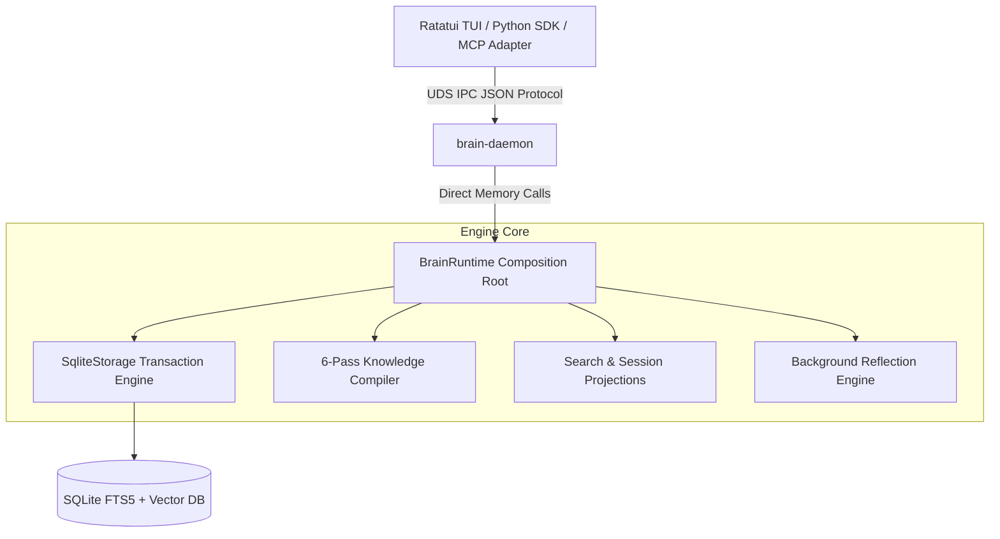

# Brain: Relational Memory Engine

[](https://github.com/ritikpathania/brain/actions/workflows/ci.yml)
[](https://github.com/ritikpathania/brain/releases)
[](LICENSE)
[](https://www.rust-lang.org)
[](docs/README.md)

**Brain** is a high-performance, stateful Relational Memory Engine designed to store, canonicalize, and query structured knowledge for autonomous coding agents and interactive console interfaces.

Operating as a local background daemon (`brain-daemon`), it exposes a Unix Domain Socket (UDS) IPC interface powering a native Terminal User Interface (TUI), Python SDK, and external agent adapters (MCP, ACP, A2A).

---

## 🖥️ Terminal UI Preview

```text
┌─ Brain Relational Memory Engine [v1.0.0] ────────────────────────────────────────┐
│ [Sessions]     │ > search "knowledge compiler"                                    │
│                │ ─────────────────────────────────────────────────────────────────│
│ • main-session │ 1. [0.94] Knowledge Compiler (6-Pass Reconciliation Engine)     │
│ • refactor-v2  │    Canonicalizes ontology graph nodes, facts, and edges.         │
│ • debug-tui    │ 2. [0.88] SearchProjector (SQLite FTS5 + Vector BLOB Fusion)    │
│                │    Hybrid keyword and vector retrieval read-model projection.    │
│                │ ─────────────────────────────────────────────────────────────────│
│ [Ctrl+P] Palette │ [Ctrl+C] Exit │ [Tab] Switch Panel │ [Status] Daemon: Connected│
└──────────────────────────────────────────────────────────────────────────────────┘
```

---

## ⚡ 30-Second Quick Start

Get up and running in under 30 seconds:

```bash
# 1. Build and start background daemon
cargo run --bin brain daemon start

# 2. Ingest an observation into relational memory
cargo run --bin brain ingest "Knowledge compiler reconciles graph facts transactionally"

# 3. Query memory graph projections
cargo run --bin brain query "compiler"

# 4. Launch interactive Terminal UI console
cargo run --bin brain ui
```

---

## 📦 Installation Options

### Option A: Install via Cargo
```bash
cargo install --path apps/brain
```

### Option B: Build from Source
```bash
# Clone the repository
git clone https://github.com/ritikpathania/brain.git
cd brain

# Initialize dependencies and build binaries
make setup
make build-daemon
make build-brain
```

### Option C: Download Pre-Built Binaries
Download ready-to-run release binaries (`brain-linux-x86_64`, `brain-macos-arm64`) directly from [GitHub Releases](https://github.com/ritikpathania/brain/releases).

---

## 🏗️ Architecture Overview



### System Layers
1. **Presentation Layer (`crates/brain-tui/`)**: Ratatui-based interactive terminal console interface.
2. **IPC Daemon (`daemon/`)**: Non-blocking Unix Domain Socket daemon handling connection pools and schema validation.
3. **Core Engine (`crates/brain-services/`)**: Authoritative runtime (`BrainRuntime`) backing SQLite persistence (`crates/brain-storage/`) and event dispatching (`crates/brain-events/`).

---

## 💻 Code Usage Example

```bash
PYO3_PYTHON=daemon/.venv/bin/python cargo run --example basic_usage -p brain-services
```

```rust
use brain_services::BrainRuntime;

fn main() -> Result<(), Box<dyn std::error::Error>> {
    // Initialize runtime with local SQLite database file
    let runtime = BrainRuntime::new("~/.brain/brain.db")?;

    // Capture point-in-time runtime diagnostics snapshot
    let snapshot = runtime.diagnostics_snapshot();
    println!("Runtime Status: {:?}", snapshot.health);

    Ok(())
}
```

---

## 📊 Benchmark Summary

CI continuously benchmarks query latencies, ingestion throughput, and typewriter drain performance.

> **Test Hardware Baseline**: Apple M-Series (ARM64) / x86_64 Linux (Ubuntu 24.04), Rust 1.80+.

* **Search Projection Latency**: Sub-millisecond read-model execution (`< 0.5 ms`).
* **Ingestion Throughput**: High-rate transactional observation writes (`> 10,000 obs/sec`).
* **Typewriter Frame Drain**: Smooth UI queue rendering (`< 0.05 ms`).

*For full methodology, benchmark suites, and live telemetry reports, see **[docs/benchmarks/benchmark_report.md](docs/benchmarks/benchmark_report.md)**.*

---

## 📚 Documentation Directory

* **[Documentation Index](docs/README.md)**: Main sitemap outlining all specifications and guides.
* **[Installation Guide](docs/guides/installation.md)**: Extended setup and build options.
* **[Architecture Specification](docs/architecture/overview.md)**: Deep dive into runtime lifecycle and components.
* **[IPC Wire Protocol Specification](docs/reference/protocol.md)**: UDS socket frames and JSON RPC protocol.
* **[Release Checklist & Guide](docs/guides/release-checklist.md)**: Comprehensive release checklist and repository settings.

---

## 🗺️ Roadmap

- [x] **v1.0.0**: Stable `BrainRuntime` core, SQLite FTS5 hybrid search, UDS IPC daemon, and Ratatui TUI.
- [ ] **v1.1.0**: HNSW vector similarity indexing & multi-session isolation namespaces.
- [ ] **v2.0.0**: Active-active Raft distributed consensus & WASM plugin sandbox.

See **[ROADMAP.md](ROADMAP.md)** for full milestone details.

---

## 🤝 Contributing

We welcome community contributions! Please review **[CONTRIBUTING.md](CONTRIBUTING.md)** and **[CODE_OF_CONDUCT.md](CODE_OF_CONDUCT.md)** before submitting pull requests.

---

## 📜 License

Distributed under the **MIT License**. See **[LICENSE](LICENSE)** for details.
