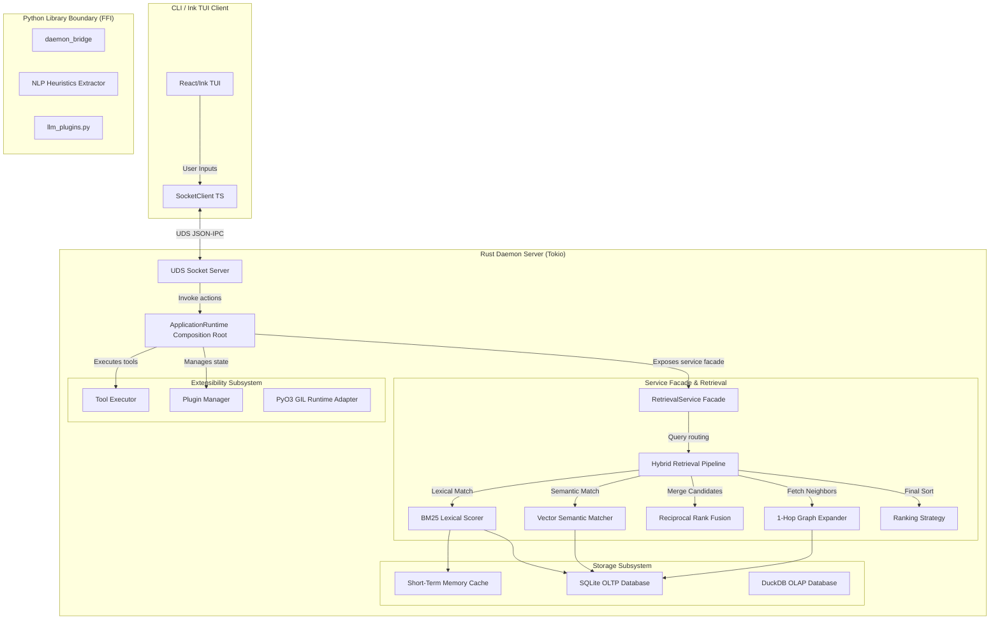
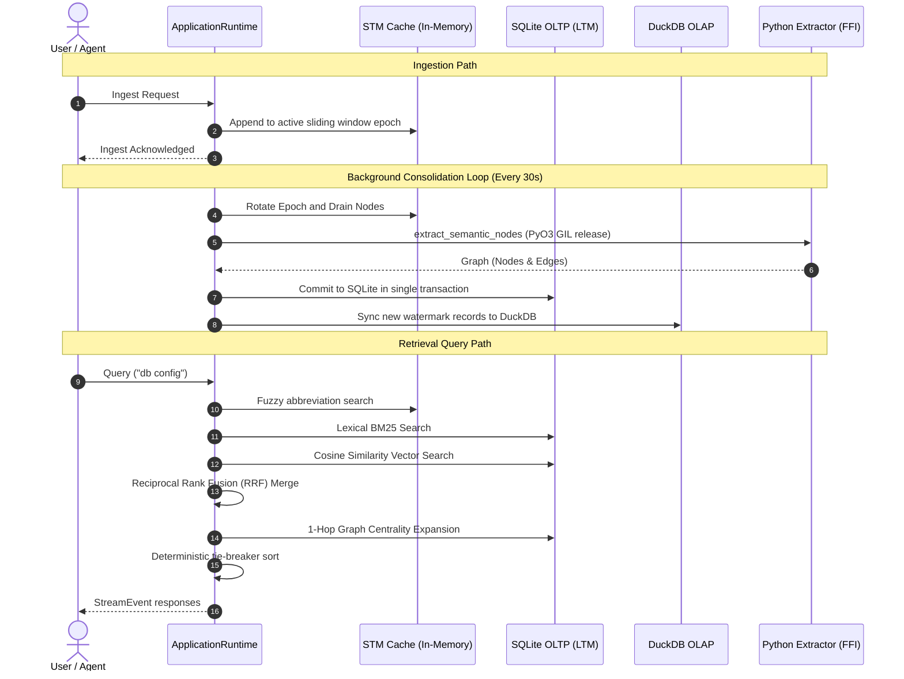

# Brain: Architecture & Developer Guide

Welcome to the canonical technical reference and developer guide for **Brain** (the Standalone Relational Memory Engine). This document unifies the design, architectural paradigms, implementation details, data models, extension guides, and testing procedures for the entire workspace.

---

## Table of Contents

1. [Overview](#1-overview)
2. [High-Level Architecture](#2-high-level-architecture)
3. [Technology Decisions](#3-technology-decisions)
4. [Project Structure](#4-project-structure)
5. [Core Subsystems](#5-core-subsystems)
   - [Configuration Subsystem (`brain-config`)](#configuration-subsystem-brain-config)
   - [Storage Subsystem (`brain-storage`, `brain-session`)](#storage-subsystem-brain-storage-brain-session)
   - [Retrieval Pipeline & Contextual Ranking (`brain-services`)](#retrieval-pipeline--contextual-ranking-brain-services)
   - [Tool Execution Engine (`brain-tools`)](#tool-execution-engine-brain-tools)
   - [Python Runtime Extensibility (`brain-python`)](#python-runtime-extensibility-brain-python)
   - [Plugin Subsystem (`brain-plugins`)](#plugin-subsystem-brain-plugins)
   - [Conversation & Memory Orchestration (`brain-services`)](#conversation--memory-orchestration-brain-services)
   - [Application Runtime Lifecycle (`brain-services`)](#application-runtime-lifecycle-brain-services)
   - [Agent Execution Pipeline (`brain-services`)](#agent-execution-pipeline-brain-services)
   - [Streaming Runtime & Observer Layer (`brain-services`)](#streaming-runtime--observer-layer-brain-services)
6. [Data Model](#6-data-model)
7. [Lifecycle & Request Flows](#7-lifecycle--request-flows)
8. [Background Workers](#8-background-workers)
9. [Performance Engineering](#9-performance-engineering)
10. [Error Handling & Resiliency](#10-error-handling--resiliency)
11. [Development Guide](#11-development-guide)
12. [TUI Client Architecture & Unidirectional Flow](#12-tui-client-architecture--unidirectional-flow)
13. [Architectural Stability Guidelines](#13-architectural-stability-guidelines)
14. [Adaptive Memory Policy Engine](#14-adaptive-memory-policy-engine)
15. [Workflow Graphs & DAG Execution](#15-workflow-graphs--dag-execution)
16. [Native Ratatui TUI Client](#16-native-ratatui-tui-client)
17. [Appendix](#17-appendix)

---

## 1. Overview

**Brain** is a standalone, local-first relational memory engine designed to serve as a low-overhead memory companion for developer tools, IDE integrations, and autonomous agents. 

Traditional memory architectures for LLMs rely on naive flat vector search, which lacks relationship awareness, or heavy graph databases, which add operational complexity and network latency. **Brain** solves this by providing a hybrid relational memory engine in a single self-contained binary.

### Goals
* **Sub-Millisecond Retrieval Latency**: Cache hot paths using in-memory structures and optimize persistent queries to run under 10ms.
* **Zero-Dependency Vector Storage**: Implement high-performance float vector comparisons inside a local SQLite database using native floating-point math, removing dependencies on heavy external vector databases.
* **Low-Overhead FFI Boundary**: Embed the Python interpreter directly into a Rust daemon using PyO3 to run NLP heuristics, agent pipelines, and embedding models in-process.
* **Separation of OLTP and OLAP**: Keep transactional writes (SQLite) isolated from columnar diagnostics and query statistics (DuckDB) to prevent analytical query lockouts.
* **Developer-Friendly Extensibility**: Support dynamic plugin loading using simple Python scripts dropped into a user-specific configuration directory (`~/.brain/plugins`).

### Non-Goals
* Replacing enterprise-grade graph databases (e.g., Neo4j) for massive multi-million node graphs.
* Running deep learning model training processes inside the daemon (training is offloaded to external LLM/embedding providers).
* Serving as a public multi-tenant cloud service (the engine is structured as a local, single-user process).

---

## 2. High-Level Architecture

The system is structured as a client-server architecture running entirely on the developer's local machine. The user interacts via a command-line interface or React/Ink TUI CLI, which communicates over a Unix Domain Socket (UDS) with the background Rust daemon.

### System Components



---

## 3. Technology Decisions

### Why Rust?
Rust was chosen for the core daemon to ensure sub-millisecond core scheduling, data race prevention, and safe concurrent access to databases and in-memory caches. It compiles to a single native binary, eliminating runtime interpreter overhead.

### Why SQLite?
SQLite is the industry standard for lightweight, zero-configuration relational storage.
* **Zero Operational Cost**: No background server to maintain; it runs in-process.
* **Transactional Reliability**: Full ACID transactions ensure graph edges and nodes never enter a desynchronized state.
* **Vector Match Performance**: Raw vector embeddings are stored as BLOBs, and cosine similarity calculations are run directly in Rust during database queries, achieving microsecond execution times.

### Why DuckDB?
DuckDB provides high-performance analytical capabilities on local columnar data.
* **Protects SQLite Performance**: SQLite is optimized for point writes and simple index lookups. Columnar scans for graph algorithms (like PageRank or degree centralities) would lock SQLite. DuckDB runs these analytics out-of-band.
* **Fast Incremental Sync**: The engine uses timestamp-based watermark queries to sync SQLite delta changes to DuckDB in milliseconds.

### Why Python Plugins?
Python is the center of the LLM, NLP, and machine learning ecosystem. Using Python for plugin development allows users to easily integrate models like `sentence-transformers`, LLMs like Anthropic/OpenAI, and local model servers like Ollama without recompiling the Rust binary.

### Why PyO3 & Maturin?
PyO3 provides direct, in-process CPython FFI bindings. Instead of running Python scripts as separate processes (which introduces high startup costs and IPC serialization delays), PyO3 loads Python modules directly into the daemon process. Maturin manages compiling the Rust-side FUI bindings back into Python.

---

## 4. Project Structure

The codebase is organized in a monorepo structure, cleanly isolating the client, daemon, storage, and Python layers.

```
brain/
├── cli/                        # React/Ink TypeScript TUI Client
│   ├── src/
│   │   ├── components/         # TUI UI components (PromptInput)
│   │   │   └── design-system/  # Token-based TUI design system (ThemeProvider, themes, hooks)
│   │   ├── screens/            # REPL split-screen layout
│   │   ├── services/           # SocketClient (UDS JSON-IPC wrapper)
│   │   └── main.tsx            # CLI entry point
├── apps/
│   └── brain-v2/               # Binary application composition entrypoint
│       └── src/main.rs         # ApplicationRuntime startup/shutdown bootstrapper
├── crates/                     # Modular workspace library crates
│   ├── brain-config/           # Layered settings loader, validation, and schema migrations
│   ├── brain-core/             # Shared extensibility, repository interfaces, and error structures
│   ├── brain-domain/           # Strongly-typed IDs, non-exhaustive entities, and DTOs
│   ├── brain-events/           # Command & event envelope schemas and bus traits
│   ├── brain-observability/     # Metrics exporters (Prometheus) and tracing subscriber logs
│   ├── brain-plugins/          # Dynamic plugin scanners, registries, and RCU managers
│   ├── brain-python/           # PyO3 embedded interpreter runtime, loaders, and agent adapters
│   ├── brain-services/         # ApplicationRuntime composition root, facades, and retrieval
│   ├── brain-session/          # Ephemeral SessionContext sliding windows and cache managers
│   ├── brain-storage/          # SQLite connection pooling, migrations, and CRUD operations
│   ├── brain-tools/            # Tool registry, executor engine, and cancellation/timeout wrappers
│   └── brain-tui/              # Terminal layout primitives and UI managers
└── docs/                       # Specifications and Architecture Decision Records
```

---

## 5. Core Subsystems

### Configuration Subsystem (`brain-config`)
The configuration system manages layered schema loading, precedence resolution, validation, and schema migrations.
* **Schema Layering**: Combines hardcoded defaults (`DefaultsSource`), TOML files (`TomlSource`), environment variables (`EnvironmentSource`), and programmatic overrides (`OverrideSource`) using a custom `Merge` trait to resolve the final `BrainSettings`.
* **Validation**: Separates structural validation (checking that required fields exist) from semantic validation (asserting values satisfy constraints like `pool_size > 0` and `volatile_ttl_secs >= 1`).
* **Migrations**: Defines a `ConfigMigration` trait leveraging `toml::Value` instead of JSON values to retain structure formatting and handle forward compatibility (unknown fields are preserved).

### Storage Subsystem (`brain-storage`, `brain-session`)
Handles ephemeral short-term memory (STM) caching and persistent long-term memory (LTM) storage.
* **Ephemeral STM**: Managed by `SessionCacheManager`. Maps active `SessionId`s to `SessionContext`s containing sliding windows. The window rotates dynamically based on chronological epochs, evicting old nodes once the `max_sliding_window_size` is reached.
* **Persistent LTM**: `SqliteStorage` implements the `RepositorySet` trait, mapping CRUD queries to SQLite tables. Employs connection pooling (`r2d2`) and manages automatic database migrations during startup.

### Retrieval Pipeline & Contextual Ranking (`brain-services`)
Coordinates query retrieval across memory sources and combines candidates using unified scoring algorithms.
* **Deduplication-Aware Retrieval**: Executed by `RetrievalPipeline`. Queries memory sources sequentially. If the unique node count collected in the `PipelineAccumulator` satisfies the requested limit, subsequent memory sources are skipped (early exit).
* **Contextual Ranking Algorithms**:
  * **BM25 Lexical Scoring**: Computes term frequency-inverse document frequency (TF-IDF) over tokenized text. IDF scores are precomputed for query tokens to prevent performance bottlenecks.
  * **Vector Similarity (Cosine)**: Computes dot-product cosine similarity over Float BLOBs. Flat-scans small datasets ($N < 50$), and uses an IVF index ANN probe ($K=2$ partitions, $B=8$ centroids) for larger datasets.
  * **Graph Centrality**: Performs 1-hop neighbor expansions, boosting neighbor relevance by relations' weights and applying a $0.5$ dampening factor.
  * **Reciprocal Rank Fusion (RRF)**: Merges scores from multiple search strategies, resolving ties deterministically using `score DESC` $\rightarrow$ `NodeId ASC`.

### Tool Execution Engine (`brain-tools`)
Provides execution orchestration for agent-callable tools.
* **Separation of Concerns**: `ToolRegistry` handles registration and alphabetical lookups, `ToolRunner` executes commands policy-free, and `ToolExecutor` coordinates execution policies (permissions, timeouts, cancellation).
* **Policy Management**:
  * **PermissionManager**: Stores granted permissions using a bitmap and validates tool scopes before running.
  * **Cooperative Cancellation**: Instantiates `CancellationTokenImpl` (Tokio-backed) to propagate cancellation triggers down the call stack.
  * **Timeout Invariant**: Executes tools inside a `tokio::time::timeout` wrapper to force termination if the tool execution exceeds the configured limit.

### Python Runtime Extensibility (`brain-python`)
Integrates the dynamic Python execution environment.
* **CPython Embed**: Direct in-process CPython interpreter initialization using PyO3 bindings.
* **GIL Release Discipline**: Calls to host routines (`retrieve`, `execute_tool`) release the Global Interpreter Lock (GIL) via `py.allow_threads(...)`. This permits concurrent execution of CPU-bound operations in Rust.
* **Versioned API Boundary**: Exposes a stable, read-only boundary namespace (`brain_ai.api.v1`) containing wrapper classes (`PyMemoryNode`, `PyConversation`, `PyExecutionResult`) that prevent Python plugins from mutating internal Rust states.
* **Agent Adapters**: Maps dynamically loaded Python classes to Rust traits (`ChatAgent`, `PlannerAgent`, `EmbeddingAgent`, `ExtractionAgent`) using cached PyObject method callables to minimize lookup latencies.

### Plugin Subsystem (`brain-plugins`)
Manages loading, validation, and dynamic updates of plugins.
* **Composed Traits**: Deconstructs capabilities into smaller interfaces: `PluginLifecycle`, `PluginCapabilities`, `PluginMetadata`, and `PluginEventHandler`.
* **Path Isolation**: The loader imports scripts using Python's `importlib.util.spec_from_file_location` and registers them under their exact `PluginId`, preventing module name collisions.
* **RCU Hot Reloading**: Dynamic updates are performed using a Read-Copy-Update (RCU) transaction. A new plugin instance is loaded, initialized, and validated *before* swapping the registry pointer under a write lock. If validation fails, the transaction is rolled back, leaving the old active instance running.

### Conversation & Memory Orchestration (`brain-services`)
Manages the lifecycle of session context, memory promotion, conversation summarization, and transaction checkpoints.
* **Separation of Concerns**: Deconstructs operations into `ConversationLifecycle` (ingesting and promoting history, managing database connections) and `ContextBuilder` (selecting history segments, budgeting system and context tokens, and assembling the final prompt context window).
* **Deterministic Context Windows**: The `ContextBuilder` constructs prompt contexts deterministically given the same budget, history, summaries, and memories. System messages are explicitly preserved during budget exhaustion.
* **Context Budgeting**: Context assembly uses `ContextBudget` (specifying maximum token limit, reserved system tokens, and reserved completion tokens) to safely allocate limits without starvation.
* **Pluggable Promotion & Summarization**: Defines extension-point traits `PromotionPolicy` and `SummaryPolicy` with default implementations (`CountThresholdPromotionPolicy` and `CountThresholdSummaryPolicy`) to dynamically trigger background promotions (promoting volatile STM nodes to LTM) and summarizations (generating versioned summaries of past messages).
* **Immutable Database Checkpoints**: The `CheckpointStore` manages atomic saving and restoring of conversation snapshot checkpoints using a SQLite backing store. Snapshots are guaranteed to be immutable and decoupled from active session evolution.
* **Pruning and Pinned Memory Preservation**: Decayed memory edges are cleaned up based on weight thresholds. To prevent loss of critical instructions, pruning logic automatically preserves low-weight edges whose source or target nodes carry `"pinned":true` metadata.

### Application Runtime Lifecycle (`brain-services`)
Acts as the composite root of the entire application.
* **Subsystem Composition**: Enforces that all subsystems (config, storage, sessions, pipelines, executors, plugin managers) are owned exclusively by `ApplicationRuntime` and constructed through `RuntimeBuilder`.
* **Lifecycle State Machine**:
  ```
  [Created] ──(start)──> [Starting] ──(phases success)──> [Running]
      ▲                      │                                │
      │               (phase failure)                    (shutdown)
      └──────────────────────┴────────────────────────────────v
                                                         [Stopping] ──> [Stopped]
  ```
* **Rollback-Aware Startup**: Coordinates composable `StartupPhase` stages (Config, Storage, Python, Tools, Plugins, Services). If any phase fails, all completed phases are rolled back in reverse order, returning the system to `Created`.
* **Observer Hooking**: `RuntimeObserver` notifies registered observers of state transitions. Observer failures are treated as best-effort, logged via `tracing::warn!`, and never block the runtime lifecycle.

### Agent Execution Pipeline (`brain-services`)
Orchestrates individual user requests through a decoupled, stage-based execution loop.
* **Separation of Concerns**: `AgentExecutionEngine` serves as the public facade, returning an `ExecutionHandle` containing event stream receivers and cancellation triggers. The actual work runs inside a spawned Tokio task executing `ExecutionRunner` stages sequentially.
* **Stage-Based Pipeline Loop**: Executes granular, modular stages conforming to the `ExecutionStage` trait:
  1. `Planning`: Resolves conversation context and calls the `PlannerAgent` to outline tool steps.
  2. `Retrieval`: Searches memory sources via the retrieval facade and populates context matches.
  3. `ToolExecution`: Runs planned tools iteratively via the tool executor up to configured limits.
  4. `Reasoning`: Invokes the reasoning `ChatAgent` and streams word tokens back to the caller.
  5. `Commit`: Transactionally commits final messages and graph updates using the `MemoryCommitService`.
* **State vs. Context Separation**: Keeps execution parameters immutable inside `ExecutionContext` while modifying intermediate results (memories, token streams, planner output) progressively inside a mutable `ExecutionState`.
* **Event Sink**: Stages emit lifecycle updates strictly via `ExecutionEventSink` which timestamps events, assigns monotonic sequence numbers, and aggregates metrics (`ExecutionMetrics`) automatically.

### Streaming Runtime & Observer Layer (`brain-services`)
Coordinates real-time, low-overhead event broadcasting to subscribers with built-in backpressure safety.
* **Pluggable Event Mapper**: The `StreamEventMapper` trait translates internal engine events (`AgentExecutionEvent`) into strongly-typed `StreamEvent`s, isolating the external protocol from internal state representation.
* **Subscriber Registry with Replay Cursor**: The `SubscriberHub` maintains a dynamic event history log. When any new client (TUI, CLI, API) subscribes, it is automatically catch-up replayed all past events from the start of execution before receiving dynamic broadcasts, eliminating startup race conditions.
* **Bounded Queues & Backpressure Safety**: Supports configurable `OverflowPolicy` settings (`SelectiveDrop`, `DropOldest`, `DropNewest`). `SelectiveDrop` discards non-critical progress updates when capacity limits are hit while dynamically preserving critical token/terminal events by allowing temporary soft-limit expansion.
* **Real-time Timeline Construction**: Timed stage transitions are collected concurrently via `TimelineBuilder` to present real-time progress timelines without impacting the execution execution thread.

---

## 6. Data Model

All domain data models are defined under `brain-domain` using the `#[non_exhaustive]` macro to allow future, non-breaking schema enhancements.

### Strongly-Typed Identifiers
To prevent ID confusion across entities, the system defines unique type wrappers around `ulid::Ulid` and `uuid::Uuid`:
* `SessionId`, `NodeId`, `EdgeId`, `PluginId`, `ConversationId`, `MessageId`, `ExecutionId`

### Core Schema Structures
* **Node**: Graph memory unit. Contains a strongly-typed `NodeType` (Concept, Action, Event, State) and a JSON properties string mapping schema-less attributes.
* **Edge**: Weighted connection between two `NodeId`s.
* **Embedding**: Vector structure carrying `Vec<f32>` values and dimensions metadata.
* **Conversation**: Sequence of message entities.
* **Message**: Individual message model carrying a `MessageRole` (System, User, Assistant, Tool).

### Serialization Boundaries (DTOs)
The engine separates raw database tables from public API/UI layers using DTOs:
* `NodeDTO`, `EdgeDTO`, `EmbeddingDTO`, `MemoryDTO`

---

## 7. Lifecycle & Request Flows

### Ingestion & Query Data Flow



### IPC Streaming Protocol
Communication over UDS uses newline-delimited JSON frames matching the versioned `StreamEvent` envelope:
* **`stream_start`**: Contains the query's `streamId` and start metadata.
* **`stream_progress`**: Contains intermediate progress floats (0.0 to 1.0) and descriptive strings.
* **`stream_chunk`**: Contains serialized `MemoryDTO` or text fragments.
* **`stream_end`**: Confirms query processing finished successfully.
* **`stream_cancelled`**: Notifies the client of cancellation.

---

## 8. Background Workers

Background execution loops run as asynchronous Tokio tasks.

### 1. Consolidation Loop
* Executes every 30 seconds.
* Rotates the STM epoch from Epoch $N$ to Epoch $N+1$, draining Epoch $N$'s nodes.
* Passes the nodes to the Python Heuristics Extractor, maps the resulting semantic graph, and commits it transactionally to SQLite.

### 2. Time-Aware Graph Decay Loop
Relationships decay dynamically over time. During consolidation, edge weights are decayed:
\[W_{\text{new}} = W_{\text{old}} \times e^{-\lambda \Delta t}\]
Where:
* $\Delta t$ is the time elapsed since the last write update.
* $\lambda$ is the decay constant calculated from the half-life configuration:
  \[\lambda = \frac{\ln(2)}{T_{1/2}}\]
  *(Default half-life $T_{1/2} = 7$ days / 604,800 seconds).*
* **Pruning**: Edges whose weights decay below `0.1` are pruned from the database.
* **Reinforcement**: Writing an edge that already exists boosts its weight by $+0.5$ (capped at `2.0`).

### 3. Asynchronous Embedding Generator
Ingested nodes are pushed to an MPSC queue. The worker drains the queue, formats the node into a descriptor string (`label (type) properties`), calls the embedding provider (Ollama, OpenAI, local transformers), and commits the vector coordinates to SQLite.

### 4. DuckDB Analytics Sync
Runs incrementally using watermarks. Queries SQLite for records updated since the last sync watermark:
```sql
SELECT * FROM nodes WHERE updated_at > ?;
```
It synchronizes the changes into DuckDB and updates the watermark timestamp.

---

## 9. Performance Engineering

To keep latency boundaries within sub-millisecond ranges:

### CPU Task Thread-Offloading
Any blocking task (PyO3 interpreter executions, SQLite database writes, DuckDB synchronizations) is redirected to Tokio's dedicated OS blocking thread pool via `tokio::task::spawn_blocking`. This prevents blocking the async socket thread pool.

### Cosine Similarity SIMD layout
Vector similarity uses native Rust iteration compiled with target-cpu optimizations. Using chunks-exact loop structures allows the Rust compiler to auto-vectorize calculations (AVX2, NEON), reducing 384-dimensional cosine scans to microsecond ranges.

### RCU Sub-Microsecond Hot Reloads
RCU pointer swapping inside the registry allows hot reloads to execute in `~113 ns`. The manager clones the active handle under a minimal write lock, meaning concurrent read threads never experience execution lockouts during updates.

---

## 10. Error Handling & Resiliency

### ephemeral STM Cache Fallback
If the cache search returns zero results, the query pipeline automatically falls back to traversing the persistent LTM database. If the database file is corrupted or locked, it logs a warning and falls back to a clean in-memory SQLite schema to prevent daemon crashes.

### Startup Rollback Safety
During startup, if any phase fails:
- The completed phases are rolled back in reverse order.
- The runtime state is reset to `Created`.
- Invariant: `rollback()` is called **only** on phases that have completed `execute()`, removing the need for rollback logic to handle partially initialized states.

### Retained Context Misuse Detection
Python plugins receive a `PyRuntimeContext` object during lifecycle hooks. To prevent plugins from keeping a reference to the context and calling host APIs after the hook terminates:
- The context holds a thread-safe `is_valid: Arc<AtomicBool>` flag.
- The loader invalidates the flag (stores `false`) immediately upon hook exit.
- Any subsequent method calls on the invalid context raise a Python `RuntimeError("RuntimeContext has expired")`, protecting host memory safety.

---

## 11. Development Guide

### Writing a Custom Python Plugin
Plugins are dropped into `~/.brain/plugins/` and must export a `register_plugins()` function:

```python
# ~/.brain/plugins/my_custom_plugin.py
import json

class CustomLlmProvider:
    def name(self) -> str:
        return "custom-llm"

    def generate(self, prompt: str) -> str:
        return f"Custom response: {prompt}"

class CustomEmbedder:
    def name(self) -> str:
        return "custom-embedder"

    def embed(self, text: str) -> list[float]:
        return [0.15, -0.42, 0.88]

def register_plugins():
    return {
        "llm_providers": [CustomLlmProvider()],
        "embedding_providers": [CustomEmbedder()]
    }
```

Enable your plugin in `~/.brain/config.json`:
```json
{
  "active_embedding_provider": "custom-embedder"
}
```

### Implementing a Custom Rust Tool
To add a new tool to the system:
1. Implement the `Tool` trait from `brain-core::extensibility`:
   ```rust
   pub struct HelloTool;
   impl Tool for HelloTool {
       fn metadata(&self) -> ToolMetadata {
           ToolMetadata {
               name: "hello".to_string(),
               description: "Prints hello message".to_string(),
               required_permissions: vec![],
               timeout: std::time::Duration::from_secs(5),
           }
       }
       fn execute(&self, _ctx: &ExecutionContext, _args: &HashMap<String, serde_json::Value>) -> Result<ExecutionResult, BrainError> {
           Ok(ExecutionResult::new(serde_json::json!({ "message": "hello" })))
       }
   }
   ```
2. Register the tool with the `ToolRegistry` during the startup phase.

### CLI TUI Theme Tokens
When writing TUI screens, avoid hardcoded ANSI color values. Use token-based themed components:
```typescript
import { ThemedText, useTheme } from './components/design-system';

const MyComponent = () => {
  const { theme } = useTheme();
  return (
    <ThemedText color="claude">
      Theme-aware Text Output
    </ThemedText>
  );
};
```

---

## 12. TUI Client Architecture & Unidirectional Flow

The React/Ink TUI Client (`cli/`) utilizes a strict unidirectional data flow design to decouple presentation components from the UDS streaming network layer.

```
       StreamingRuntime (SocketClient UDS Stream)
                       │
                       ▼
                EventController (Monotonic Sequence Validation)
                       │
                       ▼
                    UIAction (Append-Only Actions)
                       │
                       ▼
                 UIReducer (Pure State Reduction)
                       │
                       ▼
                ViewModelStore (Versioned State Store)
                       │
                       ▼
                Selectors (Pure Projections)
                       │
                       ▼
                MainLayout (Composition & LayoutState)
       ┌───────────────┼───────────────┬────────────────┐
       │               │               │                │
    ChatView     TimelineView    ToolActivity    SessionBrowser (Pure Presentational Widgets)
```

### Unidirectional Data Flow

1. **EventController**: Connected to the live UDS `SocketClient`. It validates event monotonicity (respecting `ADR-007`), tracks active/terminated stream lifecycles, maps raw network events to `UIAction` types, and dispatches them to the store.
2. **UIAction**: An append-only sum type representing all TUI actions.
3. **UIReducer**: A pure, testable state-reduction function of type `(state: UIViewModel, action: UIAction) -> UIViewModel`.
4. **ViewModelStore**: A single-writer state store containing a versioned snapshot (`ViewModelSnapshot { revision: number, state: UIViewModel }`). Every dispatch updates state and increments `revision`. Observer notification supports batching to keep UI frames smooth under high-frequency token streams.
5. **Selectors**: Pure projections querying slices of domain state without memoization or mutations.
6. **MainLayout**: Coordinates panel sizing, highlights focused pane border outlines, handles SIGWINCH resize triggers, and maintains local focus and Chrome states (`LayoutState`) separately from domain data.
7. **Presentational Widgets**: Pure rendering functions of `ViewModelSnapshot`. They do not write to or mutate the store directly.

## 13. Architectural Stability Guidelines

To maintain code quality and prevent infrastructure drift, modifications to different parts of the workspace are governed by their stability levels. For detailed extension contracts, reference the [Architectural Stability Guide](file:///Users/ritikpathania/Developer/PyCharm/brain/docs/architecture/STABILITY.md).

* **Frozen Layers (ADR Required)**: Domain models, core storage databases, retrieval pipelines, plugins runtimes, and core TUI unidirectional flow files are frozen. Changes to these layers are subject to performance audits and require an ADR.
* **Extensible Layers (Trait Implementation)**: Custom memory policies, ranking strategies, execution stages, workflow nodes, TUI widgets, and layout themes are fully extensible by implementing their respective interfaces.
* **Experimental Layers (Active Iteration)**: Adaptive memory promotion heuristics, pipeline reflection/verification stages, and async workflow graph schedulers are active research areas.

---

## 14. Adaptive Memory Policy Engine

### Objective & Architectural Decoupling

We have evolved the conversation ingestion pipeline from a simple count threshold into an extensible, capability-driven policy engine. Instead of accessing storage repositories or session cache databases directly, the policy engine is a pure, side-effect-free evaluator that takes an immutable `PromotionContext` and returns a detailed `PromotionDecision`.

```
ConversationManager (Ingestion Flow)
        │
        ├── 1. Load Session & Goals
        ├── 2. Build PromotionContext (Pure Capability Object)
        │
        ▼
  PromotionEngine (Pure Evaluator)
        │
        ├── 3. Evaluate Policy Tree (Logical & Weighted Composition)
        │
        ▼
PromotionDecision (Promote Trigger, Normalized Confidence, Reason Codes)
        │
        ▼
ConversationManager (Orchestrator Execution Stage)
        │
        └── 4. If promote: execute promote_memories()
```

### Core Abstractions

1. **`StmView`**: Read-only abstraction over the volatile memory queue. Prevents exposing internal mutability or sliding window layout details to the policies.
2. **`PromotionContext`**: Holds dynamic signals for policy execution: the current `SessionId`, a reference to the `StmView`, current `SessionMetadata` (active goals), and a monotonic `now` Instant.
3. **`PromotionReason`**: Strongly typed reasons enum for detailed audit trails:
   - `RecencyThreshold`
   - `TimeThreshold`
   - `HighImportance`
   - `GoalMatch`
   - `UserPinned`
   - `CompositeSatisfied`
   - `WeightedThresholdExceeded`
4. **`PromotionDecision`**: Pure representation of a policy result, containing a boolean `promote` flag, advisory `confidence` float, and `reasons: Vec<PromotionReason>`.

### Concrete Policies

- **`RecencyPolicy`**: Evaluates either node cache counts or time-based age thresholds of the oldest node.
- **`SemanticImportancePolicy`**: Queries an injected `ImportanceScorer` to evaluate whether individual or average importance metrics exceed a defined threshold.
- **`GoalAwarePolicy`**: Utilizes an injected `GoalMatcher` to match session context short-term memories against active task goals.
- **`UserPinnedPolicy`**: Triggers memory promotion if user-defined weights or explicit pin properties match criteria.

### Logical & Weighted Composition

- **`CompositePolicy`**: Combines sub-policies using standard logical operators: `And`, `Or`, `Not`. Evaluation is fully short-circuited (e.g. `And` stops on first false; `Or` stops on first true) and aggregates reasons deterministically following evaluation order.
- **`WeightedCompositePolicy`**: Aggregates boolean decisions from sub-policies, summing weight multipliers to determine if they meet a threshold. Normalizes overall confidence relative to total available weights.

### Performance & Zero-Overhead Dispatches

The orchestrator utilizes dynamic trait type erasure `Arc<dyn PromotionEngine>` only at the composition root. Internally, the generic wrapper `PromotionEngineImpl<P>` binds directly to a concrete policy type `P`, avoiding unnecessary extra dynamic dispatch boundaries.

Criterion microbenchmarks verify linear execution scaling with zero overhead:
* **16 nodes**: ~1.26 µs
* **64 nodes**: ~4.73 µs
* **256 nodes**: ~19.62 µs
* **1024 nodes**: ~76.81 µs

---

## 15. Workflow Graphs & DAG Execution

The **Agent Execution Pipeline** executes as a Directed Acyclic Graph (DAG) of stage nodes. Routing, loop-backs, and runtime policies are evaluated dynamically by the `ExecutionRunner` traversing the graph topology.

```
[User Prompt]
      │
      ▼
PlanningStage
      │
      ▼
RetrievalStage
      │
      ▼
ToolExecutionStage
      │
      ▼
ReasoningStage ◄───┐
      │            │
[Response]         │ (Retry loop-back target driven by RetryPolicy)
      │            │
ReflectionStage ───┘ (Outcome::Retry)
      │
(Outcome::Continue)
      │
      ▼
VerificationStage
      │
(Outcome::Continue)
      │
      ▼
CommitStage (Terminal Node)
```

### Core Abstractions

1. **`WorkflowGraph`**: Declarative, immutable container mapping `StageIdentifier` keys to `WorkflowNode` configurations, along with an entry `start_node`.
2. **`WorkflowNode`**: Represents a single vertex in the graph. It owns:
   - `stage`: The logic payload (`Box<dyn ExecutionStage>`).
   - `next_stage`: An option pointing to the next sequential node (`Option<StageIdentifier>`).
   - `policies`: A list of execution check policies (`Vec<Box<dyn NodeExecutionPolicy>>`).
3. **`WorkflowExecutionState`**: Holds the mutable runtime parameters of the active execution session, tracking the `current_stage` pointer and stage-local `attempts` counts.

### Stateless Execution Policies
To scale execution behavior without structural modifications, check policies conform to the stateless, thread-safe `NodeExecutionPolicy` trait:
```rust
pub trait NodeExecutionPolicy: Send + Sync {
    fn name(&self) -> &'static str;
    fn evaluate(&self, ctx: &PolicyContext<'_>) -> Result<PolicyDecision, BrainError>;
}
```
All mutable parameters (attempts, outcomes, and execution contexts) are fed dynamically via `PolicyContext`. Policies are evaluated in insertion order and short-circuit on the first `PolicyDecision::Fail`.

### Direct Stage Outcome Transitions
Routing is driven directly by stage outcomes, avoiding the need for parallel transition mapping tables:
- **`StageOutcome::Continue`**: Clears the current node's retry counter and transitions to `node.next_stage`. If `None`, execution structurally terminates.
- **`StageOutcome::Retry { target, feedback }`**: Increments the current stage's retry attempt count, prepends correction feedback, and jumps back to `target`.
- **`StageOutcome::Finish`**: Halts execution early behaviorally, terminating successfully regardless of remaining graph topology.
- **`StageOutcome::Cancelled`**: Cooperative cancellation aborts execution.

### Structural Graph Validation
Graph configurations are validated at build-time by the private `WorkflowGraphValidator` collaborator to enforce these guarantees:
- **Entry Integrity**: Exactly one entry `start_node` is declared and present.
- **Referential Integrity**: All `next_stage` and retry target linkages resolve to existing nodes.
- **Connectivity**: Every node is reachable from the start node, and at least one terminal path exists.
- **Acyclicity**: No cycles are allowed in the sequential `next_stage` path. Backwards loops are only permitted via explicit self-correction retry signals.
- **Policy Completeness**: Nodes carrying retry capabilities (e.g. `ReflectionStage`) must contain a `RetryPolicy` to prevent infinite loops, and duplicate policy types are rejected.

---

## 16. Native Ratatui TUI Client

The **Ratatui TUI Client** is a native Rust terminal user interface client replacing the legacy Node/React/Ink client stack. It is composed of a pure library presentation crate (`brain-tui`) and integrated directly into the `brain` executable composition root (`apps/brain-v2`).

```
                    brain-v2 (Binary Composition)
                          │
             ┌────────────┴────────────┐
             ▼                         ▼
         UdsClient              EmbeddedClient
             │                         │
      (Unix Socket UDS)        (Direct In-Process)
             │                         │
             └────────────┬────────────┘
                          ▼
                   ExecutionClient (Trait Abstraction)
                          │
                          ▼
                      brain-tui (stateless UI renderer)
```

### Decoupled Presentation Boundaries
The client is structured to remain entirely transport-agnostic. It interacts with the backend execution engine exclusively via the `ExecutionClient` trait, enabling hot-swapping between the background UDS daemon connection (`UdsClient`) and direct in-process runtime execution (`EmbeddedClient`).

### Terminal Lifecycle & RAII Guard
To prevent terminal corruption on errors or cancellations, Crossterm raw mode and alternate screen setup are isolated behind the focused RAII `TerminalGuard` structure. Global terminal settings are automatically restored when the guard is dropped, ensuring terminal state integrity.

### Dual-Queue Multiplexing Event Loop
The interactive loop runs asynchronously on a Tokio task, multiplexing operating system events (`TerminalEvent`: keystrokes, resizes) and application events (`AppEvent`: streamed server packets) onto a unified `Event` receiver, preventing blocking conditions.

### State Reducer Engine
UI state transitions are driven by a pure, side-effect free unidirectional flow:
```
TerminalEvent (Key/Resize) ──► Action ──► UiState::update() ──► UpdateResult
```
- **Action**: UI-oriented enum (e.g. `InsertChar`, `MoveCursorLeft`, `Backspace`, `Quit`) decoupling presentation states from transport events.
- **UpdateResult**: Enum (`NoChange`, `Changed`, `Exit`) optimizing terminal redraw cycles and signaling loop termination.
- **EditorState**: Encapsulates editing operations (using `Vec<char>` internally) to prevent indexing panics on multi-byte UTF-8 boundaries.

### Semantic Theme & Stateless Widgets
The presentation structure decouples rendering code from the global state and raw color codes:
- **Semantic Theme**: Exposes styling APIs (`Theme::border()`, `Theme::primary()`) mapping to semantic roles, separating branding configs from widget drawing loops.
- **Stateless Widgets**: Draw logic (Header, Chat list, Prompt input, Status bar) is side-effect free and receives preallocated `Rect` boundaries from the layout grid.
- **ViewModel Assembler**: `AppRenderer` translates the mutable `UiState` into immutable ViewModels (`HeaderView`, `ChatView`, `PromptView`, `StatusView`) before passing them to the widgets, guaranteeing that formatting logic is centralized and every frame is derived from a consistent state snapshot.

### Bounded History & Editor Logic
Command prompt management keeps input buffering isolated from the client runtime execution:
- **EditorState**: Encapsulates cursor movements, string insertion/deletion operations, and prompt history navigation.
- **HistoryStore**: Bounded history queue containing up to 500 entries (evicting oldest items upon overflow). Retains sequential and non-sequential duplicates to match shell expectations.
- **Draft Session Life Cycle**: Caches uncommitted typing drafts exactly once when first moving back into history (Up Arrow). Edits made to recalled history items are discarded, and the draft is restored when navigating back down to the newest item. Submission or pushes automatically reset the session cursor.
- **Validation & Submit/Send Decoupling**: Submissions are verified to be non-empty and non-whitespace. Submitting yields `UpdateResult::PromptSubmitted(String)` which the main async event loop intercepts to query `ExecutionClient` asynchronously.

---

## 17. Appendix

### Standard Paths Reference
* **Main Directory**: `~/.brain/`
* **Daemon Socket**: `~/.brain/daemon.sock`
* **Persistent SQLite**: `~/.brain/brain.db`
* **Analytical DuckDB**: `~/.brain/analytics.db`
* **Daemon Logs**: `~/.brain/daemon.log`
* **User Plugins Directory**: `~/.brain/plugins/`
* **Configuration File**: `~/.brain/config.json`

### CLI Subcommands
* `brain`: Launches the interactive TUI.
* `brain daemon start`: Boots the background daemon process.
* `brain daemon stop`: Stops the running daemon process.
* `brain daemon status`: Prints whether the daemon is running.
* `brain health`: Queries the `/health` diagnostic endpoint.

### Run Instructions (Local Development)
1. **Compile & Run Daemon**:
   ```bash
   make run-daemon
   ```
2. **Start Interactive CLI**:
   ```bash
   make run-cli
   ```
3. **Run Unit & Integration Tests**:
   ```bash
   RUSTFLAGS="-L /Library/Developer/CommandLineTools/Library/Frameworks/Python3.framework/Versions/3.9/lib" \
   DYLD_FRAMEWORK_PATH="/Library/Developer/CommandLineTools/Library/Frameworks" \
   PYO3_USE_ABI3_FORWARD_COMPATIBILITY=1 cargo test
   ```
4. **Execute Criterion Benchmarks**:
   ```bash
   RUSTFLAGS="-L /Library/Developer/CommandLineTools/Library/Frameworks/Python3.framework/Versions/3.9/lib" \
   DYLD_FRAMEWORK_PATH="/Library/Developer/CommandLineTools/Library/Frameworks" \
   PYO3_USE_ABI3_FORWARD_COMPATIBILITY=1 cargo bench --bench policy_benchmarks
   ```
5. **Run React Profiler Benchmarks**:
   ```bash
   cd cli && bun run benchmark:render
   ```
