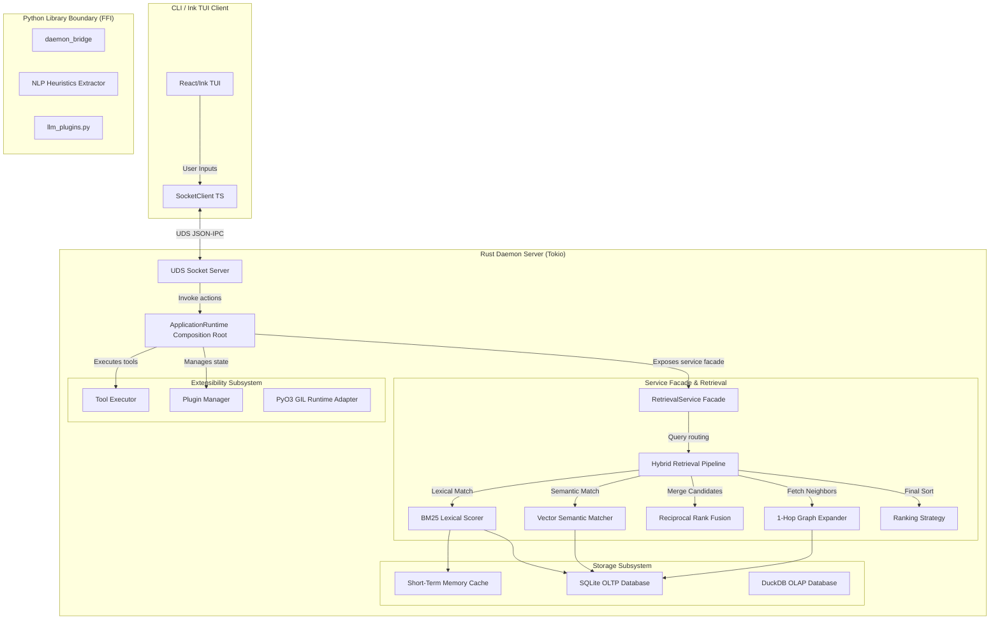
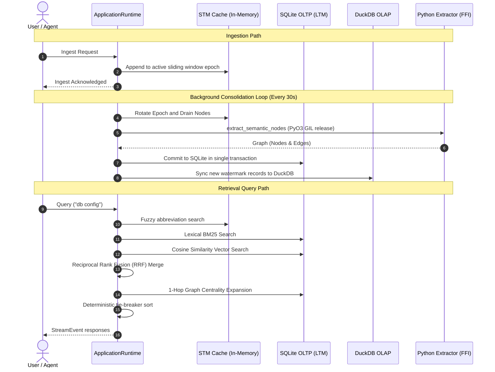

# Brain: Architecture & Developer Guide

Welcome to the canonical technical reference and developer guide for **Brain** (the Standalone Relational Memory Engine). This document unifies the design, architectural paradigms, implementation details, data models, extension guides, and testing procedures for the entire workspace.

---

## Table of Contents

1. [Overview](#1-overview)
2. [High-Level Architecture](#2-high-level-architecture)
3. [Technology Decisions](#3-technology-decisions)
4. [Project Structure](#4-project-structure)
5. [Core Subsystems](#5-core-subsystems)
   - [Configuration Subsystem (`brain-config`)](#configuration-subsystem-brain-config)
   - [Storage Subsystem (`brain-storage`, `brain-session`)](#storage-subsystem-brain-storage-brain-session)
   - [Retrieval Pipeline & Contextual Ranking (`brain-services`)](#retrieval-pipeline--contextual-ranking-brain-services)
   - [Tool Execution Engine (`brain-tools`)](#tool-execution-engine-brain-tools)
   - [Python Runtime Extensibility (`brain-python`)](#python-runtime-extensibility-brain-python)
   - [Plugin Subsystem (`brain-plugins`)](#plugin-subsystem-brain-plugins)
   - [Application Runtime Lifecycle (`brain-services`)](#application-runtime-lifecycle-brain-services)
   - [Agent Execution Pipeline (`brain-services`)](#agent-execution-pipeline-brain-services)
6. [Data Model](#6-data-model)
7. [Lifecycle & Request Flows](#7-lifecycle--request-flows)
8. [Background Workers](#8-background-workers)
9. [Performance Engineering](#9-performance-engineering)
10. [Error Handling & Resiliency](#10-error-handling--resiliency)
11. [Development Guide](#11-development-guide)
12. [Appendix](#12-appendix)

---

## 1. Overview

**Brain** is a standalone, local-first relational memory engine designed to serve as a low-overhead memory companion for developer tools, IDE integrations, and autonomous agents. 

Traditional memory architectures for LLMs rely on naive flat vector search, which lacks relationship awareness, or heavy graph databases, which add operational complexity and network latency. **Brain** solves this by providing a hybrid relational memory engine in a single self-contained binary.

### Goals
* **Sub-Millisecond Retrieval Latency**: Cache hot paths using in-memory structures and optimize persistent queries to run under 10ms.
* **Zero-Dependency Vector Storage**: Implement high-performance float vector comparisons inside a local SQLite database using native floating-point math, removing dependencies on heavy external vector databases.
* **Low-Overhead FFI Boundary**: Embed the Python interpreter directly into a Rust daemon using PyO3 to run NLP heuristics, agent pipelines, and embedding models in-process.
* **Separation of OLTP and OLAP**: Keep transactional writes (SQLite) isolated from columnar diagnostics and query statistics (DuckDB) to prevent analytical query lockouts.
* **Developer-Friendly Extensibility**: Support dynamic plugin loading using simple Python scripts dropped into a user-specific configuration directory (`~/.brain/plugins`).

### Non-Goals
* Replacing enterprise-grade graph databases (e.g., Neo4j) for massive multi-million node graphs.
* Running deep learning model training processes inside the daemon (training is offloaded to external LLM/embedding providers).
* Serving as a public multi-tenant cloud service (the engine is structured as a local, single-user process).

---

## 2. High-Level Architecture

The system is structured as a client-server architecture running entirely on the developer's local machine. The user interacts via a command-line interface or React/Ink TUI CLI, which communicates over a Unix Domain Socket (UDS) with the background Rust daemon.

### System Components



---

## 3. Technology Decisions

### Why Rust?
Rust was chosen for the core daemon to ensure sub-millisecond core scheduling, data race prevention, and safe concurrent access to databases and in-memory caches. It compiles to a single native binary, eliminating runtime interpreter overhead.

### Why SQLite?
SQLite is the industry standard for lightweight, zero-configuration relational storage.
* **Zero Operational Cost**: No background server to maintain; it runs in-process.
* **Transactional Reliability**: Full ACID transactions ensure graph edges and nodes never enter a desynchronized state.
* **Vector Match Performance**: Raw vector embeddings are stored as BLOBs, and cosine similarity calculations are run directly in Rust during database queries, achieving microsecond execution times.

### Why DuckDB?
DuckDB provides high-performance analytical capabilities on local columnar data.
* **Protects SQLite Performance**: SQLite is optimized for point writes and simple index lookups. Columnar scans for graph algorithms (like PageRank or degree centralities) would lock SQLite. DuckDB runs these analytics out-of-band.
* **Fast Incremental Sync**: The engine uses timestamp-based watermark queries to sync SQLite delta changes to DuckDB in milliseconds.

### Why Python Plugins?
Python is the center of the LLM, NLP, and machine learning ecosystem. Using Python for plugin development allows users to easily integrate models like `sentence-transformers`, LLMs like Anthropic/OpenAI, and local model servers like Ollama without recompiling the Rust binary.

### Why PyO3 & Maturin?
PyO3 provides direct, in-process CPython FFI bindings. Instead of running Python scripts as separate processes (which introduces high startup costs and IPC serialization delays), PyO3 loads Python modules directly into the daemon process. Maturin manages compiling the Rust-side FUI bindings back into Python.

---

## 4. Project Structure

The codebase is organized in a monorepo structure, cleanly isolating the client, daemon, storage, and Python layers.

```
brain/
├── cli/                        # React/Ink TypeScript TUI Client
│   ├── src/
│   │   ├── components/         # TUI UI components (PromptInput)
│   │   │   └── design-system/  # Token-based TUI design system (ThemeProvider, themes, hooks)
│   │   ├── screens/            # REPL split-screen layout
│   │   ├── services/           # SocketClient (UDS JSON-IPC wrapper)
│   │   └── main.tsx            # CLI entry point
├── apps/
│   └── brain-v2/               # Binary application composition entrypoint
│       └── src/main.rs         # ApplicationRuntime startup/shutdown bootstrapper
├── crates/                     # Modular workspace library crates
│   ├── brain-config/           # Layered settings loader, validation, and schema migrations
│   ├── brain-core/             # Shared extensibility, repository interfaces, and error structures
│   ├── brain-domain/           # Strongly-typed IDs, non-exhaustive entities, and DTOs
│   ├── brain-events/           # Command & event envelope schemas and bus traits
│   ├── brain-observability/     # Metrics exporters (Prometheus) and tracing subscriber logs
│   ├── brain-plugins/          # Dynamic plugin scanners, registries, and RCU managers
│   ├── brain-python/           # PyO3 embedded interpreter runtime, loaders, and agent adapters
│   ├── brain-services/         # ApplicationRuntime composition root, facades, and retrieval
│   ├── brain-session/          # Ephemeral SessionContext sliding windows and cache managers
│   ├── brain-storage/          # SQLite connection pooling, migrations, and CRUD operations
│   ├── brain-tools/            # Tool registry, executor engine, and cancellation/timeout wrappers
│   └── brain-tui/              # Terminal layout primitives and UI managers
└── docs/                       # Specifications and Architecture Decision Records
```

---

## 5. Core Subsystems

### Configuration Subsystem (`brain-config`)
The configuration system manages layered schema loading, precedence resolution, validation, and schema migrations.
* **Schema Layering**: Combines hardcoded defaults (`DefaultsSource`), TOML files (`TomlSource`), environment variables (`EnvironmentSource`), and programmatic overrides (`OverrideSource`) using a custom `Merge` trait to resolve the final `BrainSettings`.
* **Validation**: Separates structural validation (checking that required fields exist) from semantic validation (asserting values satisfy constraints like `pool_size > 0` and `volatile_ttl_secs >= 1`).
* **Migrations**: Defines a `ConfigMigration` trait leveraging `toml::Value` instead of JSON values to retain structure formatting and handle forward compatibility (unknown fields are preserved).

### Storage Subsystem (`brain-storage`, `brain-session`)
Handles ephemeral short-term memory (STM) caching and persistent long-term memory (LTM) storage.
* **Ephemeral STM**: Managed by `SessionCacheManager`. Maps active `SessionId`s to `SessionContext`s containing sliding windows. The window rotates dynamically based on chronological epochs, evicting old nodes once the `max_sliding_window_size` is reached.
* **Persistent LTM**: `SqliteStorage` implements the `RepositorySet` trait, mapping CRUD queries to SQLite tables. Employs connection pooling (`r2d2`) and manages automatic database migrations during startup.

### Retrieval Pipeline & Contextual Ranking (`brain-services`)
Coordinates query retrieval across memory sources and combines candidates using unified scoring algorithms.
* **Deduplication-Aware Retrieval**: Executed by `RetrievalPipeline`. Queries memory sources sequentially. If the unique node count collected in the `PipelineAccumulator` satisfies the requested limit, subsequent memory sources are skipped (early exit).
* **Contextual Ranking Algorithms**:
  * **BM25 Lexical Scoring**: Computes term frequency-inverse document frequency (TF-IDF) over tokenized text. IDF scores are precomputed for query tokens to prevent performance bottlenecks.
  * **Vector Similarity (Cosine)**: Computes dot-product cosine similarity over Float BLOBs. Flat-scans small datasets ($N < 50$), and uses an IVF index ANN probe ($K=2$ partitions, $B=8$ centroids) for larger datasets.
  * **Graph Centrality**: Performs 1-hop neighbor expansions, boosting neighbor relevance by relations' weights and applying a $0.5$ dampening factor.
  * **Reciprocal Rank Fusion (RRF)**: Merges scores from multiple search strategies, resolving ties deterministically using `score DESC` $\rightarrow$ `NodeId ASC`.

### Tool Execution Engine (`brain-tools`)
Provides execution orchestration for agent-callable tools.
* **Separation of Concerns**: `ToolRegistry` handles registration and alphabetical lookups, `ToolRunner` executes commands policy-free, and `ToolExecutor` coordinates execution policies (permissions, timeouts, cancellation).
* **Policy Management**:
  * **PermissionManager**: Stores granted permissions using a bitmap and validates tool scopes before running.
  * **Cooperative Cancellation**: Instantiates `CancellationTokenImpl` (Tokio-backed) to propagate cancellation triggers down the call stack.
  * **Timeout Invariant**: Executes tools inside a `tokio::time::timeout` wrapper to force termination if the tool execution exceeds the configured limit.

### Python Runtime Extensibility (`brain-python`)
Integrates the dynamic Python execution environment.
* **CPython Embed**: Direct in-process CPython interpreter initialization using PyO3 bindings.
* **GIL Release Discipline**: Calls to host routines (`retrieve`, `execute_tool`) release the Global Interpreter Lock (GIL) via `py.allow_threads(...)`. This permits concurrent execution of CPU-bound operations in Rust.
* **Versioned API Boundary**: Exposes a stable, read-only boundary namespace (`brain_ai.api.v1`) containing wrapper classes (`PyMemoryNode`, `PyConversation`, `PyExecutionResult`) that prevent Python plugins from mutating internal Rust states.
* **Agent Adapters**: Maps dynamically loaded Python classes to Rust traits (`ChatAgent`, `PlannerAgent`, `EmbeddingAgent`, `ExtractionAgent`) using cached PyObject method callables to minimize lookup latencies.

### Plugin Subsystem (`brain-plugins`)
Manages loading, validation, and dynamic updates of plugins.
* **Composed Traits**: Deconstructs capabilities into smaller interfaces: `PluginLifecycle`, `PluginCapabilities`, `PluginMetadata`, and `PluginEventHandler`.
* **Path Isolation**: The loader imports scripts using Python's `importlib.util.spec_from_file_location` and registers them under their exact `PluginId`, preventing module name collisions.
* **RCU Hot Reloading**: Dynamic updates are performed using a Read-Copy-Update (RCU) transaction. A new plugin instance is loaded, initialized, and validated *before* swapping the registry pointer under a write lock. If validation fails, the transaction is rolled back, leaving the old active instance running.

### Application Runtime Lifecycle (`brain-services`)
Acts as the composite root of the entire application.
* **Subsystem Composition**: Enforces that all subsystems (config, storage, sessions, pipelines, executors, plugin managers) are owned exclusively by `ApplicationRuntime` and constructed through `RuntimeBuilder`.
* **Lifecycle State Machine**:
  ```
  [Created] ──(start)──> [Starting] ──(phases success)──> [Running]
      ▲                      │                                │
      │               (phase failure)                    (shutdown)
      └──────────────────────┴────────────────────────────────v
                                                         [Stopping] ──> [Stopped]
  ```
* **Rollback-Aware Startup**: Coordinates composable `StartupPhase` stages (Config, Storage, Python, Tools, Plugins, Services). If any phase fails, all completed phases are rolled back in reverse order, returning the system to `Created`.
* **Observer Hooking**: `RuntimeObserver` notifies registered observers of state transitions. Observer failures are treated as best-effort, logged via `tracing::warn!`, and never block the runtime lifecycle.

### Agent Execution Pipeline (`brain-services`)
Orchestrates individual user requests through a decoupled, stage-based execution loop.
* **Separation of Concerns**: `AgentExecutionEngine` serves as the public facade, returning an `ExecutionHandle` containing event stream receivers and cancellation triggers. The actual work runs inside a spawned Tokio task executing `ExecutionRunner` stages sequentially.
* **Stage-Based Pipeline Loop**: Executes granular, modular stages conforming to the `ExecutionStage` trait:
  1. `Planning`: Resolves conversation context and calls the `PlannerAgent` to outline tool steps.
  2. `Retrieval`: Searches memory sources via the retrieval facade and populates context matches.
  3. `ToolExecution`: Runs planned tools iteratively via the tool executor up to configured limits.
  4. `Reasoning`: Invokes the reasoning `ChatAgent` and streams word tokens back to the caller.
  5. `Commit`: Transactionally commits final messages and graph updates using the `MemoryCommitService`.
* **State vs. Context Separation**: Keeps execution parameters immutable inside `ExecutionContext` while modifying intermediate results (memories, token streams, planner output) progressively inside a mutable `ExecutionState`.
* **Event Sink**: Stages emit lifecycle updates strictly via `ExecutionEventSink` which timestamps events, assigns monotonic sequence numbers, and aggregates metrics (`ExecutionMetrics`) automatically.

---

## 6. Data Model

All domain data models are defined under `brain-domain` using the `#[non_exhaustive]` macro to allow future, non-breaking schema enhancements.

### Strongly-Typed Identifiers
To prevent ID confusion across entities, the system defines unique type wrappers around `ulid::Ulid` and `uuid::Uuid`:
* `SessionId`, `NodeId`, `EdgeId`, `PluginId`, `ConversationId`, `MessageId`, `ExecutionId`

### Core Schema Structures
* **Node**: Graph memory unit. Contains a strongly-typed `NodeType` (Concept, Action, Event, State) and a JSON properties string mapping schema-less attributes.
* **Edge**: Weighted connection between two `NodeId`s.
* **Embedding**: Vector structure carrying `Vec<f32>` values and dimensions metadata.
* **Conversation**: Sequence of message entities.
* **Message**: Individual message model carrying a `MessageRole` (System, User, Assistant, Tool).

### Serialization Boundaries (DTOs)
The engine separates raw database tables from public API/UI layers using DTOs:
* `NodeDTO`, `EdgeDTO`, `EmbeddingDTO`, `MemoryDTO`

---

## 7. Lifecycle & Request Flows

### Ingestion & Query Data Flow



### IPC Streaming Protocol
Communication over UDS uses newline-delimited JSON frames matching the versioned `StreamEvent` envelope:
* **`stream_start`**: Contains the query's `streamId` and start metadata.
* **`stream_progress`**: Contains intermediate progress floats (0.0 to 1.0) and descriptive strings.
* **`stream_chunk`**: Contains serialized `MemoryDTO` or text fragments.
* **`stream_end`**: Confirms query processing finished successfully.
* **`stream_cancelled`**: Notifies the client of cancellation.

---

## 8. Background Workers

Background execution loops run as asynchronous Tokio tasks.

### 1. Consolidation Loop
* Executes every 30 seconds.
* Rotates the STM epoch from Epoch $N$ to Epoch $N+1$, draining Epoch $N$'s nodes.
* Passes the nodes to the Python Heuristics Extractor, maps the resulting semantic graph, and commits it transactionally to SQLite.

### 2. Time-Aware Graph Decay Loop
Relationships decay dynamically over time. During consolidation, edge weights are decayed:
\[W_{\text{new}} = W_{\text{old}} \times e^{-\lambda \Delta t}\]
Where:
* $\Delta t$ is the time elapsed since the last write update.
* $\lambda$ is the decay constant calculated from the half-life configuration:
  \[\lambda = \frac{\ln(2)}{T_{1/2}}\]
  *(Default half-life $T_{1/2} = 7$ days / 604,800 seconds).*
* **Pruning**: Edges whose weights decay below `0.1` are pruned from the database.
* **Reinforcement**: Writing an edge that already exists boosts its weight by $+0.5$ (capped at `2.0`).

### 3. Asynchronous Embedding Generator
Ingested nodes are pushed to an MPSC queue. The worker drains the queue, formats the node into a descriptor string (`label (type) properties`), calls the embedding provider (Ollama, OpenAI, local transformers), and commits the vector coordinates to SQLite.

### 4. DuckDB Analytics Sync
Runs incrementally using watermarks. Queries SQLite for records updated since the last sync watermark:
```sql
SELECT * FROM nodes WHERE updated_at > ?;
```
It synchronizes the changes into DuckDB and updates the watermark timestamp.

---

## 9. Performance Engineering

To keep latency boundaries within sub-millisecond ranges:

### CPU Task Thread-Offloading
Any blocking task (PyO3 interpreter executions, SQLite database writes, DuckDB synchronizations) is redirected to Tokio's dedicated OS blocking thread pool via `tokio::task::spawn_blocking`. This prevents blocking the async socket thread pool.

### Cosine Similarity SIMD layout
Vector similarity uses native Rust iteration compiled with target-cpu optimizations. Using chunks-exact loop structures allows the Rust compiler to auto-vectorize calculations (AVX2, NEON), reducing 384-dimensional cosine scans to microsecond ranges.

### RCU Sub-Microsecond Hot Reloads
RCU pointer swapping inside the registry allows hot reloads to execute in `~113 ns`. The manager clones the active handle under a minimal write lock, meaning concurrent read threads never experience execution lockouts during updates.

---

## 10. Error Handling & Resiliency

### ephemeral STM Cache Fallback
If the cache search returns zero results, the query pipeline automatically falls back to traversing the persistent LTM database. If the database file is corrupted or locked, it logs a warning and falls back to a clean in-memory SQLite schema to prevent daemon crashes.

### Startup Rollback Safety
During startup, if any phase fails:
- The completed phases are rolled back in reverse order.
- The runtime state is reset to `Created`.
- Invariant: `rollback()` is called **only** on phases that have completed `execute()`, removing the need for rollback logic to handle partially initialized states.

### Retained Context Misuse Detection
Python plugins receive a `PyRuntimeContext` object during lifecycle hooks. To prevent plugins from keeping a reference to the context and calling host APIs after the hook terminates:
- The context holds a thread-safe `is_valid: Arc<AtomicBool>` flag.
- The loader invalidates the flag (stores `false`) immediately upon hook exit.
- Any subsequent method calls on the invalid context raise a Python `RuntimeError("RuntimeContext has expired")`, protecting host memory safety.

---

## 11. Development Guide

### Writing a Custom Python Plugin
Plugins are dropped into `~/.brain/plugins/` and must export a `register_plugins()` function:

```python
# ~/.brain/plugins/my_custom_plugin.py
import json

class CustomLlmProvider:
    def name(self) -> str:
        return "custom-llm"

    def generate(self, prompt: str) -> str:
        return f"Custom response: {prompt}"

class CustomEmbedder:
    def name(self) -> str:
        return "custom-embedder"

    def embed(self, text: str) -> list[float]:
        return [0.15, -0.42, 0.88]

def register_plugins():
    return {
        "llm_providers": [CustomLlmProvider()],
        "embedding_providers": [CustomEmbedder()]
    }
```

Enable your plugin in `~/.brain/config.json`:
```json
{
  "active_embedding_provider": "custom-embedder"
}
```

### Implementing a Custom Rust Tool
To add a new tool to the system:
1. Implement the `Tool` trait from `brain-core::extensibility`:
   ```rust
   pub struct HelloTool;
   impl Tool for HelloTool {
       fn metadata(&self) -> ToolMetadata {
           ToolMetadata {
               name: "hello".to_string(),
               description: "Prints hello message".to_string(),
               required_permissions: vec![],
               timeout: std::time::Duration::from_secs(5),
           }
       }
       fn execute(&self, _ctx: &ExecutionContext, _args: &HashMap<String, serde_json::Value>) -> Result<ExecutionResult, BrainError> {
           Ok(ExecutionResult::new(serde_json::json!({ "message": "hello" })))
       }
   }
   ```
2. Register the tool with the `ToolRegistry` during the startup phase.

### CLI TUI Theme Tokens
When writing TUI screens, avoid hardcoded ANSI color values. Use token-based themed components:
```typescript
import { ThemedText, useTheme } from './components/design-system';

const MyComponent = () => {
  const { theme } = useTheme();
  return (
    <ThemedText color="claude">
      Theme-aware Text Output
    </ThemedText>
  );
};
```

---

## 12. Appendix

### Standard Paths Reference
* **Main Directory**: `~/.brain/`
* **Daemon Socket**: `~/.brain/daemon.sock`
* **Persistent SQLite**: `~/.brain/brain.db`
* **Analytical DuckDB**: `~/.brain/analytics.db`
* **Daemon Logs**: `~/.brain/daemon.log`
* **User Plugins Directory**: `~/.brain/plugins/`
* **Configuration File**: `~/.brain/config.json`

### CLI Subcommands
* `brain`: Launches the interactive TUI.
* `brain daemon start`: Boots the background daemon process.
* `brain daemon stop`: Stops the running daemon process.
* `brain daemon status`: Prints whether the daemon is running.
* `brain health`: Queries the `/health` diagnostic endpoint.

### Run Instructions (Local Development)
1. **Compile & Run Daemon**:
   ```bash
   make run-daemon
   ```
2. **Start Interactive CLI**:
   ```bash
   make run-cli
   ```
3. **Run Unit & Integration Tests**:
   ```bash
   PYO3_PYTHON=/Users/ritikpathania/.local/share/uv/python/cpython-3.12-macos-aarch64-none/bin/python3.12 cargo test
   ```
4. **Execute Criterion Benchmarks**:
   ```bash
   cargo bench -p brain-plugins
   ```
5. **Run React Profiler Benchmarks**:
   ```bash
   cd cli && bun run benchmark:render
   ```
