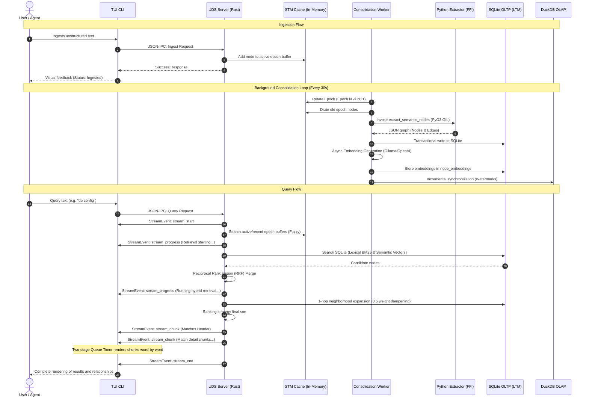

# Brain: Architecture & Developer Guide

Welcome to the canonical technical reference and developer guide for **Brain** (the Standalone Relational Memory Engine). This document unifies the design, architectural paradigms, implementation details, data models, and extension guides for the entire system.

---

## Table of Contents

1. [Overview](#1-overview)
2. [High-Level Architecture](#2-high-level-architecture)
3. [Technology Decisions](#3-technology-decisions)
4. [Project Structure](#4-project-structure)
5. [Core Systems](#5-core-systems)
6. [Data Model](#6-data-model)
7. [Plugin API](#7-plugin-api)
8. [Request Flow](#8-request-flow)
9. [Background Workers](#9-background-workers)
10. [Performance Design](#10-performance-design)
11. [Error Handling](#11-error-handling)
12. [Future Roadmap](#12-future-roadmap)
13. [Design Decisions](#13-design-decisions)
14. [Development Guide](#14-development-guide)
15. [Appendix](#15-appendix)

---

## 1. Overview

**Brain** is a standalone, local-first relational memory engine designed to serve as a low-overhead memory companion for developer tools and autonomous agents. 

Traditional memory architectures for LLMs rely on naive flat vector search, which lacks relationship awareness, or heavy graph databases, which add operational complexity and network latency. **Brain** solves this by providing a hybrid relational memory engine in a single self-contained binary.

### Goals
* **Designed for sub-millisecond STM retrieval and low-latency hybrid retrieval**: Cache hot paths using in-memory structures and optimize persistent queries to run under 10ms.
* **Native SQLite-backed vector storage without an external vector database**: Implement high-performance float vector comparisons inside a local SQLite database using native floating-point math, removing dependencies on heavy external vector databases.
* **Low-Overhead FFI Boundary**: Embed the Python interpreter directly into a Rust daemon using PyO3 and Maturin to run NLP heuristics and embedding models in-memory.
* **Separation of OLTP and OLAP**: Keep transactional writes (SQLite) isolated from columnar diagnostics and query statistics (DuckDB) to prevent analytics query lockouts.
* **Developer-Friendly Extensibility**: Support dynamic plugin loading using simple Python scripts dropped into a user-specific configuration directory (`~/.brain/plugins`).

### Non-Goals
* Replacing enterprise-grade graph databases (e.g., Neo4j) for massive multi-million node graphs.
* Running deep learning model training processes inside the daemon (training is offloaded to external LLM/embedding providers).
* Serving as a public multi-tenant cloud service (the engine is structured as a local, single-user process).

---

## 2. High-Level Architecture

The system is structured as a client-server architecture running entirely on the developer's local machine. The user interacts via a command-line interface or React/Ink TUI CLI, which communicates over a Unix Domain Socket (UDS) with the background Rust daemon.

### System Components

```mermaid
graph TD
    subgraph CLI ["CLI / Ink TUI Client"]
        TUI[React/Ink TUI]
        TS_Client[SocketClient TS]
    end

    subgraph Daemon ["Rust Daemon Server (Tokio)"]
        UDS_Server[UDS Socket Server]
        HTTP_Server[HTTP Metrics/Diag Server]
        Core_Config[Config Subsystem]
        
        subgraph Retrieval ["Retrieval Subsystem"]
            Ret_Pipeline[Hybrid Retrieval Pipeline]
            BM25[BM25 Lexical Scorer]
            Vector_Search[Vector Semantic Matcher]
            Fuzzy_Matcher[SkimMatcherV2 Fuzzy Matcher]
            RRF[Reciprocal Rank Fusion]
            Graph_Expand[1-Hop Graph Expander]
            Reranker[Ranking Strategy]
        end
        
        subgraph Storage ["Storage Subsystem"]
            STM[Short-Term Memory Cache]
            LTM[SQLite OLTP Database]
            DuckDB[DuckDB OLAP Database]
        end
        
        subgraph Plugins ["Plugin Registry & PyO3 Loader"]
            Registry[Plugin Registry]
            PyO3_Loader[PyO3 GIL Runtime Adapter]
        end
        
        subgraph Workers ["Background Workers"]
            Consolidation[Consolidation Loop]
            Decay[Edge Weight Decay Engine]
            Embed_Worker[Embedding Generation Worker]
            Analytics_Worker[DuckDB Sync Worker]
        end
    end

    subgraph Python ["Python Library Boundary (FFI)"]
        Python_Bridge[daemon_bridge]
        NLP_Extractor[NLP Heuristics Extractor]
        LLM_Plugins[llm_plugins.py]
    end

    TUI -->|User Inputs| TS_Client
    TS_Client <-->|UDS JSON-IPC| UDS_Server
    UDS_Server -->|Route requests| Ret_Pipeline
    UDS_Server -->|Write logs| STM
    
    Consolidation -->|Rotate Epoch & Drain| STM
    Consolidation -->|Acquire GIL via PyO3| NLP_Extractor
    NLP_Extractor -->|Semantic Nodes & Edges| Consolidation
    Consolidation -->|Transaction Batch Write| LTM
    
    Embed_Worker -->|Request Embeddings| PyO3_Loader
    PyO3_Loader -->|Call LLM/Embedding API| LLM_Plugins
    LLM_Plugins -->|Vectors| Embed_Worker
    Embed_Worker -->|Store Vectors| LTM
    
    Analytics_Worker -->|Read changes via watermarks| LTM
    Analytics_Worker -->|Sync| DuckDB
    
    Ret_Pipeline -->|Lexical Match| BM25
    Ret_Pipeline -->|Semantic Match| Vector_Search
    BM25 --> STM
    BM25 --> LTM
    Vector_Search --> LTM
    
    Ret_Pipeline -->|Merge Candidates| RRF
    Ret_Pipeline -->|Fetch Neighbors| Graph_Expand
    Graph_Expand --> LTM
    Ret_Pipeline -->|Final Sort| Reranker
    
    HTTP_Server -->|Query Stats/Analytics| DuckDB
    HTTP_Server -->|Read atomic counters| UDS_Server
```



### Data Flow Overview

The engine processes data through two primary pathways: the **Ingestion Path** (asynchronous, multi-stage) and the **Query Path** (synchronous, sub-millisecond).

#### Ingestion Path
1. The user or external agent submits an ingestion request (unstructured text) via UDS.
2. The daemon validates the request and immediately appends it to the in-memory **Short-Term Memory (STM)** buffer queue.
3. Every 30 seconds, a background **Consolidation Worker** rotates the STM epoch, drains the accumulated buffer, and passes the text chunks across the PyO3 FFI boundary to the Python-side **Heuristics Extractor** or LLM plugin.
4. The extractor parses the text into a semantic graph representation (nodes and relationship edges).
5. The consolidation worker receives the graph, resolves references, and commits the nodes and edges transactionally to the **SQLite Long-Term Memory (LTM)** database.
6. The **Embedding Worker** generates vector embeddings for newly consolidated nodes and stores them in SQLite.
7. The **DuckDB Sync Worker** runs incrementally using watermark timestamps, syncing new changes from SQLite to DuckDB for analytics out-of-band.

#### Query Path
1. The client sends a query request via UDS (e.g., `query db config`).
2. The daemon dispatches the search request to the **Hybrid Retrieval Pipeline**.
3. In parallel, the pipeline searches:
   * The ephemeral **STM** cache using token-overlap and fuzzy abbreviation matching (`SkimMatcherV2`).
   * The **LTM** database using lexical keyword scoring (`BM25`).
   * The **LTM** database using semantic vector similarity (cosine distance on SQLite embeddings).
4. The pipeline merges the candidate lists from the lexical and semantic matchers using **Reciprocal Rank Fusion (RRF)**.
5. The pipeline queries SQLite for the 1-hop graph neighbors of the top RRF candidates. It dampens the weights of neighbor relationships by `0.5` and includes the neighbor nodes in the candidate set.
6. The combined candidate set is sorted by the active ranking strategy and returned to the client over UDS.

### Startup Lifecycle
When the `brain` executable is started:
1. **Directory Isolation**: Ensures `~/.brain/` (or specified override directory) exists.
2. **Configuration Load**: Reads `~/.brain/config.json`. If missing, it writes a default configuration file.
3. **Database Initialization**: Starts SQLite and DuckDB handles. Performs schema initialization and schema migrations.
4. **Plugin Loading**: Initializes the embedded Python interpreter, sets the python search path, imports `brain`, and scans `~/.brain/plugins/` to register dynamic plugins.
5. **Worker Spawning**: Spawns async Tokio tasks for metrics, UDS socket management, background consolidation, decay sweeps, and DuckDB analytical synchronization.

---

## 3. Technology Decisions

### Why Rust?
Rust was chosen for the core daemon to ensure sub-millisecond core scheduling, data race prevention, and safe concurrent access to databases and in-memory caches. It compiles to a single native binary, eliminating runtime interpreter overhead.

### Why SQLite?
SQLite is the industry standard for lightweight, zero-configuration relational storage.
* **Zero Operational Cost**: No background server to maintain; it runs in-process.
* **Transactional Reliability**: Full ACID transactions ensure graph edges and nodes never enter a desynchronized state.
* **Vector Match Performance**: Raw vector embeddings are stored as BLOBs, and cosine similarity calculations are run directly in Rust during database queries, achieving microsecond execution times.

### Why DuckDB?
DuckDB provides high-performance analytical capabilities on local columnar data.
* **Protects SQLite Performance**: SQLite is optimized for point writes and simple index lookups. Columnar scans for graph algorithms (like PageRank, degree centralities, or slow query quantiles) would lock SQLite. DuckDB runs these analytics out-of-band.
* **Fast Incremental Sync**: The engine uses timestamp-based watermark queries to sync SQLite delta changes to DuckDB in milliseconds.

### Why Python Plugins?
Python is the center of the LLM, NLP, and machine learning ecosystem. Using Python for plugin development allows users to easily integrate models like `sentence-transformers`, LLMs like Anthropic/OpenAI, and local model servers like Ollama without recompiling the Rust binary.

### Why PyO3 & Maturin?
PyO3 provides direct, in-process CPython FFI bindings. Instead of running Python scripts as separate processes (which introduces high startup costs and IPC serialization delays), PyO3 loads Python modules directly into the daemon process. Maturin manages compiling the Rust-side FUI bindings back into Python.

### Architectural Tradeoffs
* **FFI Boundary Crossings**: Crossing the Rust-Python boundary requires acquiring the CPython Global Interpreter Lock (GIL). To prevent this from blocking the async socket thread pool, FFI tasks are offloaded to dedicated OS threads via `tokio::task::spawn_blocking`.
* **Case-Insensitive File Systems**: On macOS, the filesystem is case-insensitive by default. We structure paths (e.g., config and database filenames) using lowercase files while allowing capitalized module lookups to remain safe.

---

## 4. Project Structure

The codebase is organized in a monorepo structure, cleanly isolating the client, daemon, storage, and Python layers.

```
brain/
├── apps/
│   └── brain-v2/               # Main unified entrypoint app composition root
├── crates/
│   ├── brain-tui/              # Native Rust Ratatui TUI Client
│   │   ├── src/
│   │   │   ├── client.rs       # Client trait and execution states
│   │   │   ├── state.rs        # Reducer state machines & typewriter pacing
│   │   │   └── ui/             # Layout calculations and custom widgets
│   │   └── tests/              # Parity and stress integration test suite
│   ├── brain-domain/           # Core domain entity structures
│   ├── brain-core/             # Shared trait signatures
│   ├── brain-config/           # Dynamic YAML config loader
│   ├── brain-services/         # Business logic layer (indexing, retrieval)
│   └── brain-storage/          # Transactional and analytical storage layer
├── daemon/                     # Rust backend server & Python FFI package
│   ├── Cargo.toml              # Rust crate config (bundled sqlite/duckdb)
│   ├── pyproject.toml          # Maturin Python packaging config
│   ├── src/
│   │   ├── config.rs           # Core config resolution (~/.brain/ directory)
│   │   ├── lib.rs              # PyO3 module definition and FFI boundary
│   │   ├── main.rs             # CLI subcommands entry point and daemon runner
│   │   ├── plugins/            # Extensibility module
│   │   │   ├── traits.rs       # Rust plugin trait specifications
│   │   │   ├── loader.rs       # Python dynamic plugin importer
│   │   │   ├── registry.rs     # Active plugin manager
│   │   │   └── mod.rs          # Module re-exports
│   │   ├── storage/            # SQLite & DuckDB storage engine
│   │   │   ├── sqlite/         # SQLite graph schema and vector cosine math
│   │   │   ├── duckdb/         # DuckDB analytical databases & exporters
│   │   │   └── mod.rs          # Data structures and traits
│   │   ├── retrieval/          # Search algorithms
│   │   │   ├── fuzzy.rs        # Ephemeral STM fuzzy matcher
│   │   │   ├── bm25.rs         # Lexical TF-IDF keyword search
│   │   │   ├── embeddings.rs   # Semantic vector search
│   │   │   ├── reranker.rs     # Retrieval ranking strategy
│   │   │   ├── pipeline.rs     # Reciprocal Rank Fusion (RRF) coordinator
│   │   │   └── mod.rs          # Retrieval dispatch types
│   │   ├── server/             # IPC transport layers
│   │   │   ├── uds.rs          # Unix Domain Socket receiver
│   │   │   ├── tcp.rs          # HTTP Diagnostics, readiness & metrics
│   │   │   └── protocol.rs     # JSON-IPC message schemas & versioning
│   │   ├── workers/            # Multi-threaded background execution loops
│   │   │   ├── cleanup.rs      # Epoch rotation & graph decay loop
│   │   │   ├── embeddings.rs   # Asynchronous vector embedding generator
│   │   │   └── analytics.rs    # DuckDB telemetry event writer
│   │   └── telemetry/          # Observability subsystem
│   │       ├── metrics.rs      # Telemetry atomic counters
│   │       ├── tracing.rs      # Structured log subscribers
│   │       └── mod.rs          # Telemetry exports
│   └── brain/                  # Python library code
│       ├── extraction/         # Regex heuristics NLP extractor
│       ├── providers/          # Embedding & LLM client classes (Ollama, OpenAI)
│       ├── plugins/            # User-extendable plugin hooks
│       └── __init__.py         # Python FFI entry point
└── docs/                       # Specifications and Architecture Decision Records
```

---

## 5. Core Systems

### Configuration Subsystem
Configuration is managed in Rust via `daemon/src/config.rs`. It resolves the environment-specific directories, defaulting to `$HOME/.brain/`. The system dynamically initializes paths for:
* SQLite DB: `~/.brain/brain.db`
* DuckDB: `~/.brain/analytics.db`
* Sockets: `~/.brain/daemon.sock`
* Logs: `~/.brain/daemon.log`
* Plugins directory: `~/.brain/plugins/`

At startup, if `~/.brain/config.json` is missing, it is created with default plugin bindings:
```json
{
  "active_embedding_provider": "noop",
  "active_llm_provider": "noop",
  "active_retrieval_algorithm": "fuzzy",
  "active_ranking_strategy": "default",
  "active_storage_backend": "sqlite",
  "active_memory_extractor": "python-default",
  "active_exporter": "duckdb"
}
```

### Storage Subsystem
Isolates read/write persistence. The SQLite OLTP backend uses Write-Ahead Logging (WAL) for concurrent reads/writes. In directories with restricted permissions, SQLite falls back gracefully to `rollback DELETE` journal mode. It maintains database schema migrations automatically.

### Plugin System
The plugin system operates on a registry model. At startup, the daemon compiles a registry of active plugins, resolving dynamic plugins from Python scripts inside `~/.brain/plugins/` and built-in Rust plugins. It registers them against trait implementations for LLMs, embeddings, retrievers, storage backends, and metrics exporters.

### Indexing Subsystem
Short-term indexing parses raw text into tokens, strips English stop-words, and stores them in a memory-efficient `HashMap` Inverted Index inside the current epoch. Long-term indexing relies on SQLite indexing tables on node types and edge relations.

### Embeddings Subsystem
Retrieves vector representation from the active `EmbeddingProvider`. Embeddings are stored as binary BLOBs representing contiguous `f32` vectors.
* **Vector Serialization**: Rust converts `[f32]` arrays into binary formats using native-endian encoding (`to_ne_bytes`), avoiding JSON serialization overhead inside the database.

### Search Subsystem
Search operations evaluate exact token overlap, substring matching, and abbreviation matches. The abbreviation search matches initials (e.g., query `"db config"` matches `"database-configuration"`) using the `SkimMatcherV2` scoring engine.

### Hybrid Retrieval Pipeline (RAG)
When a query is dispatched, the retrieval pipeline executes:
1. **Volatile Matches**: Fetch candidate nodes from the in-memory STM cache.
2. **Lexical LTM Matches**: Fetch candidate nodes from SQLite using BM25 keyword matching.
3. **Semantic LTM Matches**: Query the SQLite vector table using cosine similarity on the query embedding.
4. **RRF Merging**:
   For each candidate, the RRF score is calculated as:
   \[RRF(d) = \sum_{m \in M} \frac{1}{k + r_m(d)}\]
   where \(M\) represents the matchers (lexical, semantic), \(r_m(d)\) is the rank of document \(d\) in matcher \(m\), and \(k = 60\) is a smoothing constant.
5. **1-Hop Neighborhood Expansion**:
   For the top \(N\) candidates, the pipeline fetches neighbor nodes. The neighbor nodes are injected into the result set, and their relationship weights are multiplied by a dampening factor of `0.5`.
6. **Reranking**: The merged candidates are sorted by the active `RankingStrategy`.

### Memory Hierarchy
```
┌────────────────────────────────────────────────────────┐
│  Short-Term Memory (STM)                               │
│  - Ephemeral cache, Inverted Index HashMap             │
│  - Epoch-based rotations (30s)                         │
└──────────────────────────┬──────────────────────────────┘
                           │
             Consolidation (Epoch Drain)
                           │
                           v
┌────────────────────────────────────────────────────────┐
│  Long-Term Memory (LTM)                                │
│  - Persistent SQLite OLTP Store                        │
│  - Structured Graph Database (Nodes/Edges)             │
│  - In-process Cosine Similarity Vector BLOB Table      │
└────────────────────────────────────────────────────────┘
```

---

## 6. Data Model

### SQLite OLTP Store Schema

#### `nodes` Table
Stores graph entities.
* `id` (`TEXT PRIMARY KEY`): Unique identifier (e.g., uuid or normalized name like `"sqlite"`).
* `label` (`TEXT`): Human-readable name.
* `type` (`TEXT`): Entity type (e.g., `technology`, `credential`, `configuration`).
* `properties` (`TEXT JSON`): Key-value metadata.
* `updated_at` (`INTEGER`): Unix epoch timestamp of last write.

#### `edges` Table
Stores directed graph relationships.
* `source` (`TEXT`): Source node ID, foreign key referencing `nodes(id)`.
* `target` (`TEXT`): Target node ID, foreign key referencing `nodes(id)`.
* `relation` (`TEXT`): Edge type (e.g., `configures`, `stored_in`).
* `weight` (`REAL DEFAULT 1.0`): Edge strength (decays over time).
* `updated_at` (`INTEGER`): Unix epoch timestamp of last write.

#### `node_embeddings` Table
Stores raw vector float embeddings.
* `node_id` (`TEXT PRIMARY KEY`): Referencing `nodes(id)`.
* `embedding` (`BLOB`): Binary array of `f32` vector values.

*Indexes*: `CREATE INDEX idx_nodes_type ON nodes(type);`, `CREATE INDEX idx_edges_source ON edges(source);`, `CREATE INDEX idx_edges_target ON edges(target);`.

---

### DuckDB OLAP Store Schema

The analytical database is synchronized incrementally and contains:

#### `sync_metadata` Table
Tracks watermark sync offsets.
* `table_name` (`VARCHAR`): Name of target table.
* `last_sync_timestamp` (`TIMESTAMP`): High watermark timestamp.

#### `analytics_nodes` Table
Duplicate schema of the SQLite `nodes` table, optimized for columnar analytical aggregation.

#### `analytics_edges` Table
Duplicate schema of the SQLite `edges` table, optimized for columnar analytics.

#### `query_logs` Table
Telemetry logs tracking search behaviors.
* `query_text` (`VARCHAR`): Query query string.
* `hit_type` (`VARCHAR`): Hit category (`STM`, `LTM`, or `None`).
* `execution_time_us` (`BIGINT`): Latency in microseconds.
* `timestamp` (`TIMESTAMP`): Time of execution.

#### `ingest_logs` Table
Telemetry logs tracking system writes.
* `payload_len` (`BIGINT`): Size of the ingested text.
* `execution_time_us` (`BIGINT`): Execution time in microseconds.
* `timestamp` (`TIMESTAMP`): Time of execution.

---

## 7. Plugin API

The extensibility layer provides a unified set of Rust traits. Python equivalents serialize data across the FFI boundary using JSON structures.

### Rust Trait Specifications

```rust
pub trait LlmProvider: Send + Sync {
    fn name(&self) -> &str;
    fn generate(&self, prompt: &str) -> Result<String, String>;
}

pub trait EmbeddingProvider: Send + Sync {
    fn name(&self) -> &str;
    fn embed(&self, text: &str) -> Result<Vec<f32>, String>;
}

pub trait StorageBackend: Send + Sync {
    fn name(&self) -> &str;
    fn write_graph(&self, nodes: &[ExtractedNode], edges: &[ExtractedEdge]) -> Result<(), String>;
    fn query_graph(&self, query: &str) -> Result<Vec<(ExtractedNode, Vec<ExtractedEdge>)>, String>;
    fn decay_weights(&self, half_life_secs: f64, threshold: f64) -> Result<(), String>;
}

pub trait MemoryExtractor: Send + Sync {
    fn name(&self) -> &str;
    fn extract(&self, text: &str) -> Result<(Vec<ExtractedNode>, Vec<ExtractedEdge>), String>;
}
```

### Python Plugin Implementation Example
Python scripts dropped into `~/.brain/plugins/` must export a `register_plugins()` function:

```python
# ~/.brain/plugins/my_custom_plugin.py
import json

class CustomLlmProvider:
    def name(self) -> str:
        return "custom-llm"

    def generate(self, prompt: str) -> str:
        return f"Custom response to prompt: {prompt}"

class CustomEmbedder:
    def name(self) -> str:
        return "custom-embedder"

    def embed(self, text: str) -> list[float]:
        # Return a float list representing the vector
        return [0.15, -0.42, 0.88]

def register_plugins():
    return {
        "llm_providers": [CustomLlmProvider()],
        "embedding_providers": [CustomEmbedder()]
    }
```

### Built-in Local Embedding Providers
The system includes built-in python classes in `llm_plugins.py` to support local model execution:
* **Ollama**: Connects to local Ollama API instances via `/api/embed` or `/api/embeddings`.
* **Local Transformers**: Runs `sentence-transformers` locally inside the embedded Python runtime.
* **OpenAI-Compatible**: Integrates with local inference engines (e.g., vLLM, LiteLLM).

---

## 8. Request Flow

Communication with the daemon happens over a Unix Domain Socket (default: `~/.brain/daemon.sock`) using newline-delimited JSON frames.



### IPC Versioning and Schema

To support backward compatibility with older command-line tools, the daemon uses Serde untagged enums to route requests transparently.

#### Versioned Request Envelope
```json
{
  "version": "1.0.0",
  "message_type": "request",
  "payload": {
    "action": "query",
    "query_string": "sqlite database"
  }
}
```

#### Legacy Format (Auto-routed Requests)
```json
{
  "action": "query",
  "payload": "sqlite database"
}
```

#### Streaming Responses (`StreamEvent`)
For queries, responses are emitted as sequential JSON objects tagged with `"type"`:
- **`stream_start`**: Signals the start of query retrieval. Contains `streamId` and `metadata`.
- **`stream_progress`**: Emitted during long-running processing phases. Contains `progress` (0.0 to 1.0) and `message`.
- **`stream_chunk`**: Emitted incrementally for matches and relations. Contains response `content`.
- **`stream_end`**: Marks successful completion.
- **`stream_cancelled`**: Signals premature stream cancellation.

All events increment sequence numbers (`sequence`) monotonically starting at `1` to allow client-side order validation. Unknown future event types are ignored gracefully by the client for forward-compatibility.

---

## 9. Background Workers

Background workers handle non-blocking, periodic execution loops.

### 1. Consolidation Worker
* Runs every 30 seconds.
* Rotates the STM epoch from Epoch \(N\) to Epoch \(N+1\).
* Drains the nodes in Epoch \(N\).
* Runs the PyO3 extractor over the drained nodes.
* Batches the writes to SQLite in a single transaction.

### 2. Time-Aware Graph Decay Loop
Relationships decay dynamically over time. During consolidation, the decay engine updates edge weights:
\[W_{\text{new}} = W_{\text{old}} \times e^{-\lambda \Delta t}\]
Where:
* \(\Delta t\) is the elapsed time since the edge's last update.
* \(\lambda\) is the decay constant calculated from the half-life configuration:
  \[\lambda = \frac{\ln(2)}{T_{1/2}}\]
  *(Default half-life \(T_{1/2} = 604,800\) seconds / 7 days).*

If a relationship's weight falls below a pruning threshold (default: `0.1`), the edge is pruned from the database.

**Reinforcement Boost**: If an edge write occurs for an existing edge, it is boosted by $+0.5$ and capped at a maximum weight of `2.0`.

### 3. Asynchronous Embedding Generator
When new nodes are committed to SQLite, they are sent to a background MPSC channel. The embedding worker reads these nodes, formats them into a descriptive text string (`label (type) attributes`), calls the embedding provider, and saves the resulting bytes back to SQLite.

### 4. DuckDB Analytics Sync
Runs incrementally after consolidation completes. It queries SQLite for all nodes and edges updated since the last sync watermark:
```sql
SELECT * FROM nodes WHERE updated_at > ?;
```
It writes these updates to DuckDB's tables and updates the watermark timestamp.

---

## 10. Performance Design

To maintain sub-millisecond latencies, **Brain** employs several design patterns:

### GIL Offloading via Tokio Threadpool
Acquiring the CPython GIL blocks executing threads. Because the Tokio async scheduler runs on a fixed pool of thread workers, blocking any of them degrades daemon socket responsiveness.
* **Solution**: All PyO3 boundary calls, SQLite database writes, and DuckDB analytical sweeps are executed inside a `tokio::task::spawn_blocking` pool. This shifts blocking operations to a separate pool of OS threads.

### SQLite Cosine Similarity & IVF Indexing
Vector similarity calculations are compiled in native Rust. When a vector search is requested:
1. The query text is embedded to generate a query vector.
2. If the database contains fewer than 50 embeddings, it loads the binary embedding BLOBs directly into memory and performs a flat scan.
3. If the database has 50 or more embeddings, it executes an Approximate Nearest Neighbor (ANN) search using a native Inverted File (IVF) index partition search. It maps the query vector to the nearest 2 centroids out of 8 deterministic unit centroids, and queries only those partitions (probes = 2) for a sub-linear scale search.
4. The cosine similarity is computed in Rust using a chunks-exact single-pass SIMD layout.
5. Auto-vectorization allows the compiler to generate SIMD instructions (like AVX2 or NEON), reducing vector search latency into the low-microsecond range for small datasets.

### Atomic Metrics & Standardized Telemetry
Liveness metrics (like cache hit rates, query counts, and queue depth) are updated on every request. Instead of using Mutex locks (which introduce lock contention), the daemon uses lock-free atomic counters (`AtomicUsize`, `AtomicU64`) to track metrics.
These metrics are exposed via two HTTP endpoints running on a dedicated health server (default port `8080`):
* `GET /metrics`: Returns standard Prometheus text metrics formatted with `HELP` and `TYPE` comments (`Content-Type: text/plain; version=0.0.4`).
* `GET /metrics/json`: Returns the metrics in legacy JSON format (`Content-Type: application/json`).

---

## 11. Error Handling

### SQLite Fallback
If the ephemeral STM cache search returns zero results, the query pipeline automatically falls back to traversing the persistent LTM database. If the database file is corrupted or locked, it logs a warning and falls back to a clean in-memory SQLite schema to prevent daemon crashes.

### Network and LLM Resiliency
When generating embeddings or NLP graphs, if external API calls (e.g. OpenAI or Ollama) fail:
* The embedding worker falls back to generating a zero-vector mock representation to prevent ingestion pipelines from stopping.
* The NLP extractor falls back to local regex heuristics to extract entities.
* The client CLI features automatic reconnection logic with exponential backoff if the socket connection is temporarily lost.

---

## 12. Future Roadmap

* **Multi-Agent Remote Synchronization**: Allow multiple instances of `brain` running on different developer machines to sync their LTM databases over secure TLS/TCP.
* **Advanced Approximate Nearest Neighbor (ANN) Indexing**: Expand the current native IVF index implementation to support:
  * Hierarchical Navigable Small World (HNSW) graphs for high-dimensional search.
  * Product Quantization (PQ) to reduce the memory footprint of vector storage.
  * Disk-backed ANN for scaling to millions of nodes beyond memory limits.
  * Adaptive indexing and GPU-accelerated similarity search.
* **Extended Telemetry and Tracing**: Expand observability by introducing full OpenTelemetry distributed tracing and native exporters for tools like Jaeger and Zipkin.
* **Real-time Graph Visualization**: Expose a local WebSocket server to render real-time interactive 3D visualizations of the relational memory graph in a web browser.
* **Semantic Graph Partitioning**: Group related nodes into semantic community structures using algorithms like Louvain Modularity, allowing queries to retrieve entire thematic subgraphs.

---

## 13. Design Decisions

### Embedded Assets
To make the application a single, self-contained executable:
* The Python NLP heuristics library and providers are bundled as binary assets in the Rust binary using `include_str!`.
* The Ink TUI script assets (including `yoga.wasm` binary bytes) are embedded in the CLI module, ensuring that the user does not need to install Bun or Node dependencies to run the TUI.

### Columns vs. Key-Value Storage
Instead of creating complex relational tables for every possible node attribute, properties are stored as JSON strings in a single SQLite column (`properties`). This allows schema-less flexibility while retaining SQL search compatibility via SQLite JSON operators:
```sql
SELECT * FROM nodes WHERE json_extract(properties, '$.priority') = 'high';
```

---

## 14. Development Guide

### Adding a Custom Plugin

To add a custom embedding provider:
1. Create a Python file in `~/.brain/plugins/my_embedder.py`.
2. Implement your embedder class:
   ```python
   class HuggingFaceEmbedder:
       def name(self) -> str:
           return "hf-local"
       
       def embed(self, text: str) -> list[float]:
           # custom local model logic here
           return [0.0] * 384
   ```
3. Export it in `register_plugins()`:
   ```python
   def register_plugins():
       return {
           "embedding_providers": [HuggingFaceEmbedder()]
       }
   ```
4. Update `~/.brain/config.json` to activate it:
   ```json
   {
     "active_embedding_provider": "hf-local"
   }
   ```
5. Restart the daemon: `brain daemon restart`.

### Adding a Custom Database Query

If you need to query SQLite directly inside a custom Rust module:
1. Open [graph.rs](file:///Users/ritikpathania/Developer/PyCharm/brain/daemon/src/storage/sqlite/graph.rs).
2. Implement your query logic using the database handle:
   ```rust
   pub fn get_high_weight_edges(&self, threshold: f64) -> Result<Vec<ExtractedEdge>, String> {
       let conn = self.conn.lock().unwrap();
       let mut stmt = conn.prepare("SELECT source, target, relation, weight FROM edges WHERE weight > ?")
           .map_err(|e| e.to_string())?;
       // Map results ...
       Ok(vec![])
   }
   ```

### Adding a Custom CLI Command

To register a custom CLI command dynamically using a Python plugin:
1. Implement the `CliPlugin` interface:
   ```python
   class CustomCommand:
       def name(self) -> str:
           return "custom-cmd"
       def get_subcommand_name(self) -> str:
           return "hello"
       def get_subcommand_description(self) -> str:
           return "Prints a hello message"
       def handle_command(self, args: list[str]) -> None:
           print(f"Hello! Arguments received: {args}")
   ```
2. Register it in `register_plugins()` under `"cli_plugins"`.
3. You can now execute it directly: `brain hello world`.

---

## 15. Appendix

### Standard Paths Reference
* **Main Directory**: `~/.brain/`
* **Daemon Socket**: `~/.brain/daemon.sock`
* **Persistent SQLite**: `~/.brain/brain.db`
* **Analytical DuckDB**: `~/.brain/analytics.db`
* **Daemon Logs**: `~/.brain/daemon.log`
* **Daemon PID File**: `~/.brain/daemon.pid`
* **User Plugins Directory**: `~/.brain/plugins/`
* **Configuration File**: `~/.brain/config.json`

### CLI Subcommands
The CLI tool `brain` supports the following operations:
* `brain`: Launches the interactive React/Ink TUI. Supports theme override via the `--theme`/`-t` flag or `BRAIN_THEME` environment variable.
* `brain daemon start`: Starts the background memory daemon process.
* `brain daemon stop`: Stops the running daemon process.
* `brain daemon status`: Asserts if the daemon is currently running.
* `brain health`: Queries the HTTP diagnostics `/health` endpoint.
* `brain diagnostics`: Prints atomic telemetry counters.
* `brain config`: Validates the current configurations.

### Run Instructions (Local Development)

1. **Build and Start Backend**:
   ```bash
   make run-daemon
   ```
2. **Start Interactive CLI**:
   ```bash
   make run-cli
   ```
3. **Execute Unit Tests**:
   ```bash
   cd daemon && uv run cargo test
   cd daemon && uv run pytest
   ```
4. **Execute Criterion Benchmarks**:
   ```bash
   cd daemon && uv run cargo bench
   ```
