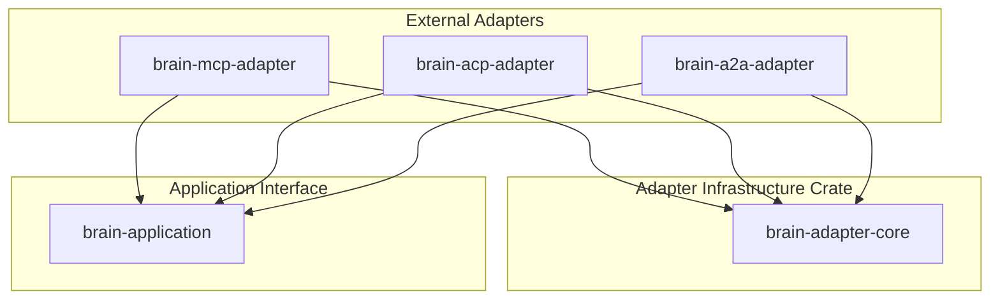

# ADR-023: Shared Adapter Infrastructure

## Status
Accepted

## Context
When building multiple external protocol adapters (MCP, ACP, and A2A), we observed semantic code duplication in the capability registration and type-erased dynamic dispatch routing logic. To ensure maintenance efficiency and prevent architectural drift, we needed to isolate shared adapter infrastructure without creating a compile-time dependency from the shared core back to the Brain application, services, or domain layers.

## Decision
We introduce a generic, zero-dependency shared adapter crate (`brain-adapter-core`) to act as the common framework for all external protocol adapters:

1.  **Pure Generic Abstraction**: The shared core has zero knowledge of Brain-specific structures (`BrainApplication`, `ExecutionContext`, `ApplicationError`). It parameterizes capability and registry interfaces using generics: `<Target, Context, Error>`.
2.  **Object Safety Isolation**: We keep capability semantics (`Capability`) distinct from runtime dynamic dispatch mechanics (`ErasedCapability` object safety wrappers). This enables future dispatch mechanism evolutions (e.g. static dispatch via enums/specialization) without breaking semantic contracts.
3.  **No Protocol or Application Leakage**:
    *   **What belongs inside**: Capability metadata traits, type-erased dynamic dispatch, and generic registry storage.
    *   **What must never belong inside**: JSON-RPC models, protocol DTOs, HTTP handlers, error/event mappers, transport lifecycles, and concrete Brain capability definitions/registrations.

### Crate Invariant
> [!IMPORTANT]
> `brain-adapter-core` intentionally contains no knowledge of Brain, MCP, ACP, A2A, REST, or any application-specific concepts.

### Dependency Flow

## Alternatives Considered
*   **Duplicate Registry Logic in Each Adapter**: Rejected. Maintaining duplicate type-erased dispatch boilerplate across MCP, ACP, and A2A adapters would make introducing future protocol adapters error-prone.
*   **Create a Shared Crate Depending on Brain**: Rejected. This would violate hexagonal bounds, turning the generic core infrastructure into an application-specific framework layer and increasing compile-time coupling.

## Related ADRs
*   [ADR-020 (Protocol Independence)](file:///Users/ritikpathania/Developer/PyCharm/brain/docs/architecture/adr/ADR-020-protocol-independence.md)
*   [ADR-021 (Stable Application Interface)](file:///Users/ritikpathania/Developer/PyCharm/brain/docs/architecture/adr/ADR-021-stable-application-interface.md)

## Expected Stability
Long-term.
