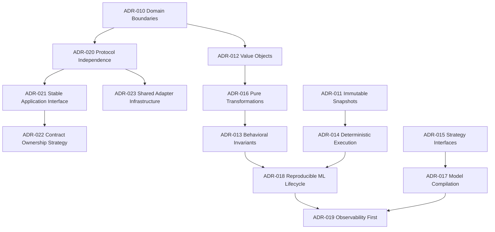

# Architecture Documentation

## Architecture Status
* **State**: Stable
* **Foundational ADRs**: Complete
* **Future Architectural Evolution**: Evidence-driven only
* **Primary Engineering Focus**: Building product capabilities

---

## Architectural Governance Hierarchy

Brain uses a top-down architectural governance model. New design proposals, features, or integrations must proceed through this validation chain:

```text
       PHILOSOPHY.md         (Root axioms: Why Brain exists and core invariants)
            │
            ▼
      STABILITY.md           (Policy boundaries: frozen vs. extensible modules)
            │
            ▼
     adr/ (ADR-XXX)          (Decisions: permanent structural patterns)
            │
            ▼
     rfc/ (RFC-XXX)          (Design specs: proposed changes under discussion)
            │
            ▼
     Implementation          (Code commits matching the design contract)
```

Start here to understand the structural design and guidelines:

* **[PHILOSOPHY.md](file:///Users/ritikpathania/Developer/PyCharm/brain/docs/architecture/PHILOSOPHY.md)** — Core design axioms, derived consequences, and architectural identity.
* **[STABILITY.md](file:///Users/ritikpathania/Developer/PyCharm/brain/docs/architecture/STABILITY.md)** — Stability contracts for frozen, extensible, and experimental code.
* **[overview.md](file:///Users/ritikpathania/Developer/PyCharm/brain/docs/architecture/overview.md)** — Canonical technical reference guide to the Brain runtime.
* **[contract-lifecycle.md](file:///Users/ritikpathania/Developer/PyCharm/brain/docs/architecture/contract-lifecycle.md)** — Explanation of the DTO contract lifecycle.
* **[GRAPH_SPEC.md](file:///Users/ritikpathania/Developer/PyCharm/brain/docs/architecture/GRAPH_SPEC.md)** — Specification governing the Knowledge Graph schema and constraints.
* **[relations.md](file:///Users/ritikpathania/Developer/PyCharm/brain/docs/architecture/relations.md)** — Canonical design specification for relationship semantics and the declarative taxonomy.


## Architectural Decision Records (ADRs)

The core architectural decisions are recorded chronologically in the **[adr/](file:///Users/ritikpathania/Developer/PyCharm/brain/docs/architecture/adr)** directory. They are categorized below by stability and focus.

### ADR Dependency Graph


### ADR Stability Index

### Foundational Invariants (Expected Stability: Long-term)
* **[ADR-004: In-Memory Event Bus](file:///Users/ritikpathania/Developer/PyCharm/brain/docs/architecture/adr/ADR-004.md)** (Accepted) — Establish single-process asynchronous pub-sub for decoupled subsystem events.
* **[ADR-009: BKF Representation](file:///Users/ritikpathania/Developer/PyCharm/brain/docs/architecture/adr/ADR-009.md)** (Accepted) — Canonical JSON-LD serialization for structured context interchange.
* **[ADR-010: Domain Boundaries](file:///Users/ritikpathania/Developer/PyCharm/brain/docs/architecture/adr/ADR-010-domain-boundaries.md)** (Accepted) — Isolates `brain-domain` rules from `brain-services` infrastructure.
* **[ADR-011: Immutable Snapshots](file:///Users/ritikpathania/Developer/PyCharm/brain/docs/architecture/adr/ADR-011-immutable-snapshots.md)** (Accepted) — Configs and weights snapshotting for thread-safety and auditability.
* **[ADR-012: Value Objects](file:///Users/ritikpathania/Developer/PyCharm/brain/docs/architecture/adr/ADR-012-value-objects.md)** (Accepted) — Wrap floats/strings in validated types to exclude illegal state representation.
* **[ADR-013: Behavioral Invariants](file:///Users/ritikpathania/Developer/PyCharm/brain/docs/architecture/adr/ADR-013-behavioral-invariants.md)** (Accepted) — Verify retrieval/routing invariants mathematically instead of end-to-end data matches.
* **[ADR-014: Deterministic Execution](file:///Users/ritikpathania/Developer/PyCharm/brain/docs/architecture/adr/ADR-014-deterministic-execution.md)** (Accepted) — Injecting clocks and stable hash algorithms (`FNV-1a`) to ensure reproducible runs.
* **[ADR-016: Pure Transformations](file:///Users/ritikpathania/Developer/PyCharm/brain/docs/architecture/adr/ADR-016-pure-transformation-pipelines.md)** (Accepted) — Restructuring execution loops to adhere to stateless `Input -> Transform -> Output` flows.
* **[ADR-020: Protocol Independence & Adapter Architecture](file:///Users/ritikpathania/Developer/PyCharm/brain/docs/architecture/adr/ADR-020-protocol-independence.md)** (Proposed) — Establishes strict hexagonal decoupling between Brain Runtime and external interfaces.
* **[ADR-021: Stable Application Interface](file:///Users/ritikpathania/Developer/PyCharm/brain/docs/architecture/adr/ADR-021-stable-application-interface.md)** (Proposed) — Defines the transport-neutral, capability-oriented application interface contract.
* **[ADR-022: Contract Ownership & DTO Generation Strategy](file:///Users/ritikpathania/Developer/PyCharm/brain/docs/architecture/adr/ADR-022-contract-ownership-strategy.md)** (Proposed) — Decides on Rust-first contract ownership and language-neutral type generation workflows.
* **[ADR-023: Shared Adapter Infrastructure](file:///Users/ritikpathania/Developer/PyCharm/brain/docs/architecture/adr/ADR-023-shared-adapter-infrastructure.md)** (Accepted) — Defines the generic, type-erased capability and registry infrastructure for protocol independence.

### Platform & Extensibility (Expected Stability: Medium to High)
* **[ADR-000: Plugin-Based Architecture](file:///Users/ritikpathania/Developer/PyCharm/brain/docs/architecture/adr/ADR-000.md)** (Accepted) — Define core providers as traits with offloaded blocking executor calls.
* **[ADR-002: GIL Redesign](file:///Users/ritikpathania/Developer/PyCharm/brain/docs/architecture/adr/ADR-002.md)** (Accepted) — GIL-releasing PyO3 boundaries for low-overhead Python execution.
* **[ADR-006: Retrieval Extension Philosophy](file:///Users/ritikpathania/Developer/PyCharm/brain/docs/architecture/adr/ADR-006.md)** (Accepted) — Two-path modularity rules freezing pipeline orchestration.
* **[ADR-015: Strategy Interfaces](file:///Users/ritikpathania/Developer/PyCharm/brain/docs/architecture/adr/ADR-015-strategy-interfaces.md)** (Accepted) — Decouples ranking models and routers behind trait interfaces.
* **[ADR-017: Model Compilation](file:///Users/ritikpathania/Developer/PyCharm/brain/docs/architecture/adr/ADR-017-model-compilation.md)** (Accepted) — Decouples serializable models from optimized compiled evaluation trees.
* **[ADR-024: IVF Vector Indexing](file:///Users/ritikpathania/Developer/PyCharm/brain/docs/architecture/adr/ADR-024-ivf-vector-indexing.md)** (Accepted) — Establish deterministic inverted file clustering for sub-linear similarity search in SQLite.
* **[ADR-025: Hybrid Retrieval Architecture](file:///Users/ritikpathania/Developer/PyCharm/brain/docs/architecture/adr/ADR-025-hybrid-retrieval-architecture.md)** (Proposed) — Defines independent channels and reciprocal rank fusion (RRF) for hybrid retrieval.

### Operational Lifecycle (Expected Stability: Evolutionary)
* **[ADR-007: Streaming API Stability](file:///Users/ritikpathania/Developer/PyCharm/brain/docs/architecture/adr/ADR-007.md)** (Accepted) — Stability contract for client typewriter network event loops.
* **[ADR-018: Reproducible ML Lifecycle](file:///Users/ritikpathania/Developer/PyCharm/brain/docs/architecture/adr/ADR-018-reproducible-ml-lifecycle.md)** (Proposed) — Defines promotional checkpoints from feedback and evaluation to canary routing.
* **[ADR-019: Observability First](file:///Users/ritikpathania/Developer/PyCharm/brain/docs/architecture/adr/ADR-019-observability-first.md)** (Proposed) — Codifying diagnostic reporting, telemetry tracking, and evaluations as core system capabilities.

### Historical Evolutionary Decisions
* **[ADR-001: Native Rust TUI UI](file:///Users/ritikpathania/Developer/PyCharm/brain/docs/architecture/adr/ADR-001.md)** (Accepted) — Replaced react-ink/bun processes with in-process Thread-isolated Ratatui components.
* **[ADR-003: Deletion of DuckDB OLAP](file:///Users/ritikpathania/Developer/PyCharm/brain/docs/architecture/adr/ADR-003.md)** (Accepted) — Removed DuckDB synchronizations to reduce deployment latency.
* **[ADR-005: Event Bus Refinements](file:///Users/ritikpathania/Developer/PyCharm/brain/docs/architecture/adr/ADR-005.md)** (Accepted) — Cleaned event schemas for client network synchronization.
* **[ADR-008: Python Plugin Isolation](file:///Users/ritikpathania/Developer/PyCharm/brain/docs/architecture/adr/ADR-008.md)** (Accepted) — Standardizes virtual environment setups via `uv`.

## Specifications

The design RFCs and proposals are tracked in the **[rfc/](file:///Users/ritikpathania/Developer/PyCharm/brain/docs/architecture/rfc)** directory. 

### RFC Lifecycle

Every RFC proceeds through a structured lifecycle to trace its validation from abstract design to verified code:

| Status | Meaning |
| :--- | :--- |
| **Draft** | Initial proposal under active creation. |
| **Proposed** | Formally submitted and open for architectural discussion. |
| **Accepted** | Approved design and core contract guidelines. |
| **Implementing** | Engineering work is currently active. |
| **Implemented** | Core code features are committed to the codebase. |
| **Verified** | Invariants validated via **Architectural Fitness Tests**. |
| **Superseded** | Replaced or retired by a newer RFC. |

---

### Active Specifications Index

* **[RFC-007: Active Workspace](file:///Users/ritikpathania/Developer/PyCharm/brain/docs/architecture/rfc/RFC-007.md)** (Implemented) — Formalizes working sets and workspace boundaries inside the memory engine and TUI.
* **[RFC-008: Projection Architecture](file:///Users/ritikpathania/Developer/PyCharm/brain/docs/architecture/rfc/RFC-008.md)** (Implemented) — Defines projection models, read-only lifecycle states, caching metrics, and service-boundary generator interfaces.
* **[RFC-009: Runtime Event & Progress Model](file:///Users/ritikpathania/Developer/PyCharm/brain/docs/architecture/rfc/RFC-009.md)** (Implemented) — Establishes how the runtime communicates changes and background task stages over UDS to client adapters.
* **[RFC-010: Canonical Knowledge Evolution](file:///Users/ritikpathania/Developer/PyCharm/brain/docs/architecture/rfc/RFC-010.md)** (Implemented) — Defines how raw observations validate, canonicalize, and semantically enrich the canonical knowledge graph.
