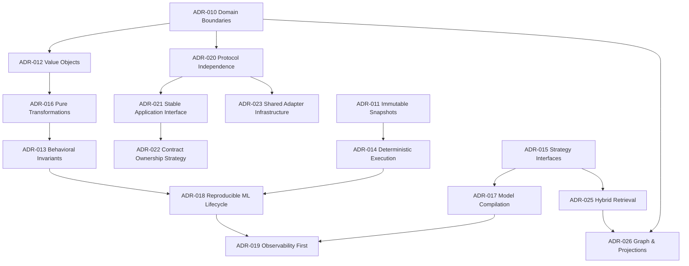

# Architecture Documentation

## Architecture Status
* **State**: Stable
* **Foundational ADRs**: Complete
* **Future Architectural Evolution**: Evidence-driven only (requires an ADR under the Architecture Freeze)
* **Primary Engineering Focus**: Building product capabilities

---

## Architectural Governance Hierarchy

Brain uses a top-down architectural governance model. New design proposals, features, or integrations must proceed through this validation chain:

```text
       PHILOSOPHY.md         (Root axioms: Why Brain exists and core invariants)
            │
            ▼
      STABILITY.md           (Policy boundaries: frozen vs. extensible modules)
            │
            ▼
      principles.md          (Enduring rules of the system architecture)
            │
            ▼
      adr/ (ADR-XXX)          (Decisions: permanent structural patterns)
            │
            ▼
      Implementation          (Code commits matching the design contract)
```

Start here to understand the structural design and guidelines:

* **[CONSTITUTION.md](CONSTITUTION.md)** — Frozen normative baseline, 3 axioms, and 4-layer dependency model.
* **[PHILOSOPHY.md](PHILOSOPHY.md)** — Core design axioms, derived consequences, and architectural identity.
* **[STABILITY.md](STABILITY.md)** — Stability contracts for frozen, extensible, and experimental code.
* **[ARCHITECTURE_INVARIANTS.md](ARCHITECTURE_INVARIANTS.md)** — Foundational testable engineering invariants.
* **[GOVERNANCE.md](GOVERNANCE.md)** — Architectural governance policy and change procedures.
* **[SPECIFICATION.md](SPECIFICATION.md)** — Versioned system reference specification.
* **[GLOSSARY.md](GLOSSARY.md)** — System glossary and domain vocabulary definitions.
* **[FITNESS_TESTS.md](FITNESS_TESTS.md)** — Automated fitness test specification.
* **[STABLE_UI_INVARIANTS.md](STABLE_UI_INVARIANTS.md)** — TUI structural invariants.
* **[compatibility_policy.md](compatibility_policy.md)** — Versioning and compatibility matrix.
* **[execution_platform_governance.md](execution_platform_governance.md)** — Execution platform governance rules.
* **[runtime_api_stability.md](runtime_api_stability.md)** — API stability contract classification.
* **[overview.md](overview.md)** — Canonical technical reference guide to the Brain runtime.
* **[data-flow.md](data-flow.md)** — Documentation of internal data pathways, layers, and component execution sequence diagrams.
* **[principles.md](principles.md)** — Enduring rules of the system architecture.
* **[contract-lifecycle.md](contract-lifecycle.md)** — Explanation of the DTO contract lifecycle.
* **[GRAPH_SPEC.md](GRAPH_SPEC.md)** — Specification governing the Knowledge Graph schema and constraints.
* **[relations.md](relations.md)** — Canonical design specification for relationship semantics and the declarative taxonomy.
* **[rfc/](rfc/README.md)** — Requests for Comments (RFC-001 to RFC-012).

---

## Architectural Decision Records (ADRs)

The core architectural decisions are recorded chronologically in the **[adr/](adr)** directory.

### ADR Dependency Graph


### ADR Stability Index

### Foundational Invariants (Expected Stability: Long-term)
* **[ADR-001: Knowledge Runtime Evolution Model](adr/ADR-001-knowledge-runtime-evolution-model.md)** (Accepted) — Invariants governing identity, provenance monotonicity, and reflection purity.
* **[ADR-010: Domain Boundaries](adr/ADR-010-domain-boundaries.md)** (Accepted) — Isolates `brain-domain` rules from `brain-services` infrastructure.
* **[ADR-011: Immutable Snapshots](adr/ADR-011-immutable-snapshots.md)** (Accepted) — Configs and weights snapshotting for thread-safety and auditability.
* **[ADR-012: Value Objects](adr/ADR-012-value-objects.md)** (Accepted) — Wrap floats/strings in validated types to exclude illegal state representation.
* **[ADR-013: Behavioral Invariants](adr/ADR-013-behavioral-invariants.md)** (Accepted) — Verify retrieval/routing invariants mathematically instead of end-to-end data matches.
* **[ADR-014: Deterministic Execution](adr/ADR-014-deterministic-execution.md)** (Accepted) — Injecting clocks and stable hash algorithms (`FNV-1a`) to ensure reproducible runs.
* **[ADR-016: Pure Transformations](adr/ADR-016-pure-transformation-pipelines.md)** (Accepted) — Restructuring execution loops to adhere to stateless `Input -> Transform -> Output` flows.
* **[ADR-020: Protocol Independence & Adapter Architecture](adr/ADR-020-protocol-independence.md)** (Proposed) — Establishes strict hexagonal decoupling between Brain Runtime and external interfaces.
* **[ADR-021: Stable Application Interface](adr/ADR-021-stable-application-interface.md)** (Proposed) — Defines the transport-neutral, capability-oriented application interface contract.
* **[ADR-022: Contract Ownership & DTO Generation Strategy](adr/ADR-022-contract-ownership-strategy.md)** (Proposed) — Decides on Rust-first contract ownership and language-neutral type generation workflows.
* **[ADR-023: Shared Adapter Infrastructure](adr/ADR-023-shared-adapter-infrastructure.md)** (Accepted) — Defines the generic, type-erased capability and registry infrastructure for protocol independence.

### Platform & Extensibility (Expected Stability: Medium to High)
* **[ADR-015: Strategy Interfaces](adr/ADR-015-strategy-interfaces.md)** (Accepted) — Decouples ranking models and routers behind trait interfaces.
* **[ADR-017: Model Compilation](adr/ADR-017-model-compilation.md)** (Accepted) — Decouples serializable models from optimized compiled evaluation trees.
* **[ADR-024: IVF Vector Indexing](adr/ADR-024-ivf-vector-indexing.md)** (Accepted) — Establish deterministic inverted file clustering for sub-linear similarity search in SQLite.
* **[ADR-025: Hybrid Retrieval Architecture](adr/ADR-025-hybrid-retrieval-architecture.md)** (Accepted) — Defines independent channels and reciprocal rank fusion (RRF) for hybrid retrieval.
* **[ADR-026: Graph and Projection Capabilities](adr/ADR-026-graph-and-projection-capabilities.md)** (Accepted) — Outlines design invariants for request-scoped graph retrieval, relationship expansion DTOs, and graph/temporal projection view models.

### Operational Lifecycle (Expected Stability: Evolutionary)
* **[ADR-018: Reproducible ML Lifecycle](adr/ADR-018-reproducible-ml-lifecycle.md)** (Proposed) — Defines promotional checkpoints from feedback and evaluation to canary routing.
* **[ADR-019: Observability First](adr/ADR-019-observability-first.md)** (Proposed) — Codifying diagnostic reporting, telemetry tracking, and evaluations as core system capabilities.
