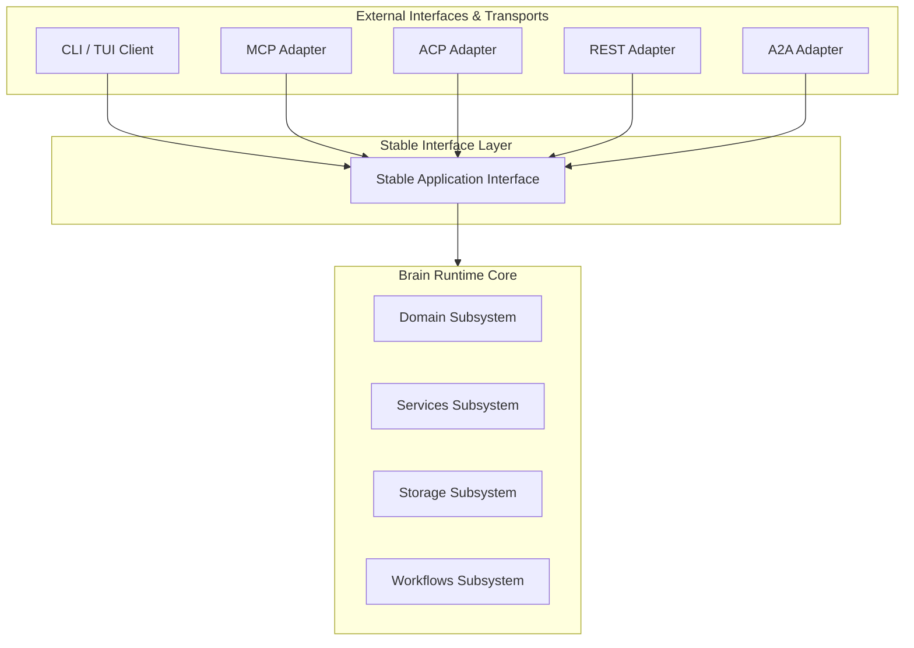

# ADR-020: Protocol Independence & Adapter Architecture

## Status
Proposed

## Context
Brain is a terminal-first, local-first knowledge engine. However, in the future, it must also be consumed by various external systems (such as MCP, ACP, A2A, and REST). Introducing protocol-specific concerns directly into the core runtime would pollute the domain model, make maintenance difficult, and create tight coupling to transient external standards.

## Decision
We enforce strict protocol independence using a clean hexagonal (ports & adapters) architecture:

1. **Protocol-Agnostic Core**: The core Brain Runtime (including domain, services, storage, etc.) remains entirely protocol-neutral and has zero knowledge of MCP, ACP, A2A, REST, HTTP, or WebSocket.
2. **Stable Application Interface**: We define a stable internal application interface that serves as the singular entry point for all operations.
   > [!NOTE]
   > The Stable Application Interface is an architectural concept. Its eventual implementation (crate, module, or facade) is intentionally left unspecified.
3. **Protocol Translation Layer**: External integrations exist solely to translate between external protocols and the stable internal application interface:
   * Validate incoming external requests.
   * Translate external DTOs into stable internal commands/requests.
   * Invoke the stable application interface.
   * Translate output responses back into external DTOs.
4. **Adapter Replaceability**: Any external interface (CLI, TUI, MCP, ACP, REST, A2A, SDKs) may be added, removed, or replaced without requiring changes to the Brain Runtime.

### Dependency Flow

## Alternatives Considered
* **Embedding MCP/REST directly into daemon server**: Rejected as it pollutes the core codebase with HTTP/JSON-RPC/Websocket protocol parsing and networking logic.
* **Direct Subsystem Access**: Allowing adapters to depend directly on internal service classes. Rejected as this exposes deep internal details and makes updating core services high-risk.

## Related ADRs
* [ADR-010 (Domain Boundaries)](ADR-010-domain-boundaries.md)
* [ADR-015 (Strategy Interfaces)](ADR-015-strategy-interfaces.md)

## Expected Stability
Long-term.
