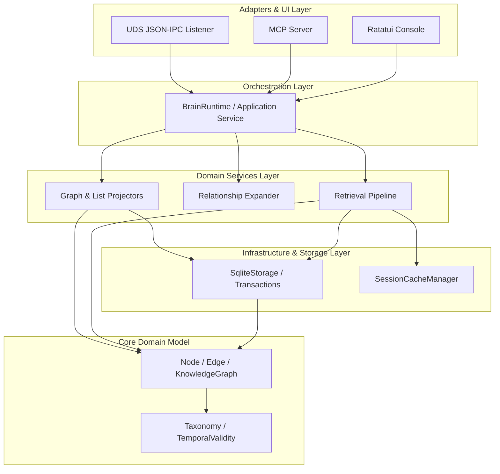
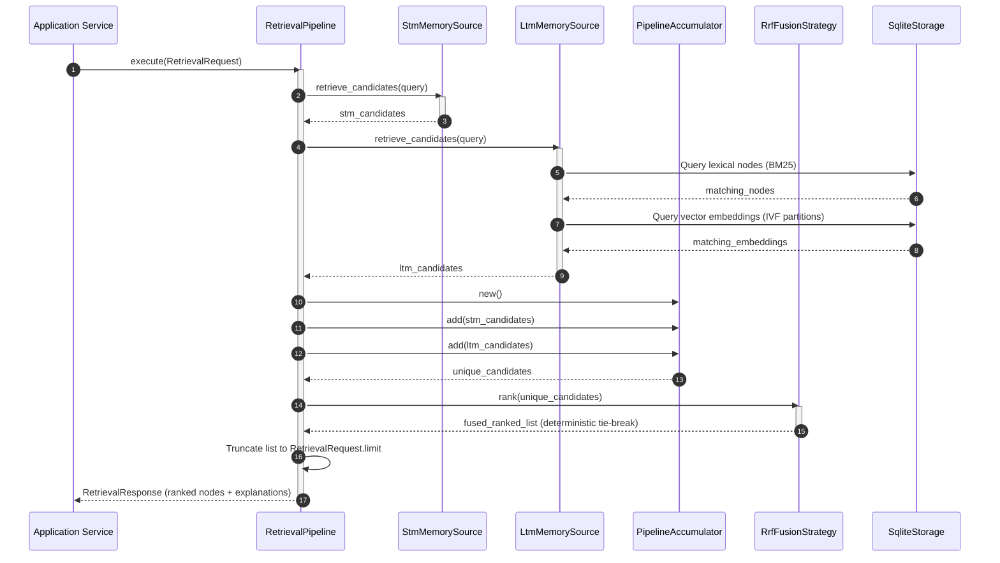
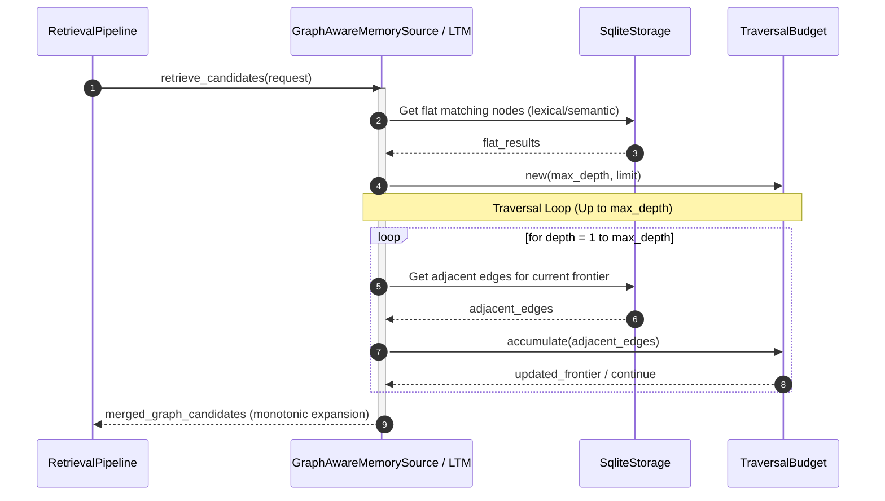
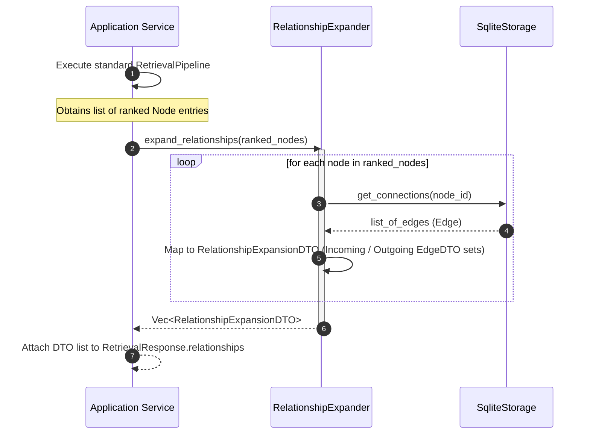
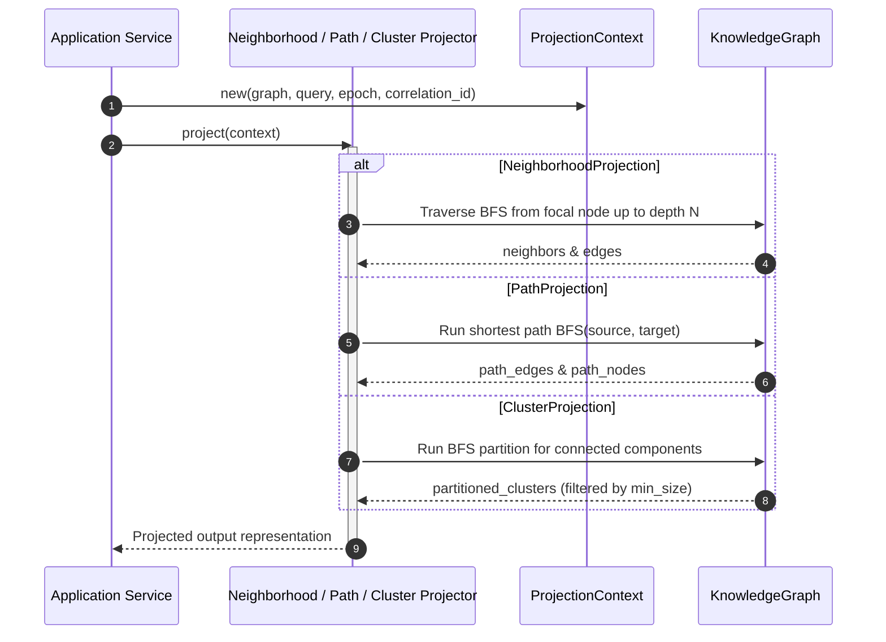

# Data Flow and Sequences

This document provides a canonical reference for the internal data flow, layers, components, and execution sequences in the Brain Relational Memory Engine as of v0.8.

---

## 1. Architectural Layers and Data Flow

The system is designed around a clean Domain-Driven Design (DDD) model, separating protocols, services, and pure domain rules. Data flows top-down, and dependencies point strictly inward.



---

## 2. Pipeline Component Topology

The retrieval engine processes search requests through a modular multi-stage pipeline. The stage boundaries are strictly enforced:

```mermaid
flowchart LR
    Request([RetrievalRequest]) --> Stage1[Stage 1: Normalization]
    Stage1 --> Stage2[Stage 2: Candidate Retrieval]
    
    subgraph Sources [Memory Sources]
        Stm[StmMemorySource]
        Ltm[LtmMemorySource]
    end
    
    Stage2 --- Sources
    Sources --> Accumulator[PipelineAccumulator]
    Accumulator --> Stage3[Stage 3: Fusion / Ranking]
    
    subgraph Fuser [Ranking / Fusion Strategies]
        RRF[RrfFusionStrategy]
        Decay[Temporal Decay / Ranker]
    end
    
    Stage3 --- Fuser
    Fuser --> Stage4[Stage 4: Truncation]
    Stage4 --> Stage5([RetrievalResponse])
    
    Stage5 --> Expander[Relationship Expander (Opt-In)]
    Expander --> Projector[Projectors (Outside Pipeline)]
```

---

## 3. Sequence Diagrams

### A. Standard Retrieval Sequence

Below is the execution flow for a standard lexical and vector query:



---

### B. Graph-Aware Retrieval Sequence (N-Hop Traversal)

When `graph_depth` is set to `Some(n)`, memory sources perform a BFS graph traversal starting from the direct query matches to include neighbor context:



---

### C. Relationship Expansion Sequence

When `expand_relations` is set to `true`, a post-pipeline processor maps candidate nodes to their first-order edges:



---

### D. Graph Projection Sequence

Read models evaluate projections on-demand outside of the retrieval pipeline:


