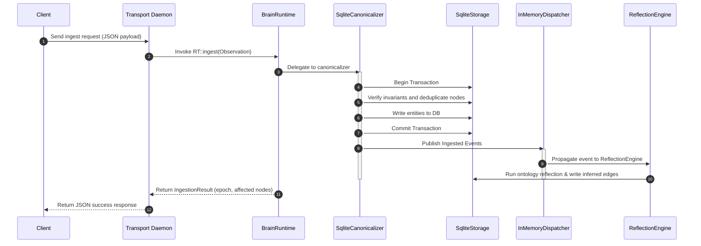
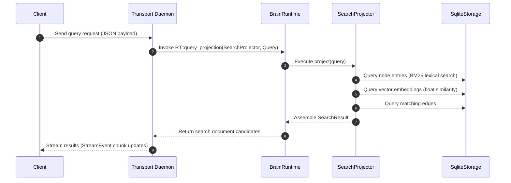

# Architecture Overview

This document provides a detailed breakdown of the active architecture of the Brain Relational Memory Engine, detailing the core components, their lifecycles, and transaction flows.

---

## 1. System Topology

The platform operates as a decoupled client-server system communicating over a low-overhead Unix Domain Socket (UDS) JSON-IPC wire protocol:

```text
  ┌─────────────────────────────────┐
  │           Ratatui TUI           │ (Interactive Console Client)
  └────────────────┬────────────────┘
                   │
                   │ Unix Domain Socket (UDS) JSON-IPC
                   ▼
  ┌─────────────────────────────────┐
  │        Transport Daemon         │ (Stateless socket listener)
  └────────────────┬────────────────┘
                   │
                   │ In-Memory Rust Calls
                   ▼
  ┌─────────────────────────────────┐
  │          BrainRuntime           │ (Authoritative Composition Root)
  │                                 │
  │  ┌───────────────────────────┐  │
  │  │      SearchProjector      │  │ (Lexical & Vector Projection)
  │  └───────────────────────────┘  │
  │  ┌───────────────────────────┐  │
  │  │   InMemoryDispatcher      │  │ (Synchronous Event Bus)
  │  └───────────────────────────┘  │
  │  ┌───────────────────────────┐  │
  │  │       SqliteStorage       │  │ (Durable Transaction Backend)
  │  └───────────────────────────┘  │
  └─────────────────────────────────┘
```

---

## 2. Core Components

### BrainRuntime
`BrainRuntime` is the authoritative composition root and lifecycle owner of the relational memory engine. It exposes clean boundaries:
- `ingest(obs)`: Authoritative write pathway. Coordinates validation, canonicalization, and relationship reflection transactionally.
- `query_projection(projector, query, correlation_id)`: Authoritative read pathway. Generates materializations of the knowledge graph on-demand.
- `subscribe()`: Allows external observers to listen to the runtime event stream.
- `shutdown()`: Flushes event queues, terminates background threads, and closes database connections.

### SqliteStorage
Located in `brain-storage` crate, `SqliteStorage` manages the durable transaction engine. It exposes the transaction boundaries using a pool of connections and ensures ACID compliance.

### SearchProjector & MemoryListProjection
Located in `brain-services`, these represent native read-model projections.
- `SearchProjector` implements lexical matching (BM25) and semantic vector similarity nearest-neighbors queries against SQLite, returning pure domain-level documents.

### InMemoryEventDispatcher
A synchronous event bus providing in-order event propagation. When the database transaction commits, events (such as `ObservationCanonicalized`) are published to the dispatcher, which routes them to synchronous and asynchronous observers (e.g. reflection engine).

---

## 3. Ingestion Lifecycle (Write Path)

Every ingested observation is processed synchronously inside a single SQLite transaction to preserve strict database invariants:



---

## 4. Query Lifecycle (Read Path)

Read queries are routed on-demand through the `SearchProjector` projection:



---

## 5. Observability & Telemetry

Operational auditing is instrumented directly within the engine:
- **Metrics**: Runtime execution counts, average canonicalization/reflection/dispatch stage latencies, and total operations are tracked via lock-free atomics in `RuntimeMetrics`.
- **Diagnostics**: A FIFO ring-buffer retains the 50 most recent operational failures, inspectable via `RuntimeDiagnostics` at any time.
