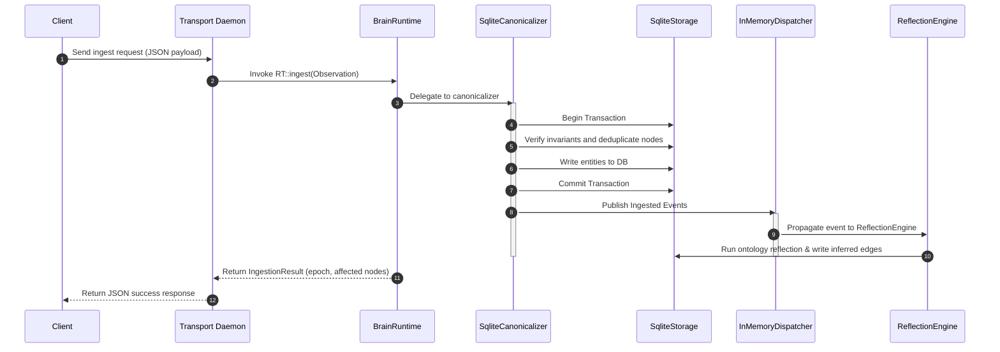
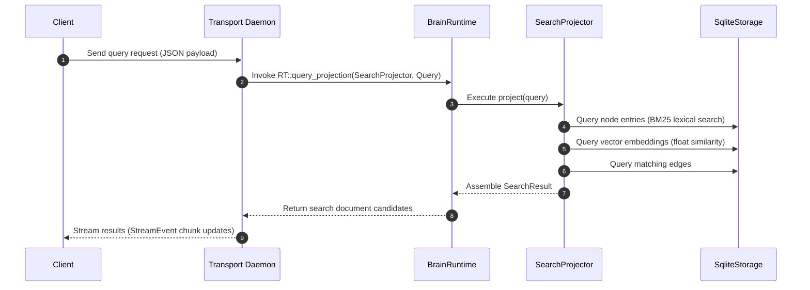
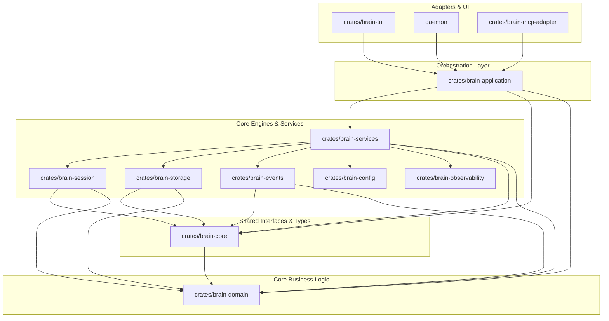

# Architecture Overview

This document provides a detailed breakdown of the active architecture of the Brain Relational Memory Engine, detailing the core components, their lifecycles, transaction flows, and architectural invariants.

---

## 1. System Topology

The platform operates as a decoupled client-server system communicating over a low-overhead Unix Domain Socket (UDS) JSON-IPC wire protocol:

```text
  ┌─────────────────────────────────┐
  │           Ratatui TUI           │ (Interactive Console Client)
  └────────────────┬────────────────┘
                   │
                   │ Unix Domain Socket (UDS) JSON-IPC
                   ▼
  ┌─────────────────────────────────┐
  │        Transport Daemon         │ (Stateless socket listener)
  └────────────────┬────────────────┘
                   │
                   │ In-Memory Rust Calls
                   ▼
  ┌─────────────────────────────────┐
  │          BrainRuntime           │ (Authoritative Composition Root)
  │                                 │
  │  ┌───────────────────────────┐  │
  │  │      SearchProjector      │  │ (Lexical & Vector Projection)
  │  └───────────────────────────┘  │
  │  ┌───────────────────────────┐  │
  │  │   InMemoryDispatcher      │  │ (Synchronous Event Bus)
  │  └───────────────────────────┘  │
  │  ┌───────────────────────────┐  │
  │  │       SqliteStorage       │  │ (Durable Transaction Backend)
  │  └───────────────────────────┘  │
  └─────────────────────────────────┘
```

---

## 2. Core Components

### BrainRuntime
`BrainRuntime` is the authoritative composition root and lifecycle owner of the relational memory engine. It exposes clean boundaries:
- `ingest(obs)`: Authoritative write pathway. Coordinates validation, canonicalization, and relationship reflection transactionally.
- `query_projection(projector, query, correlation_id)`: Authoritative read pathway. Generates materializations of the knowledge graph on-demand.
- `subscribe()`: Allows external observers to listen to the runtime event stream.
- `shutdown()`: Flushes event queues, terminates background threads, and closes database connections.

### SqliteStorage
Located in the `brain-storage` crate, `SqliteStorage` manages the durable transaction engine. It exposes transaction boundaries using a pool of connections and ensures ACID compliance.

### SearchProjector & MemoryListProjection
Located in `brain-services`, these represent native read-model projections.
- `SearchProjector` implements lexical matching (BM25) and semantic vector similarity nearest-neighbors queries against SQLite, returning pure domain-level documents.

### InMemoryEventDispatcher
A synchronous event bus providing in-order event propagation. When the database transaction commits, events (such as `ObservationCanonicalized`) are published to the dispatcher, which routes them to synchronous and asynchronous observers (e.g., the reflection engine).

---

## 3. Ingestion Lifecycle (Write Path)

Every ingested observation is processed synchronously inside a single SQLite transaction to preserve strict database invariants:



---

## 4. Query Lifecycle (Read Path)

Read queries are routed on-demand through the `SearchProjector` projection:



---

## 5. Module Dependency Topology

Brain utilizes a strict layered hierarchy enforced by build-time architectural boundary tests in `brain-arch-tests`:



---

## 6. Public API Overview

The external surface of the memory service is defined by decoupled core schemas and projection traits:

### Retrieval Contracts
- `RetrievalRequest`: Parameters mapping query search criteria.
  - `query: String` — Search keywords or natural language.
  - `limit: usize` — Result cap.
  - `exclude_ids: HashSet<NodeId>` — Set of nodes to omit.
  - `explain: bool` — Request generation of diagnostic scores/traces.
  - `graph_depth: Option<usize>` — Number of hops to traverse (None = 1-hop default, Some(0) = flat retrieval).
  - `expand_relations: bool` — Request mapping of node edges.
- `RetrievalResponse`: Results structure.
  - `nodes: Vec<Node>` — Output list.
  - `explanation: Option<RetrievalExplanation>` — Diagnostics populated if `explain: true`.
  - `relationships: Option<Vec<RelationshipExpansionDTO>>` — Relationship contexts populated if `expand_relations: true`.

### Read Models & Projections
- `Projector<Output, Query>`: Core trait for processing queries against a graph snapshot.
- Native Projector Implementations:
  - `SearchProjector`: Lexical and vector search matching.
  - `NeighborhoodProjector`: Extraction of N-hop subgraphs.
  - `PathProjector`: BFS shortest path between nodes.
  - `ClusterProjector`: Deterministic connected component partitioning.
  - `TemporalProjector`: Static projection utility for retrieving historical graph states.

---

## 7. Architectural Invariants

The system maintains strict architectural guarantees that govern runtime execution and prevent code decay:

- **Retrieval remains deterministic**: For any given graph state and query, the candidate ranking and scoring result is identical and reproducible across repeated runs.
- **RRF is the sole production fusion strategy**: Reciprocal Rank Fusion serves as the definitive merging mechanism for lexical and vector query channels.
- **Projection never mutates retrieval results**: Projectors operate strictly as read models, evaluating in-memory data structures without writing to the database or updating retrieval pipeline state.
- **Relationship expansion is optional and post-retrieval**: Relational enrichment happens as a non-intrusive DTO mapping stage after candidate truncation, avoiding additional candidate search overhead.
- **Domain entities never cross service boundaries**: Services communicate with external clients exclusively via DTO models (`MemoryDTO`, `RelationshipExpansionDTO`), isolating core domain entities like `Edge` and `Node` within the domain/services layer.
- **RetrievalRequest defaults preserve backward compatibility**: Constructing a request with default parameters (`graph_depth: None`, `expand_relations: false`, `explain: false`) yields behavior identical to the original v0.7 engine.
- **Graph traversal is request-scoped**: The depth of graph traversal is passed per request, allowing dynamic configuration rather than static, global limits.
- **Temporal projection is separate from temporal ranking**: Bounded time queries ("graph at T") are isolated as projection models, distinct from recency decay scoring logic.

---

## 8. Observability & Telemetry

Operational auditing is instrumented directly within the engine:
- **Metrics**: Runtime execution counts, average canonicalization/reflection/dispatch stage latencies, and total operations are tracked via lock-free atomics in `RuntimeMetrics`.
- **Diagnostics**: A FIFO ring-buffer retains the 50 most recent operational failures, inspectable via `RuntimeDiagnostics` at any time.
