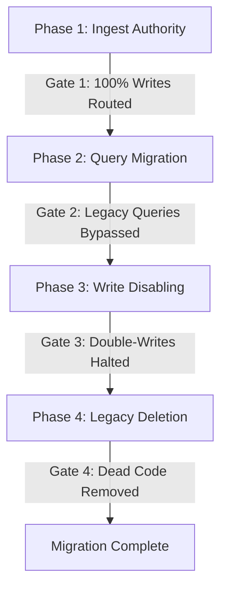

# Sprint 11 — Runtime Authority & Migration Design

This document formalizes the architectural transition of the memory engine, moving from duplicated ingestion paths to making `BrainRuntime` the sole authoritative knowledge engine.

---

## 1. Architectural Decision Record (ADR): Runtime Authority

### Status
Accepted (Sprint 11)

### Context & Problem
Currently, the system maintains two parallel ingestion and retrieval systems:
1. The **Legacy In-Memory Path**: A volatile Short-Term Memory (STM) sliding window and a simple index hosted inside the daemon process state.
2. The **BrainRuntime Path**: A durable, transactional, and semantically aligned relational memory engine.

This duplication causes split data ownership, increases memory usage, complicates host integrations (since every host has to talk to both interfaces), and leads to inconsistent query results.

### Decision
`BrainRuntime` is established as the sole authoritative runtime of the system. All hosts (Daemon, SDKs, MCP, CLI) will interact with `BrainRuntime` as the single source of truth for both writes and reads.

### Ownership vs. Implementation Boundary

| Concern | Owner | Responsibility |
| :--- | :--- | :--- |
| **Ingestion** | `BrainRuntime` | Structural/semantic validation, hashing, and event pipeline execution. |
| **Persistence** | `BrainRuntime` | Safe storage, ACID transaction scopes, and schema migrations. |
| **Projections** | `BrainRuntime` | Search indexes (FTS5), vector indexes, and retrieval queries. |
| **Transport** | Host adapters | Handling network boundaries (UDS sockets, HTTP JSON, MCP, standard IO). |
| **Process Lifecycle**| Host daemon | Process initialization, SIGTERM/SIGWINCH signal handling, and runtime startup/shutdown coordination. |
| **Configuration** | Host daemon | Parsing command-line args, env variables, or config files and passing them into the runtime. |

### Consequences
- **Decoupling**: The daemon ceases to manage graph state or in-memory indexes directly; it becomes a thin host.
- **Durable Parity**: The performance parity metric with the legacy path is retired. Instead, the runtime is held to an operational budget target (average latency $< 1.5$ms under a `NORMAL` synchronous policy).
- **Complexity**: Host orchestration is simplified; data duplication is eliminated.

---

## 2. Migration Invariants & Readiness Gates

### Migration Invariants
The migration process must adhere to these absolute correctness rules during all phases:

| Invariant | Reason |
| :--- | :--- |
| **One Authoritative Writer** | Prevent divergent database and cache states; only one engine must decide epoch sequencing. |
| **One Authoritative Query Path** | Eliminate inconsistent reads; clients must never retrieve data from conflicting state versions. |
| **No Duplicated Persistence** | Remove split ownership; data must only write to one authoritative database. |
| **Rollback Compatibility** | Rollback to the previous phase must be possible without data loss until the final phase is completed. |

---

### Migration Readiness Gates (Exit Criteria)



| Phase | Description | Exit Criteria (Gate) |
| :--- | :--- | :--- |
| **Phase 1: Ingest Authority** | Ingestion requests route through `BrainRuntime::ingest`. Legacy double-writing is maintained for safety, but runtime persistence is primary. | **Gate 1**: 100% of write paths flow through `BrainRuntime`, and verification checks show identical graph structures. |
| **Phase 2: Query Migration** | Re-route host queries to retrieve from `BrainRuntime` projections (`query_projection`). | **Gate 2**: No read or query requests hit the legacy in-memory cache/index in production. |
| **Phase 3: Write Disabling** | Stop double-writing to legacy STM cache/index. | **Gate 3**: The legacy writing path is disabled and bypassed at the handler level. |
| **Phase 4: Legacy Deletion** | Clean up dead code, test structures, and modules. | **Gate 4**: Legacy structs are deleted, and full test suites pass cleanly. |

---

## 3. Migration Scope, Risks, & Deferred Decisions

### Non-Goals
To control risk and execution time, the following goals are explicitly out of scope for the migration:
- **No Protocol Redesign**: UDS socket message structures and JSON schemas will remain unchanged.
- **No Storage Engine Replacement**: The SQLite storage backend is retained.
- **No Performance Optimization**: No further code changes to timing, caching, or execution stages.
- **No Public API Changes**: The external client interface remains stable.
- **No Feature Additions**: No new capabilities or traits are introduced.

---

### Risk Register

| Risk | Impact | Mitigation Strategy |
| :--- | :--- | :--- |
| **Behavioral Regressions** | High | Run automated regression test suites comparing `BrainRuntime` and legacy results before cutover. |
| **Hidden Legacy Dependencies** | Medium | Utilize compile-time removal checks and test harnesses to identify missing links. |
| **Data Ownership Ambiguity** | Low | The ADR clearly establishes `BrainRuntime` as the sole authority. |
| **Rollback Complexity** | Medium | Maintain schema compatibility and rollback capability until Phase 4 (Deletion) is reached. |

---

### Deferred Decisions
The following architectural choices are intentionally postponed:
- **Distributed Storage**: Evaluating how multiple replica storage affects the runtime boundary is deferred.
- **Storage Backends**: Querying multiple databases (vector, document) in parallel is deferred.
- **Configurable Reflection**: Support for executing ontological rules asynchronously under different policies is deferred.

---

## 4. End-State Architecture & Component Categorization

### Target Decoupled Architecture

```text
               Clients
                  │
                  ▼
            Host Adapters
    (UDS / HTTP / MCP / SDK / CLI)
                  │
                  ▼
            BrainDaemon
  (Thin Host: Lifecycle & Transport)
                  │
                  ▼
             BrainRuntime
                  │
     ┌────────────┴────────────┐
     │                         │
  Storage                 Projections
(SQLite DB)            (Search / Vector)
     │                         │
     ▼                         ▼
Reflection             Event Dispatcher
 (Ontario)             (Notifications)
```

---

### Component Categorization Checklist

| Component | Target Location | Categorization | Action Required |
| :--- | :--- | :--- | :--- |
| **`daemon/src/stm.rs`** | - | ❌ Scheduled for Removal | Remove the in-memory context and token index. |
| **`crates/brain-storage`** | `crates/brain-storage` |  Retained | Keep as the database connection and statement caching layer. |
| **`sqlite_evolution.rs`** | `crates/brain-services` |  Retained | Keep as the canonicalization pipeline. |
| **`brain_runtime.rs`** | `crates/brain-services` |  Retained / Promoted | Promote to the sole coordinator for ingestion and query execution. |
| **`daemon/src/server/handlers.rs`** | `daemon/src/server/handlers.rs` | ⚠️ Migrated | Update UDS handlers to route all queries and writes to `BrainRuntime`. |
