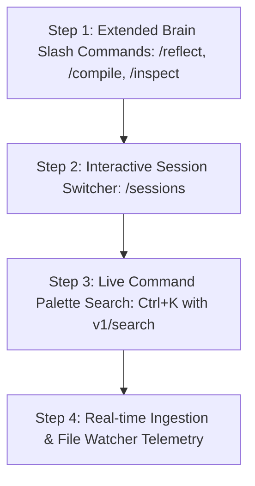

# Brain Product Capability Roadmap & Inventory

> **Document Status**: Strategic Architecture & Capability Planning (Pre-Implementation)  
> **Presentation Baseline**: `🔒 FROZEN FRONTEND INFRASTRUCTURE` (React 18 + Ink 5 + Yoga)  
> **Backend Baseline**: `brain-domain`, `brain-services`, `brain-storage`, `brain-tools`, `daemon`  
> **Author**: Antigravity AI  
> **Date**: 2026-08-14  

---

```text
================================================================================
BRAIN PRODUCT CAPABILITY ROADMAP
================================================================================
BASELINE STATUS: Frontend Frozen & Production Certified (77/77 tests, 22/22 flows)
OBJECTIVE: Map & prioritize high-value Brain product capabilities exposed via the frontend
ARCHITECTURE RULE: Zero changes to frozen presentation shell (components/**, types/**)
================================================================================
```

---

## 1. Current Capability Inventory

| Subsystem | Existing Capability in Rust Backend | Exposed in Production Frontend | Status |
|---|---|---|---|
| **Query & Reasoning** | Agentic loop, LLM prompt generation, reasoning stages | Streamed token rendering, live thinking duration blocks | **Fully Exposed** |
| **Tool Execution** | Tool call planning, execution, verification | Interactive tool cards, `y`/`Enter` approval, `n`/`Esc` denial | **Fully Exposed** |
| **Session Management** | Multi-turn persistence, SQLite session/messages storage | Startup restoration, session switching, ordering preservation | **Fully Exposed** |
| **Workspace & Memory Status** | Working directory tracking, index active flags | Header title, status bar `daemon:connected | memory:active` | **Fully Exposed** |
| **Slash Commands** | None (pure daemon endpoints) | `/help`, `/status`, `/config`, `/clear`, `/exit` | **Fully Exposed** |
| **Hybrid Retrieval / Search** | FTS5 + Vector IVF + Temporal decay (`v1/search`) | Backend only (`query` action uses hybrid retrieval) | **Partially Exposed** |
| **Knowledge Compilation** | Compiler passes, IR generation, diagnostics (`v1/compile`) | Backend only | **Unexposed** |
| **Knowledge Reflection** | Background reflection scheduler, report, findings (`v1/reflect`) | Backend only | **Unexposed** |
| **Node / Graph Inspector** | Deep relation inspection (`v1/inspect_node`) | Backend only | **Unexposed** |
| **Command Palette (`Ctrl+K`)** | Backend `v1/search` candidate matching | UI Modal exists; live search query dispatch unhooked | **Partially Exposed** |
| **Interactive Session Switcher** | `list_sessions` and `loadSession` endpoints exist | Programmatic / startup only; no live `/sessions` picker | **Partially Exposed** |

---

## 2. Missing High-Value Product Capabilities

### 1. Interactive Knowledge Graph Search (`Ctrl+K` Palette Live Query)
- **What it is**: Pressing `Ctrl+K` opens the existing `GlobalSearchDialog` overlay, allowing the user to search nodes, memories, files, and concepts across the relational memory graph in real time.
- **Backend Capability**: `v1/search` (`ApplicationRequest::Search`) and `search_candidates()`.
- **Frontend Layer**: `BrainFrontendController.openCommandPalette()` $\rightarrow$ `udsClient.search()` $\rightarrow$ updates `PresentationState.overlays.searchQuery` and candidate items.
- **Value**: High. Gives users instant visibility into their relational memory graph without leaving the terminal.

### 2. Knowledge Compiler Trigger & Diagnostics (`/compile`)
- **What it is**: Command to trigger the Brain Knowledge Compiler pipeline, verifying invariants, building the Knowledge IR, and surfacing emitted compiler diagnostics.
- **Backend Capability**: `v1/compile/run`, `v1/compile/status`, `v1/compile/diagnostics`.
- **Frontend Layer**: `BrainFrontendController.handleSlashCommand('/compile')` $\rightarrow$ invokes `v1/compile` over UDS $\rightarrow$ injects formatted compiler report into timeline.
- **Value**: High. Exposes the core cognitive compiler capability of Brain to the user.

### 3. Knowledge Reflection & Memory Synthesis (`/reflect`)
- **What it is**: Command to trigger reflection cycles that consolidate short-term conversational facts into long-term semantic knowledge.
- **Backend Capability**: `v1/reflect`, `v1/reflect/report`, `v1/reflect/findings`.
- **Frontend Layer**: `BrainFrontendController.handleSlashCommand('/reflect')` $\rightarrow$ invokes `v1/reflect` over UDS $\rightarrow$ injects synthesis findings into timeline.
- **Value**: High. Allows users to inspect and trigger memory consolidation on demand.

### 4. Interactive Session Picker (`/sessions`)
- **What it is**: Command to list past conversation sessions in a selectable list and switch active context with one keystroke.
- **Backend Capability**: `list_sessions`, `v1/sessions/get`.
- **Frontend Layer**: `BrainFrontendController.handleSlashCommand('/sessions')` $\rightarrow$ renders interactive session list in timeline $\rightarrow$ `/session <id>` switches context.
- **Value**: Medium-High. Empowers seamless multi-session workflow.

### 5. Memory Graph Node Inspection (`/inspect <node_id>`)
- **What it is**: Detailed relational inspection of a specific memory node (predicates, neighbors, confidence score, source provenance, temporal intervals).
- **Backend Capability**: `v1/inspect_node`.
- **Frontend Layer**: `BrainFrontendController.handleSlashCommand('/inspect <node_id>')` $\rightarrow$ retrieves `InspectorModel` over UDS $\rightarrow$ injects structured relations table into timeline.
- **Value**: Medium. Excellent for debugging knowledge graph state and understanding AI reasoning context.

---

## 3. Layer Allocation & Invariant Protection

```text
┌─────────────────────────────────────────────────────────────┐
│ 🔒 FROZEN PRESENTATION SHELL (components/**, types/**)      │
│ Zero modifications allowed. Consumes PresentationState.     │
└──────────────────────────────▲──────────────────────────────┘
                               │ State Updates
┌──────────────────────────────┴──────────────────────────────┐
│ BrainFrontendController (Interaction Layer)                 │
│ - Slash command routing (/compile, /reflect, /sessions, etc)│
│ - Command palette (Ctrl+K) search routing                   │
└──────────────────────────────▲──────────────────────────────┘
                               │ Method Calls
┌──────────────────────────────┴──────────────────────────────┐
│ BrainFrontendAdapter (State Translation Layer)              │
│ - Injects formatted reports, findings, and diagnostics      │
│ - Updates overlay search query and active modals            │
└──────────────────────────────▲──────────────────────────────┘
                               │ Typed IPC
┌──────────────────────────────┴──────────────────────────────┐
│ BrainUdsClient (Transport Layer)                            │
│ - Dispatches v1/compile, v1/reflect, v1/search, v1/inspect  │
└──────────────────────────────▲──────────────────────────────┘
                               │ ~/.brain/daemon.sock
┌──────────────────────────────┴──────────────────────────────┐
│ Brain Daemon UDS Router & Dispatcher                        │
│ - Reuses existing KnowledgeRuntime, ReflectionRuntime,      │
│   SearchProjection, and SessionRepository                   │
└─────────────────────────────────────────────────────────────┘
```

---

## 4. Dependencies & Recommended Implementation Order



### Proposed Phase Sequence:

1. **Product Phase 4.1: Extended Slash Commands (`/reflect`, `/compile`, `/inspect`)**
   - *Scope*: Add slash command handlers in `BrainFrontendController` and `BrainUdsClient` for reflection, knowledge compilation, and node inspection.
   - *Impact*: 0 lines changed in `components/**` or `types/**`. Uses `injectSystemMessage`.
2. **Product Phase 4.2: Interactive Session Switcher (`/sessions` & `/session <id>`)**
   - *Scope*: List sessions formatted with timestamps and IDs; allow switching active session via `/session <id>`.
   - *Impact*: 0 lines changed in `components/**` or `types/**`. Reuses existing `switchSession` and `restoreTimeline`.
3. **Product Phase 4.3: Live Command Palette (`Ctrl+K` Global Search Integration)**
   - *Scope*: Wire `Ctrl+K` keyboard shortcut in `main.tsx` to toggle `overlays.activeModal = 'commandPalette'` and stream search candidates from `v1/search`.
   - *Impact*: 0 lines changed in `components/**` or `types/**`.
4. **Product Phase 4.4: Real-time Ingestion & File Watcher Telemetry**
   - *Scope*: Connect file watcher events to daemon ingestion and surface active index updates in the status bar.

---

## 5. Risks & Tradeoffs

| Capability | Risk | Mitigation |
|---|---|---|
| **Live Knowledge Compilation (`/compile`)** | Compilation passes can take 200–500ms on large memory graphs. | Run asynchronously over UDS; stream progress stage updates so UI remains completely fluid. |
| **Reflection Cycle (`/reflect`)** | Reflection triggers memory consolidation transactions in SQLite. | Reuses existing non-blocking async reflection runtime in `brain-services`. |
| **Command Palette Search (`Ctrl+K`)** | Keystrokes in command palette require rapid search candidate response. | Uses local IVF vector index and in-memory FTS5 search projection (< 10ms latency). |

---

## 6. Strategic Summary & Next Action

The Brain React + Ink + Yoga frontend is now the locked production presentation shell. All upcoming product capabilities (knowledge compilation, reflection reports, live graph search, session picking, node inspection) can be implemented **100% cleanly behind the existing Controller / Adapter / UDS boundary** without modifying a single line of the frozen frontend infrastructure.
