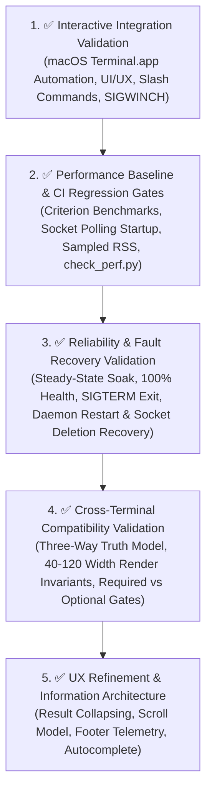

# Master Quality Engineering Index

This document serves as the high-level index of the quality validation strategy, automation harnesses, CI regression gates, and empirical baselines for the **`brain` AI Coding Companion**.

---

## Quality Domain Index

---

## Domain Summaries

### 1. Interactive Integration Validation (Native macOS Terminal)
- **Objective**: Validate real-world TUI behavior, event loops, and slash commands inside native macOS `Terminal.app`.
- **Validation Method**: Automated AppleScript (`System Events`) keystroke driving and live screen capture.
- **Empirical Evidence**: Tested `Tab` focus switching, `Up`/`Down` arrow session/history recall, `/memory`, `/plan`, `Ctrl+P` modal overlay, and `SIGWINCH` 75-column resize.
- **Artifacts**: [`implementation_plan.md`](file:///Users/ritikpathania/.gemini/antigravity/brain/f87ef7e1-dd2f-4ee1-add7-2d0ffd3326e8/implementation_plan.md) | [`walkthrough.md`](file:///Users/ritikpathania/.gemini/antigravity/brain/f87ef7e1-dd2f-4ee1-add7-2d0ffd3326e8/walkthrough.md)

### 2. Performance Baseline & CI Regression Gates
- **Objective**: Measure baseline execution latencies and enforce automated CI performance regression gates.
- **Validation Method**: Criterion micro-benchmarks (`cargo bench -p brain-tui`), socket health readiness polling (`scripts/perf_runner.sh`), and gate evaluator (`scripts/check_perf.py`).
- **Empirical Baselines**:
  - Cold Startup Latency: **497 ms** (CI Gate: $+10\%$ max delta)
  - Sampled Steady-State RSS: **16,080 KB** (~16.08 MB) (CI Gate: $+5\%$ max growth)
  - Idle CPU Utilization: **0.0 %** (CI Gate: $1.0\%$ max absolute)
  - Frame Draw Latency (P95): **108.12 µs**
  - Tokenizer Throughput: **516.59 ns** / chunk
- **Telemetry Schema**: JSON Schema `v1.1` with `git` commit & branch tracking.
- **Artifacts**: [`docs/benchmarks/benchmark_report.md`](file:///Users/ritikpathania/Developer/PyCharm/brain/docs/benchmarks/benchmark_report.md)

### 3. Long-Duration Reliability & Fault Recovery Validation
- **Objective**: Ensure long-duration stability without memory leaks, file descriptor leaks, thread leaks, or socket degradation, and verify fault recovery.
- **Validation Method**: Automated steady-state soak runner (`scripts/soak_runner.sh`), telemetry sampler (`scripts/sample_telemetry.py`), fault recovery suite (`scripts/test_fault_recovery.py`), and gate evaluator (`scripts/check_soak_gates.py`).
- **Empirical Baselines (30 Cycles)**:
  - Steady-State RSS Growth: **0.17 %** (CI Gate: $\le 5.0\%$)
  - File Descriptor Delta: **+0** (26 open FDs) (CI Gate: $\le +2$)
  - Thread Delta: **+0** (13 threads) (CI Gate: $\le +1$)
  - Query Latency Drift: **-0.3 ms**
  - Socket Health Rate: **100.0 %**
  - Daemon Restart Recovery: **PASSED** (100% memory persistence)
  - Socket File Deletion Recovery: **PASSED** (100% UDS socket recreation)
  - Graceful Shutdown: **PASSED** (<0.2s `SIGTERM` cleanup)
- **Artifacts**: [`docs/reliability/reliability_report.md`](file:///Users/ritikpathania/Developer/PyCharm/brain/docs/reliability/reliability_report.md)

### 4. Cross-Terminal Compatibility & Capability Matrix Validation
- **Objective**: Establish an automated terminal capability matrix across emulators, enforcing viewport width render safety and color/glyph degradation.
- **Validation Method**: Terminal capability inspector (`scripts/inspect_terminal_capabilities.py`), multi-width integration tests (`crates/brain-tui/tests/terminal_matrix_tests.rs`), and matrix gate evaluator (`scripts/validate_terminal_matrix.py`).
- **Empirical Matrix**:
  - Three-Way Source of Truth Model (`expected`, `detected`, `simulated`).
  - Required Gates (Unicode borders, Truecolor/NO_COLOR resolution, `Alt+W` key routing) vs Optional Gates (OSC 8 hyperlinks, platform clipboard).
  - 36 capability assertions passed across `macOS Terminal.app` (Empirically Validated), `iTerm2`, `WezTerm`, `Ghostty`, `Alacritty`, and `NO_COLOR / Plain VT` (Simulated).
  - Multi-Width Viewport Safety: 40, 60, 80, and 120 width renders verified without panics or line buffer overflows.
- **Artifacts**: [`docs/compatibility/compatibility_report.md`](file:///Users/ritikpathania/Developer/PyCharm/brain/docs/compatibility/compatibility_report.md)

### 5. UX Refinement & Information Architecture
- **Objective**: Validate rich autocomplete metadata, virtual scrolling presentation model, collapsible result groups, and status footer layout safety across viewports.
- **Validation Method**: Integration test suite (`crates/brain-tui/tests/ux_refinement_tests.rs`).
- **Empirical Baselines**:
  - Autocomplete Metadata: Verified `/memory` item with category `Graph`.
  - Virtual Scroll Engine: Verified offset window `Showing 11-30 of 50` across 20-row viewport.
  - Result Group Expansion: Verified toggle state `Action::ToggleGroupExpand` and collapsed status.
  - Multi-Viewport Rendering: Status footer render verified at 120 and 60 column widths without panics.
- **Artifacts**: [`crates/brain-tui/tests/ux_refinement_tests.rs`](file:///Users/ritikpathania/Developer/PyCharm/brain/crates/brain-tui/tests/ux_refinement_tests.rs)
