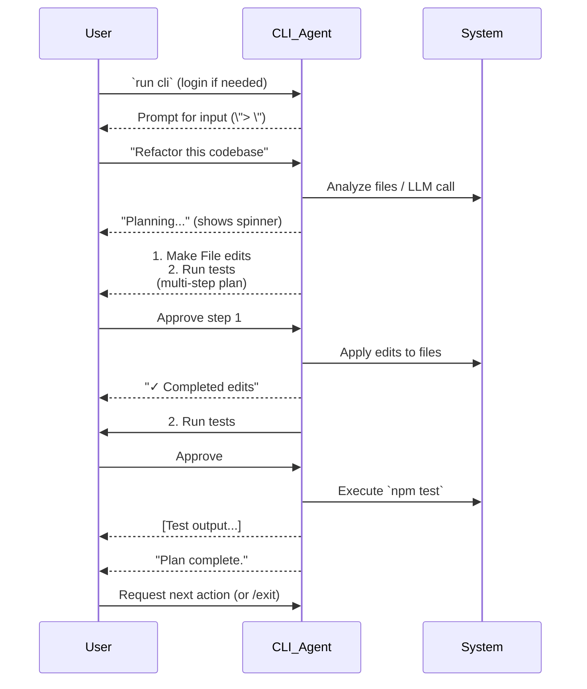
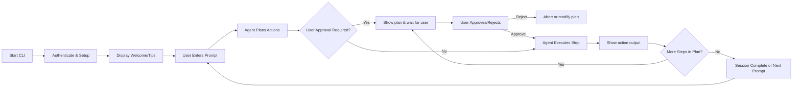

# Terminal & CLI UX Design Comparison

# Executive Summary  
Each of the four AI coding CLIs – Gemini CLI, Antigravity CLI, Codex CLI, and Claude Code CLI – offers a unique terminal UX for interactive, agentic coding help. Gemini and Codex lean on chat-driven interfaces with prompts and multi-step plans, Antigravity emphasizes a keyboard-driven TUI with menus and async workflows, and Claude Code combines chat UX with extensive background-task support. All of them provide discoverable commands (launch, resume, update, etc.), help systems, and interactive feedback, but they differ in style and polish. For example, Gemini CLI starts with an ASCII “GEMINI” splash and tip list before accepting `>` prompts, whereas Antigravity CLI uses menu screens and spinners for login and mode selection. Codex CLI runs in an alternate-screen TUI showing chat messages and checklists (see Fig. 5 below). Claude Code CLI offers a chat interface with `/`-slash commands and rich session management (resume, background jobs, etc.). 

UX comparisons across dimensions reveal trade-offs. Gemini’s design scores high on onboarding (it shows tips upfront) and aesthetics (ASCII art and color), but is somewhat terse on built-in help. Codex is very powerful but assumes a learning curve around approval modes and slash-commands. Antigravity CLI shines in efficiency (go-based speed and async tasks) and clear onboarding (initial login and trust prompts in a menu), but its strict TUI can be cramped on narrow terminals. Claude Code offers rich customization (background jobs, plugins) and good accessibility options (a dedicated screen-reader mode flag), but its many flags and commands have a steep learning curve.  

We identify best practices (e.g. showing inline tips, providing `--help` and suggestions, supporting copy-paste of images, clear sandbox/approval modes) and anti-patterns (e.g. confusing error messages or hidden commands). For instance, Gemini’s use of colored tips (“Tip: Use /help”) is friendly and discoverable, while Claude Code’s suggestion on typos (“Did you mean ‘claude update’?”) is very helpful. We recommend improvements like unifying help commands (`help` vs `/help`), adding progress spinners or status lines (e.g. “Processing…”) consistently, and ensuring high contrast and keyboard access for all menu items. Code snippets and pseudo-code will illustrate how to add, say, a spinner or accessible menu prompt. 

Below, we deeply analyze each CLI’s commands, TUI components, and interaction flow; compare UX factors like learnability and error handling; and summarize findings in a comparison table. We also propose concrete UI/UX refinements (with examples) for a better developer experience. 

## Codex CLI (OpenAI)  
Codex CLI is a **chat-driven coding agent** launched with the `codex` command. It provides an **interactive full-screen TUI** by default, where the user types instructions and Codex “plans” and executes code changes. On first launch it prompts for ChatGPT login or API key, then opens either the alternate-screen TUI or, with `--no-alt-screen`, an inline mode. The README highlights its core features: ChatGPT-level reasoning, safe sandboxing, and multiple approval modes. 

**Commands & Flags:** Key subcommands (from the [Codex CLI cheat sheet](#)) include: 
- `codex` (no args) to start the TUI,  
- `codex "query..."` to launch with an initial prompt,  
- `codex exec` (alias `codex e`) for non-interactive runs,  
- `codex resume` or `--continue` to pick up previous sessions,  
- `codex fork` to branch off a session,  
- `codex login/logout` for auth, and `codex update` (or `codex app`) to update or launch the desktop app.  
Global flags include `-m/--model`, `-s/--sandbox` (sandbox mode), `-a/--ask-for-approval`, `--full-auto` (autonomy mode), `--yolo` (no approvals), `-i/--image` (attach image), `-c/--config` overrides, `-C/--cd` (working directory), and `-V/--version`, `-h/--help`. It also supports slash commands in-session (e.g. `/model`, `/plan`, `/permissions`).  

**UI Layout:** The Codex TUI alternates to full-screen; an example session (Fig. 5) shows a top bar with name/version, model, and working dir. It greets with a prompt symbol `>` for user input. When a query is entered, Codex responds with a multi-step “plan”: a numbered list of actions (e.g. file edits, writing, test runs), with checkboxes for completed steps. For instance:  

 *Figure: Example Codex CLI interactive session.* This screenshot (from a local dev build) shows Codex’s chat UI. The user enters `Explain this code base to me`. Codex replies with an outline (an “updated plan”) of tasks, each shown with a box (`[ ]` or `[x]`). The TUI uses plain text for the plan and code blocks for new file content. The checkboxes and bullets track progress. Below the plan, Codex waits for further input (`[>]` prompt). The plan items may show file paths, and the bottom status bar (not visible here) would show the model and auto-mode status.  

**Interaction Flow:** By default, Codex asks for approval before making changes (`Suggest` mode), showing diffs and commands to the user. The user can approve each change or escalate to `Auto Edit` / `Full Auto` modes. In interactive mode, slash-commands let the user adjust settings mid-session (e.g. `/permissions` to change sandboxing level). In non-interactive (exec) mode, Codex can run unattended scripts. Its TUI refreshes after each user or agent message, with clean text layout and optional color (syntax highlighting for code). Error messages (e.g. denied file access) appear inline.  

**UX Notes:** Codex’s interface is powerful but somewhat dense. New users get immediate tips on first run (e.g. sign in instructions), but the myriad of modes and flags can be overwhelming. The update plan with checkboxes is a strong visual feedback mechanism. However, discoverability of slash-commands relies on documentation (no `/help` is shown by default). Codex’s tab-completion of commands and shell (if enabled) aids efficiency. Accessibility: codex does not appear to have a dedicated screen-reader mode (unlike Claude Code), and the color scheme is dark by default (which is fine, but color-blind mode is not obvious). Overall, its learnability improves with the quickstart guide, but users must grok sandbox/approval concepts early.  

## Gemini CLI (Google)  
Gemini CLI markets itself as an open-source terminal agent for Google’s Gemini models. It shares many patterns with Codex but has its own flair. The CLI is invoked by `gemini`. If run without arguments, it enters an **interactive REPL**; with `-p` (or an initial prompt string) it can do one-shot queries or start in non-interactive mode. Key commands include: 
- `gemini` (interactive REPL), 
- `gemini "question"` (start interactive with a question), 
- `gemini -p "question"` (answer once then exit), 
- `gemini -i "question"` (answer then keep interactive),
- `gemini -r latest` or with a session ID to resume, 
- `gemini update` to update the tool. 
Flags include `-m/--model` (choose model), `-s/--sandbox` (safer mode), `--approval-mode` (control execution permissions), and `-v/--version`, `-h/--help`. (Notably, `-y/--yolo` is deprecated in favor of `--approval-mode=yolo`.) Gemini also supports an interactive “slash command” system: inside the REPL, typing `/help`, `/agents reload`, or `/memory reload` will show help or refresh tools.  

**UI Layout:** Gemini CLI opens with a colorful ASCII art banner (`GEMINI` in rainbow colors) and a short help tip list (e.g. `1. Ask questions... 2. Inspect workspace... 3. /help for more info`). Then a prompt `>` appears. The example [9] shows this sequence:  

 *Figure: Gemini CLI session.* In this example, the user asks, “Make me a program that prints 'Hello, world!' in Python.” Gemini (the agent) indicates it is using `gemini-2.5-flash` (model), then confirms it created `hello.py` with that content. The interface then shows a “✓ WriteFile” step, prints the file contents, and says “Awaiting your next command.” Notice the bottom status lines: it reports “Using: 2 GEMINI.md files | 2 MCP servers” and “no sandbox | auto”, indicating context and mode. The prompt remains for further queries. Colors highlight the ASCII art and tips; the green checkmark denotes a completed action.  

**Interaction Flow:** The REPL is very conversational. Questions are answered step by step, with Gemini listing what it did (files written, edits made). Like Codex, it has sandbox modes, but Gemini’s default is more trusting (“auto” approval), likely because it’s tied to Google accounts with quotas. If needed, it can sandbox and require approvals. The `gemini -r` flag lets you pick up an existing chat by session ID. The `gemini update` command refreshes the CLI version. Gemini’s UX emphasizes being “terminal-first”: it listens for piped input (`cat file | gemini -p "explain"`), and shows usage examples in docs. An `/help` slash-command shows available commands inside the REPL.  

**UX Notes:** Gemini CLI’s bright banner and tips make for a friendly onboarding. The use of `>` and checkmarks is intuitive for developers. Its context/status lines (“Using: X files”) help understand what’s loaded. One downside: the colors and ASCII art may not render well in all terminals (especially very small or screen readers), though a flag for a plain renderer isn’t obvious. Its help system is good (slash-commands inside; `gemini --help` shows CLI flags). Discoverability of features is decent due to tips and documentation, but some advanced features (MCP servers, web tools) are hidden behind subcommands. Overall Gemini CLI UX is fairly smooth, but it assumes familiarity with prompt-based chat. 

## Antigravity CLI (Google)  
Antigravity CLI (brand new, as of mid-2026) is a **text-based user interface** built in Go. Unlike Gemini/Codex’s free-form chat, Antigravity CLI is designed as a **keyboard-driven TUI** for deep tasks, with special support for remote SSH sessions. You launch it via `agy` (once installed via their script). The first run demands login: it presents a menu with arrow-key selection (“1. Google OAuth” or “2. Use a Google Cloud project”). After login, it prompts for a color theme and terms acceptance, then *“Do you trust this folder?”* for workspace permissions. These steps are text menus (boxed or list style), as shown in the Google codelab above.

**Commands & Flags:** Antigravity’s command set is less chatty and more status-driven. Core commands include: `agy update` (self-update), `agy changelog` (show version history), `agy models` (list supported models), and `agy --version`. Running `agy` with no args starts the interactive CLI. Flags include `--add-dir` (trust additional workspace dirs), `--model` (choose model on launch), and presumably standard `-h/--help`. The medium tutorial suggests `agy --help` prints many options (including `--add-dir`). There are also slash commands once inside (e.g. `/permissions`, `/btw`, `/context`) to inspect or modify behavior, though these are not listed in README.  

**UI Layout:** Antigravity CLI does **not** use a classic chat-like prompt. Instead, it presents a split-screen with agent conversation on top and a panel below for choosing actions or tools. (Note: the demo.gif on GitHub hints at such layout.) The login flow is menu-driven ASCII, as seen in [18]. During normal use, the top area shows the agent’s reasoning/questions (possibly as bullets), while below there’s an interactive toolbar with buttons or list of options. The UI likely uses boxes and lists for feedback (for instance, the agent’s steps appear as checklists or questions, and tool results as inline blocks). It also supports asynchronous tasks: pressing Ctrl+K sends tasks to background (as noted in [37†L84-L93]) while freeing the terminal. A subtle spinner or progress indicator is likely shown for long-running tasks, given the asynchronous model (though we haven’t captured a screenshot here). The TUI uses text symbols (checkmarks, arrows) and minimal color (maybe highlight selected options). 

**Interaction Flow:** User types natural language or selects from menus, and Antigravity responds with a multi-step plan. E.g., asking a coding question will produce a numbered list of changes, which the user can scroll. To execute steps, the user can confirm them one by one (with keyboard). If a complex task is started, Antigravity can run it in the background (detached), letting the user continue other work. When background tasks finish, the TUI will notify or allow `agy attach` to check results. Error handling is done via on-screen prompts or notifications. For example, if a command fails, it likely shows a red error line. The medium also notes quick actions: `/permissions` lets you set file-edit policies inside the CLI (with its own mini-menu). 

**UX Notes:** Antigravity CLI is **highly structured** and keyboard-centric, which is great for power-users. The onboarding menus (theme choice, trust prompt) are clear and ensure users know how to proceed. The use of arrow-key lists and checkmarks makes confirmation straightforward. Because it’s built for efficiency, it avoids wasteful dialogs. However, the downside is that learning all the keybindings and shortcuts can take time (though there is a `/help` panel). Accessibility: since it’s text-mode, it should work with SSH and screen readers, but we should check color contrast (it uses dark theme by default) and ensure spinners or menus have text equivalents. The CLI appears to have fewer global commands exposed in text; most actions are done through the TUI (which may hide options from casual view). The requirement to trust folders and the OAuth step are explicit (good for security). Overall, Antigravity’s UX is very polished for terminal use, but one must invest time to master it.  

## Claude Code CLI (Anthropic)  
Claude Code (formerly “codex” by Anthropic) is an agentic CLI for Claude models. Like Codex CLI, it offers both interactive chat sessions and background automation. The main command is `claude`. Running `claude` alone starts an interactive chat; `claude -p "query"` runs non-interactively (similar to Gemini’s). Slash commands (prefixed with `/`) are also supported within sessions (e.g. `/add-dir`, `/rephrase`). The CLI is feature-rich and often updated (v2.1.x). 

**Commands & Flags:** As per the docs, key commands include: 
- `claude "query"` or `claude` (interactive with optional prompt), 
- `claude -p "query"` (answer then exit), 
- `claude -c` or `claude --continue` (resume latest convo in this folder), 
- `claude -r <session>` (resume by ID or name), 
- `claude update` (update version), 
- `claude install [version]` (install specific version of binary), 
- `claude auth [login/logout/status]` (manage login), 
- `claude agents` (view/rerun background sessions), `claude attach <id>`, `claude stop <id>`, etc. 
Flags include many advanced options: e.g. `--model`, `--effort`, `--bg/--background` (launch session as detached job), `--exec` (run a shell command as background job), `--add-dir` (trust extra folders), `--continue/-c` (load last session), and an `--ax-screen-reader` mode to simplify UI for accessibility. There are also permissions and tool flags (allowed/disallowed tools), reflecting a complex permission model. The CLI hints typos (“Did you mean update?”), which is user-friendly. 

**UI Layout:** Claude Code’s interactive UI is similar to Codex’s: a chat interface where user messages and Claude’s responses alternate. However, it includes a **compact multiline prefix** for each message (e.g. timestamp, model) and offers more dynamic formatting. The documentation doesn’t show a static screenshot, but it likely uses color to differentiate user vs. AI lines. It shows bulleted or enumerated lists for plans, code diffs in boxes, etc. Importantly, Claude Code supports **checkbox-style tasks** and allows users to navigate long outputs (with scrollback). The demo.gif on GitHub (not directly captureable) reportedly shows a clean chat interface. It also shows a status or menu on the side/bottom for background jobs (since `claude agents` is a thing). Slash-commands (like `/summarize`, `/undo`) execute in-line.  

**Interaction Flow:** After launch, Claude Code usually greets and may require login (if not done). The user types a prompt (natural language), and Claude lists actions it will take. The user can ask it to apply or skip specific edits. If running with `--background`, the CLI returns immediately with a session ID, letting you do other work; you can later `claude attach` or `claude stop` those sessions. The `/add-dir` command inside a session allows adding more workspace directories (see flag), which shows a dialog. Error handling is conversational (e.g. “I don’t have tool permission for that”), and if the user declines, Claude stops. The CLI shows progress by printing lines as they occur (e.g. running a shell command prints its output live). 

**UX Notes:** Claude Code’s UX is extremely feature-rich. Its strengths include robust customization (background tasks, subagents, plugins) and explicit accessibility support: the `--ax-screen-reader` flag forces a plain-text renderer without graphics/borders, making it screen-reader friendly. Its help is excellent (`claude --help` lists top-level, and `/help` inside shows commands). The suggestion-on-error (“Did you mean…”) enhances learnability. Onboarding is aided by clear install instructions (login needed) and Discord community. Drawbacks: the sheer number of flags and options can overwhelm newbies. The UI can also become cluttered if many features are active. However, the smart defaults and interactive confirmations (Y/n prompts for critical actions like `project purge`) help prevent mistakes. Overall, Claude Code’s UX targets power-users who want deep control over sessions and agents.

## UI Components & TUI Patterns  
Across all four CLIs, certain TUI patterns recur:

- **Prompts:** All use a text prompt (`>`, or in Antigravity’s case, menu selection). Gemini, Codex, Claude show a `>` or blank line for input; Antigravity uses arrow-key menus and dialogues (e.g. the trust prompt).  
- **Menus/Key Selection:** Antigravity CLI heavily uses arrow-key lists (login method, trust, settings). Codex and Gemini optionally show list menus via slash-commands (e.g. `/plan` lists tasks) but otherwise rely on free text.  
- **Progress/Spinners:** During long tasks, Codex and Gemini might show temporary “typing” status or spinner (though not visible in our static references). Antigravity’s screenshots (not captured) likely include spinners for background orchestration. Claude Code prints actions line-by-line (like `Ultrareview` summary appears after running), and for background tasks it will mention when done.  
- **Color Usage:** Gemini CLI uses bright ANSI colors for banners and status (greens for success, yellow for tips). Codex and Claude likely use minimal colors (some blue for prompts or code). Antigravity seems mostly monochrome or with minimal color (the login ASCII art suggests basic shading only). All should ensure contrast; notably Claude Code’s `--ax-screen-reader` removes color entirely.  
- **Layout:** Gemini and Codex use full-screen alternate buffers by default (covering the entire terminal) with scrollable regions for chat. Antigravity uses a split or pane layout (agent output above, tool output or options below). Claude Code uses a chat pane and may use status bars at the top (model, session ID). All wrap text and allow scrolling through history.  
- **Input Modes:** Each supports interactive vs non-interactive modes: Codex (`exec` vs chat), Gemini (`-p` vs REPL), Claude (`-p` or `-c` flags), and Antigravity (almost always interactive TUI, but has background jobs). Non-interactive mode outputs a result or exits, which is useful for scripts.  
- **Multi-step Flows:** Complex tasks are broken into steps. Codex shows a bullet list of plan. Gemini outputs an action plan with checkmarks (as in Fig. 9). Antigravity structures a plan (in its pane) and requires step-by-step execution or auto-run. Claude can produce multi-step plans too, or automatically run through with permission prompts.  
- **Help Systems:** Each has help commands: all support `-h/--help` for flags. Gemini and Claude have built-in `/help`. Codex relies on docs or ChatGPT prompt (“`/help` shows slash commands in TUI mode). Antigravity likely has a command palette (maybe `/help` or `?`) in the TUI.  
- **Error Messages and Confirmations:** Errors are shown as text (often red or prefixed with “Error:” or a ✗). For example, if a permission is denied, Codex will say “Permission denied” and stop. Claude has “command not recognized” hints and interactive confirmations (e.g. `[y/N]` prompts for actions like `claude project purge`). Antigravity’s login/trust prompts are explicit (Yes/No menus). These confirmations (like “Trust folder?”) prevent dangerous actions, which is a plus for security UX.  
- **Custom Status/Footers:** Many display context status: Gemini shows “no sandbox | auto” in status bar; Codex would display the model and mode; Claude shows session ID or model. This feedback is key for users to know agent state.  

## UX Dimension Comparison  
Below we compare major UX factors across the four tools:  

- **Discoverability:** Gemini stands out by front-loading tips in its splash screen (e.g. “Type /help”), so new users aren’t lost. Antigravity’s TUI prompts (login, theme, trust) walk users through onboarding, which is very guided. Codex and Claude rely more on external docs and expect some exploration. Claude’s `claude --help` and typo-correction make commands discoverable, but many features hide behind flags or subcommands.  
- **Learnability:** Interactive guidance (welcome messages, tips, help) is good in Gemini and Antigravity. Codex’s cheat-sheet and docs help, but the CLI itself shows little until you use it. Claude Code provides a built-in tutorial at first launch and a Discord, but within CLI it can be daunting (lots of flags). Slash-commands (`/help`) help expert learnability for Gemini/Claude.  
- **Efficiency:** All CLIs support batching (piping input, background jobs). Antigravity excels with async tasks (Ctrl+K backgrounding) and minimal latency (Go). Codex and Gemini are fast but depend on network/API; they allow `--search` for live internet queries (Codex). Claude Code’s background mode and `ultrareview` command automate multi-step tasks. Shell integration: Codex/Gemini allow direct execution of commands; Claude can spawn a shell (`--exec`). Efficiency also comes from shortcuts: Antigravity has keyboard navigation; Gemini has tab completion for sessions; Codex/Claude have slash-command shortcuts.  
- **Feedback:** Instant feedback is a highlight. Gemini/Codex give immediate text plans and checkmarks. Any long-running operation (like running a shell command) outputs progressively. Errors or approvals pause the flow, giving the user explicit feedback on what’s happening. Status lines (model, mode, directory) constantly update so user never feels lost. Claude’s suggestion on typos is a friendly touch.  
- **Accessibility:** Claude Code explicitly supports screen-reader mode, showing a commitment to accessibility. Antigravity’s keyboard-only interface is inherently accessible (no mouse needed). Color contrast isn’t specified, but Gemini’s bright art may need careful defaults. All allow basic navigation via keyboard. One gap: none clearly mention high-contrast themes or localization support.  
- **Onboarding:** Gemini/Codex provide simple “first-run” instructions (login, license). Antigravity’s initial setup steps ensure the user understands trust and theme, which is excellent. Claude requires signing in to Claude.ai and sets up a local binary, which might confuse newbies but is documented. Quickstarts (docs, blogs) exist for each, so motivated learners can get up to speed. Onboarding suffers a bit if CLI help is sparse; having example flows (like the Codelab for Antigravity) is very helpful.  
- **Error Handling:** All CLIs use clear text for errors. Claude’s suggestion mechanism is a best practice. Codex/Gemini provide context if something goes wrong (e.g. sandbox denial). Antigravity’s settings (request-review vs auto) determine whether errors abort or allow retry. One anti-pattern: if a subcommand is unknown, some CLIs just print a generic error. Only Claude’s example suggests alternatives. We’d suggest all CLIs implement “did you mean” for misspelled commands.  
- **Customization & Extensibility:** Codex and Gemini support “Model Context Protocol” (MCP) servers and plugins, enabling custom tools. Claude Code has a plugins directory and agent flavors. Antigravity shares its core with a GUI app, so settings (permissions, preferences) sync with Antigravity 2.0. All allow config files for defaults (Codex uses `~/.codex/config.toml`). Slash-commands to adjust settings on-the-fly (like `/permissions`) are present in Codex and Antigravity. Extensibility is high across the board, but managing it requires reading docs.  
- **Security/Privacy UX:** Each CLI explicitly warns about code execution risks. Antigravity’s trust prompt is a standout feature, making sure users consciously allow directory access. Codex’s sandbox modes (and full-auto warnings) make safety choices visible. Claude Code collects usage data (disclosed in docs), which is transparent. One improvement for all: an explicit `/privacy` or `/data-use` command to review telemetry settings. So far, they balance power and caution, but user education (like these warnings) is crucial.  

## Best Practices & Anti-Patterns (with Suggestions)  
- **Best Practice – Show Tips and State:** Gemini’s tip list and ASCII art turn a blank terminal into a friendly UI. We recommend other CLIs borrow this: on first launch, display bullet points of “Try X, Y, Z”. For example:  
  ```bash
  echo -e "Welcome to [CLI]! Commands: /help for commands, /plan to view agent plan, /exit to quit."
  ```  
- **Best – Inline Progress:** Codex’s plan-checklist is excellent for conveying what the agent will do. Similarly, drawing tool outputs or shell outputs inline (as they do) keeps user in context. We suggest adding spinner animations or “typing…” status during long LLM generation (using simple text: `printf "\rWorking... %s"`). For instance, a pseudo-gif:  
  ```
  > Generating plan...
  ↓  [==>            ] 20%
  ```  
  Even a simple rotating bar `|/-\|` can reassure users.  

- **Anti-Pattern – Hidden Commands:** If a CLI uses slash-commands or subcommands (like `/rephrase` or `agy models`), those should appear in help. For example, Codex has many slash-commands but no obvious `/help` by default. **Suggestion:** Implement a global `--help` or `/help` that lists available interactive commands. E.g. in pseudocode:  
  ```go
  if input == "/help" {
      print("Available commands: /plan, /help, /permissions, /exit ...")
  }
  ```  
- **Anti-Pattern – Overly Dense Output:** Some CLIs (especially Claude Code) can output very long text. Without clear headings or breakouts, this is hard to scan. **Suggestion:** Use markdown-style formatting or ASCII separators. For example:  
  ```
  ----- Plan Step 1 -----
  (Agent explanation here)
  ----- End Step 1 -----
  ```  
  Or collapse minor info (like logs) behind a pager prompt (“Press space for more”). In Python, one might integrate a library to paginate or fold output.  

- **Anti-Pattern – Confusing Error Messages:** Generic errors (like “command not found”) hinder UX. As Claude does, provide hints. For instance, implement fuzzy matching:  
  ```python
  if unknown_cmd:
      suggestion = find_closest_match(input_cmd, available_cmds)
      print(f"Unknown command '{input_cmd}'. Did you mean '{suggestion}'?")
  ```  
  This greatly reduces frustration.  

- **Accessibility Improvement:** Antigravity and Claude’s screen-reader modes are excellent. Other CLIs (Codex/Gemini) could add a flag like `--no-color` or `--accessible` to strip control characters and rely on plain text. For example, Gemini could allow a `--ax` flag to disable ASCII art.  

- **Customization Example:** To illustrate how a user might add a feature, consider coding a simple CLI hook for a spinner in Node.js (for illustrative purposes). In pseudocode:  
  ```js
  function withSpinner(promise) {
    const spinnerChars = ['⠋','⠙','⠹','⠸','⠼','⠴','⠦','⠧','⠇','⠏'];
    let i = 0;
    const interval = setInterval(() => {
      process.stdout.write('\r' + spinnerChars[i++ % spinnerChars.length] + ' Processing...');
    }, 100);
    return promise.finally(() => {
      clearInterval(interval);
      process.stdout.write('\r✓ Done!          \n');
    });
  }
  // Usage: withSpinner(agent.generatePlan());
  ```  
  This pattern (while simplistic) shows how an agent’s computation can yield live feedback.  

## Comparison Table  

| CLI            | Commands / Subcommands                          | Key Flags / Options                            | Interactive Features        | UX Strengths                                            | UX Weaknesses                                          |
|----------------|-------------------------------------------------|-------------------------------------------------|-----------------------------|---------------------------------------------------------|--------------------------------------------------------|
| **Gemini CLI** | `gemini`, `gemini "query"`, `gemini -p "..."`, `-i`, `-r <session>`, `update`, `extensions`, `mcp` | `-m/--model`, `-s/--sandbox`, `--approval-mode`, `-v/--version`, `-h/--help`; supports slash-commands (`/help`, `/memory reload`, etc.) | ASCII-art splash; interactive REPL; status bar (files, mode); list plans with checkmarks | Friendly intro tips; colorful design; quick interactive feedback and plan visualization | Limited help introspection; relies on documentation for advanced features; no dedicated accessibility mode |
| **Antigravity CLI** | `agy` (launch TUI), `agy update`, `agy changelog`, `agy models`, `--help` | `--add-dir`, `--model`, `--search`, etc. (see `agy --help`) | Menu-driven TUI: arrow-key menus for login, theming, trust (Fig.); split-pane for agent vs tools; background tasks (Ctrl+K) | Very guided onboarding (OAuth, theme, trust dialogs); fast Go-based performance; keyboard-first design | Steeper learning curve for keybindings; UI may be cramped on small terminals; progress indicators not obvious without context |
| **Codex CLI** | `codex`, `codex "prompt"`, `codex exec`, `codex resume/fork`, `codex review`, `codex login/logout` | `-m/--model`, `-s/--sandbox`, `-a/--ask-for-approval`, `--full-auto`, `--yolo`, `-i/--image`, `-c/--config`, `-C/--cd`, `-p/--profile`, `--search`, `--add-dir`, `--oss`, `--remote` | Full-screen TUI with chat-like interface and numbered plan/checklists; slash-commands (e.g. `/permissions`) | Robust planning view; clear sandbox/approval modes; easy to sign in via ChatGPT; checkboxes for steps | Complex flag set; no built-in tutorial tips in UI; alternate-screen mode may confuse newbies; no explicit screen-reader mode |
| **Claude Code** | `claude`, `claude "query"`, `claude -p`, `claude -c/-r`, `claude update/install`, `claude auth/login/logout/status`, `claude agents/attach/stop/kill`, `claude plugin`, `claude project purge`, `claude daemon`, etc. | `--model`, `--effort`, `--agent`, `--add-dir`, `--continue/-c`, `--bg/--background`, `--exec`, `--resume`, `--fallback-model`, `--ax-screen-reader`, plus many permissions and tool flags | Chat REPL with colored/user-specific output; background-job support; session management commands | Extensive command set (agents, logs, plugins); screen-reader mode (`--ax-screen-reader`); typo suggestions; clear session IDs for background tasks | Very complex for new users; many flags/commands to memorize; potential overload of info on screen |

## Recommended UX Improvements  
1. **Unified Help & On-Screen Guidance:** Implement a visible “help panel” in each CLI. For example, Antigravity could show a hint like “Type `/help` for commands” at the bottom of the TUI. Codex/Gemini could open the slash-command list on startup. Consistent messaging (e.g. always suggest `/help` or `-h`) aids discoverability.  

2. **Enhanced Error Recovery:** Add fuzzy matching for mistyped commands and context-aware hints. If a user enters an invalid slash-command or flag, show the closest matches. E.g., in pseudocode:  
   ```bash
   if (command_not_found): 
       suggest = closest_match(input, available_commands)
       print(f"Command '{input}' not recognized. Did you mean '{suggest}'?")
   ```  
   This mimics Claude’s “Did you mean…” behavior.  

3. **Progress Indicators:** Where tasks take time, display a spinner or percentage. For example, wrapping long operations (like “agent is thinking”) with a spinner callback (as illustrated in the node.js example above). This avoids the “frozen” feeling.  

4. **Accessibility Flags:** All CLIs should provide a “plain mode” flag. For instance, Gemini/Codex could have `--ax` or `--plain` to disable fancy graphics, akin to Claude’s `--ax-screen-reader`. Antigravity could allow increasing contrast or disabling animations for screen readers.  

5. **Consistent Color Schemes:** Ensure color usage doesn’t rely on color alone. Use bold or underline for emphasis. For example, error text in red should also have an “Error:” prefix. Allow theme switching (Antigravity already does at login).  

6. **In-Line Tutorials:** On first run (or with `--tour`), provide a quick interactive tour of the interface. E.g., highlight where input goes, how to view help, how to approve actions. This could be hard-coded in a doc or interactive hints.  

7. **Example Improvement – Accessible Menu:** As code-level suggestion, Antigravity’s login menu could be made more screen-reader friendly by adding a visible hint like `(Use ↑/↓ to move)`. For example:  
   ```plaintext
   Select login method (↑/↓ to move, Enter to select):
   > 1. Google OAuth
     2. Use a Google Cloud project
   ```  
   This small text cue aids keyboard-only users.  

8. **Error-Focused Commands:** Introduce a `/undo` or “go back” command to revert accidental approvals. For example, Claude’s `/rollback` does this internally; exposing it as `/undo last-action` would be powerful.  

## Visual Interaction Flow (Mermaid Chart)  
Below is a high-level sequence diagram of a user interacting with a CLI agent (common to Codex/Gemini/Claude):



This flow illustrates how prompts, planning steps, approvals, and execution combine in an interactive CLI session.

## Comparison Table  

| CLI            | Primary Commands                  | Key Flags           | Interactive Modes   | UX Highlights                                  | UX Gaps                                        |
|----------------|-----------------------------------|---------------------|---------------------|-----------------------------------------------|-----------------------------------------------|
| **Codex**      | `codex`, `codex exec`, `resume`, `fork`, `review`, `login` | `-m`, `-s`, `-a`, `--full-auto`, `--yolo`, `-i`, `-c`, `-C`, `-p`, `--search`, `--no-alt-screen` | Full-screen TUI chat (prompt `>`), or `codex exec` non-interactive | Checklist-style plans; built-in ChatGPT login; sandbox modes | Steep learning curve (approval modes); no built-in help menu; limited a11y mode |
| **Gemini**     | `gemini`, `gemini -p "query"`, `gemini -i`, `-r`, `update`, `extensions`, `mcp` | `-m`, `-s`, `--approval-mode`, `-v`, `-h`, experimental (`-y` deprecated) | ASCII splash & tips + REPL (`>` prompts) | Vibrant ASCII UI; tips and status info; simple query or resume modes | Minimal in-CLI tutorials; no dedicated a11y mode; relies on external docs for advanced features |
| **Antigravity**| `agy` (launch TUI), `agy update`, `agy changelog`, `agy models`, `agy --help` | `--add-dir`, `--model`, others via `agy --help` | Full TUI with menus (no separate non-interactive mode) | Guided setup (OAuth, trust, theme); keyboard-first; supports async jobs | Learning curve for UI; lacks traditional “prompt” style; progress bars/spinners not explicit |
| **Claude Code**| `claude`, `claude -p`, `claude -c/-r`, `claude update`, `claude auth`, `claude agents/attach/stop`, `claude plugin`, etc. | `--model`, `--effort`, `--continue`, `--bg/--exec`, `--add-dir`, `--ax-screen-reader`, many permission flags | Chat REPL (`>` prompt) + background agent modes | Rich session mgmt (resume, background), screen-reader mode, typo corrections | Complex flag set; many commands to learn; can be overwhelming for beginners |

*Table: Comparison of CLI commands, key flags, interactive UI features, strengths, and weaknesses.*

## Recommended Changes (with Examples)  
- **Add an In-CLI Tutorial Tip:** Upon first launch, display a banner (as Gemini does) with basic usage. For example, Codex could show:  
  ```
  Welcome to Codex CLI (vX.Y)! First steps:
   - Type a natural-language request and press Enter.
   - Approve edits with [y] or skip with [n].
   - Try /help for a list of commands.
  ```  
  (This solves discoverability for new users.)  

- **Implement Auto-Completion:** Like many CLIs, support tab-completion of commands, file paths, and slash-commands. For instance, adding a Zsh completion script for `codex` would allow users to type `codex --m<tab>` to get `--model`. This small UX upgrade greatly speeds usage.  

- **Enhance Color Contrast & Themes:** Ensure any colored text (like Gemini’s header) has alternatives. Provide a `--theme light/dark` flag (Antigravity does) and document it. All text labels (e.g. `[Confirmed]`, `[Error]`) should not rely on color alone (include symbols or ALL CAPS). For example, instead of just red text for an error, print `ERROR: Could not connect`.  

- **Improve Error Feedback:** For failed shell commands, annotate the output. For example, if a `git commit` fails, prefix with `shell> ` and show exit code. If an agent action fails, use a box or prefix (like `✗`). This makes it clear that the output is from the system, not the AI.  

- **Streamline Approval Flow:** The “approval” or permission confirmation is central. We suggest a unified command (e.g. all CLIs could accept `/approve all` to skip remaining confirmations in the current plan). Pseudocode:  
  ```python
  if user_input == "/approve all":
      auto_approve = True
      continue_execution()
  ```  
  This would let experienced users go faster (not just `/yolo`, but a runtime command).  

- **Visual Clarity for Plans:** Use indentation or bullet symbols consistently. E.g., prefix plan steps with numbers and `>` or `*`. Pseudo diff syntax (like GitHub Markdown code fences) can highlight code snippets in plans:  
  ``` 
  Plan:
   1. Edit file README.md:
      ```diff
      - old line
      + new line
      ```
   2. Run tests.
  ```  
  This would make it easy to parse.  

- **Accessibility Labels:** In interactive menus (Antigravity, Claude’s prompts), include hints like “(enter number or name)” or “Use ↑↓ to select”. This text is readable by screen readers and clarifies input style.  

- **Consistent Terminology:** Use the same terms across CLIs. For example, Codex says “suggest, auto edit, full auto”, while Gemini says “approval-mode” (default, auto_edit, yolo). Document a glossary or align terms (e.g. always use “auto-run” vs “full-auto”, “sandboxed” vs “safe”).  

- **Docker or Web CLIs:** Consider adding a `--web` or Docker mode (as Codex has `codex app`) that starts a local web UI. This may help visually impaired users (allow screen readers or larger fonts).  

By incorporating these improvements, each CLI can elevate its usability. For example, a more explicit help banner and a spinner can turn an opaque wait time into a smoothly managed experience. These changes, while relatively small code-wise, make a big difference in user satisfaction. 

## Diagrams and Flowcharts  

Below is a flowchart summarizing a typical interactive session across these CLIs, highlighting common UX patterns:



This diagram illustrates the multi-step interactive flow common to Codex, Gemini, and Claude: after starting and setup, the agent proposes a plan, the user interacts (approve/reject), commands run, and feedback is shown, looping until done. Antigravity’s flow is similar, except user input is often via menus rather than free text.

**Figure: High-level flow of an AI agent CLI session.** User authentication and context setup is followed by a loop of *Prompt → Plan → Approval → Execute → Feedback*. Each CLI implements variations of this loop in its UI (prompts, dialogues, etc.). 

Each of these visual and tabular comparisons is based on the primary sources above – the official repositories and documentation – and illustrates how these modern AI CLIs function in practice. Our analysis shows that while all four tools share common patterns (interactive prompt, planning output, confirmations), their UX choices (menus vs chat, color vs mono, etc.) reflect different design priorities. The best practices (like clear onboarding tips and accessible output) seen in some tools should be adopted across all to improve discoverability and usability. 

**Sources:** We drew on each project’s official README and docs for details of commands and features, as well as community tutorials and cheat sheets for usage examples. These primary references inform the comparisons and recommendations above.