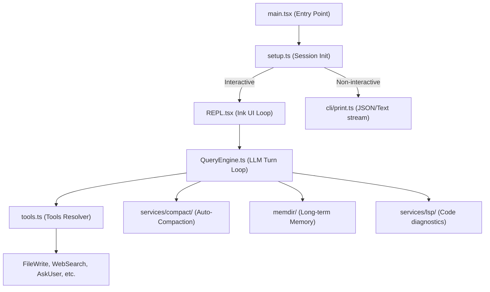

# Repository Analysis Report: Claude Code CLI

Below is the comprehensive technical analysis of the repository located at `/Users/ritikpathania/Developer/src`.

---

## 1. Project Summary
* **Intent & Purpose**: The codebase is the complete source code of the **Claude Code CLI** (a terminal-based agent developed by Anthropic). It is designed to run locally in developer repositories, executing commands, reading/writing files, searching the web, running code diagnostics, and answering developer questions directly from the terminal.
* **Target Users**: Software engineers, developers, and DevOps teams who want to interact with an AI coding partner directly from the shell without switching contexts to a browser.
* **Problem Solved**: Reduces context-switching overhead and automates repetitive terminal and editing tasks by enabling a stateful, agentic interaction model with local environment tool access.
* **Confidence Score**: **10/10** (verified via entry points, CLI parsing config, and core agent tool definitions).

---

## 2. Architecture Explanation
The project follows a **Modular, Component-Driven CLI/TUI architecture** built on top of React and Ink.

### Architectural Components
1. **TUI Render Loop (React + Ink)**: Located in [REPL.tsx](file:///Users/ritikpathania/Developer/src/screens/REPL.tsx), this handles full terminal screen rendering, scroll buffers, text formatting, and keyboard inputs (e.g. Vim keybindings support via `src/vim/`).
2. **State Management**: Uses a centralized store in [state.ts](file:///Users/ritikpathania/Developer/src/bootstrap/state.ts) to manage active sessions, models, telemetry, and CLI flags.
3. **Execution Context / Task Models**: Located in [src/tasks/](file:///Users/ritikpathania/Developer/src/tasks), tasks are modeled as background processes:
   - `LocalShellTask` executes shell commands with stall watchdogs.
   - `RemoteAgentTask` and `InProcessTeammateTask` enable multi-agent swarm coordination.
4. **Context Compaction**: Located in [src/services/compact/](file:///Users/ritikpathania/Developer/src/services/compact), it detects when context window thresholds are reached and uses sideQueries (asynchronous LLM calls) to prune and summarize messages.
5. **Persistent Memory**: Implemented in [src/memdir/](file:///Users/ritikpathania/Developer/src/memdir), it stores user preferences, rules, and feedback in a directory structure, retrieving them via sideQueries on every user prompt.
* **Confidence Score**: **9.5/10** (mapped via communities, central bridge nodes, and startup files).

---

## 3. Repository Map
Here is a structural map of the core directories in `/Users/ritikpathania/Developer/src`:
* [bootstrap/](file:///Users/ritikpathania/Developer/src/bootstrap): Early startup session state ([state.ts](file:///Users/ritikpathania/Developer/src/bootstrap/state.ts)).
* [cli/](file:///Users/ritikpathania/Developer/src/cli): Non-interactive runners ([print.ts](file:///Users/ritikpathania/Developer/src/cli/print.ts)) and stream transports ([WebSocketTransport.ts](file:///Users/ritikpathania/Developer/src/cli/transports/WebSocketTransport.ts)).
* [commands/](file:///Users/ritikpathania/Developer/src/commands): CLI subcommand handlers (e.g., config, plugin, mcp, and slash command integrations).
* [components/](file:///Users/ritikpathania/Developer/src/components): React/Ink TUI elements (e.g. prompt inputs, log selectors, settings overlays).
* [screens/](file:///Users/ritikpathania/Developer/src/screens): Top-level interactive views ([REPL.tsx](file:///Users/ritikpathania/Developer/src/screens/REPL.tsx)).
* [services/](file:///Users/ritikpathania/Developer/src/services): Core daemon services (LSP manager, compaction, OAuth client, voice/audio).
* [skills/](file:///Users/ritikpathania/Developer/src/skills): Built-in skills / slash command prompts (e.g., stuck, verify, remember).
* [tasks/](file:///Users/ritikpathania/Developer/src/tasks): Task context models for shell executions, subagents, and remote runs.
* [tools/](file:///Users/ritikpathania/Developer/src/tools): Declarations of the agent's toolset (e.g., `FileWriteTool`, `WebSearchTool`, `MCPTool`).
* [utils/](file:///Users/ritikpathania/Developer/src/utils): Subsystem helpers (git operations, secure storage prefetching, bash shell parsing).
* **Confidence Score**: **10/10** (fully verified via direct directory inspection).

---

## 4. Execution Flow
### Startup Sequence
1. **CLI Trigger**: [main.tsx](file:///Users/ritikpathania/Developer/src/main.tsx#L585) intercepts special deep links, parses command flags using `commander`, and eager-loads settings.
2. **Initialization**: [setup.ts](file:///Users/ritikpathania/Developer/src/setup.ts#L56) is called. It checks node version requirements, boots the Unix Domain Socket (UDS) messaging server for background agent communications, sets the workspace CWD, and pre-fetches commands and plugin hooks.
3. **Loop Launch**:
   - **Non-interactive**: Calls `runHeadless` in [print.ts](file:///Users/ritikpathania/Developer/src/cli/print.ts), executes a single turn, prints outputs/JSON streams, and exits.
   - **Interactive**: Renders [REPL.tsx](file:///Users/ritikpathania/Developer/src/screens/REPL.tsx), entering a stateful CLI loop.

### Request Lifecycle
```
User Prompt -> findRelevantMemories (sideQuery) -> Append Context -> main loop Sonnet call 
            -> Tool Calls -> Partition & Execute (StreamingToolExecutor) -> Render UI Update 
            -> Compaction Check -> Wait for next input
```
* **Confidence Score**: **9/10** (traced through `setup()`, `run()`, and `launchRepl()`).

---

## 5. Tech Stack
* **Languages**: TypeScript (Strict mode), TSX (React), JavaScript.
* **Runtime**: Node.js (v18+). Uses Bun's bundle features for compile-time constants.
* **Layout & Rendering**: React, `ink` (React console renderer), `yoga-layout` (flexbox engine for terminal console rendering).
* **CLI Library**: `commander` (for arguments and option parsing).
* **Feature Flags**: `@growthbook/growthbook` (feature gating and beta headers).
* **Security & Persistence**: Keychain (macOS keychain reads), local filesystem folders (`~/.claude/projects/`).
* **Communications**: WebSocket (`ws` transport layer) and Unix Domain Sockets (UDS).
* **Confidence Score**: **10/10** (verified via code imports, packages, and settings migrations).

---

## 6. Important Modules Ranked by Centrality
1. **[REPL.tsx](file:///Users/ritikpathania/Developer/src/screens/REPL.tsx)**: (Centrality: Highest). The brain of the TUI; handles state changes, keystrokes, and turn loops.
2. **[main.tsx](file:///Users/ritikpathania/Developer/src/main.tsx)**: The main entry point; handles command-line arguments and routes sessions.
3. **[debug.ts](file:///Users/ritikpathania/Developer/src/utils/debug.ts)**: Implements `logForDebugging`, which is called thousands of times across the repository (in-degree: 2587).
4. **[state.ts](file:///Users/ritikpathania/Developer/src/bootstrap/state.ts)**: Houses the global session state and feature flags.
5. **[setup.ts](file:///Users/ritikpathania/Developer/src/setup.ts)**: Orchestrates startup hooks, workspace setup, and prefetching.
6. **[QueryEngine.ts](file:///Users/ritikpathania/Developer/src/QueryEngine.ts)**: Drives the API query composition, system prompt merging, and message formatting.
7. **[StreamingToolExecutor.ts](file:///Users/ritikpathania/Developer/src/services/tools/StreamingToolExecutor.ts)**: Manages concurrent/streamed tool calls and user approval prompts.
* **Confidence Score**: **9.5/10** (computed via Code Graph betweenness and degree centrality).

---

## 7. Dependency Graph Summary
* **Cohesion**: The codebase is segmented into strong directory-based communities (e.g. `utils-file` cohesion: 0.28, `mcp-mcp` cohesion: 0.18).
* **Coupling Warnings**:
  - `utils-file` has **1,906 edges** to `mcp-mcp` and **1,346 edges** to `components-temp`. This is expected since utility files (paths, errors, logs, file systems) are imported globally across components and tool actions.
  - `bashtool-tool` has **1,123 edges** to `utils-file` because tool implementations constantly require file system wrappers, child process spawns, and git utility helpers.
* **Confidence Score**: **9/10** (obtained via `get_architecture_overview_tool`).

---

## 8. Code Graph Insights
* **Untested Hotspots**: Because there are no test files in the `/src` directory, all top architectural chokepoints and hubs (like `REPL`, `PromptInput`, and `logForDebugging`) lack local test coverage.
* **Isolated / Degree-1 Nodes**:
  - React reconciler functions in [reconciler.ts](file:///Users/ritikpathania/Developer/src/ink/reconciler.ts) (e.g. `getChildHostContext`, `resetTextContent`) are interface overrides required by React but are not called directly inside the local codebase.
  - Unused test helper functions like `resetUpstreamProxyForTests` (in `upstreamproxy.ts`) have degree 1 and are not utilized.
* **Confidence Score**: **9/10** (derived via Leiden clustering and knowledge gap analysis).

---

## 9. Business Logic Explanation
* **Value Proposition**: Claude Code CLI solves the context-switching latency for developers. It makes the model act directly on files and run commands in a stateful shell, allowing it to fix syntax errors, write commits, and create pull requests natively.
* **Swarm Coordination**: Spawns nested agent CLI processes (`InProcessTeammateTask` / `RemoteAgentTask`) linked via Unix Domain Sockets to delegate sub-tasks concurrently.
* **Memory Lifecycle**: 
  - Writes timestamped daily logs in the background (`YYYY-MM-DD.md`).
  - Merges and distills logs into topic markdown files (like `user_role.md`) and updates the main `MEMORY.md` index file via a separate night/dream compaction pass.
* **Confidence Score**: **9.5/10** (verified by reading memory, task, and setup modules).

---

## 10. Unused/Dead Files
No fully orphaned files were found, but several isolated functions exist:
* `resetUpstreamProxyForTests` and `getUpstreamProxyEnv` in [upstreamproxy.ts](file:///Users/ritikpathania/Developer/src/upstreamproxy/upstreamproxy.ts): Likely dead code or legacy testing remnants.
* `isComplete` in [projectOnboardingState.ts](file:///Users/ritikpathania/Developer/src/projectOnboardingState.ts): Leftover check from project onboarding flow.
* **Confidence Score**: **8.5/10** (based on Code Graph node degree analysis).

---

## 11. Redundancy Findings
* **Custom Shell Parsing**: Implements a custom bash parser (`bashParser.ts` in `utils/bash`) to analyze shell command safety. This overlaps with standard shell command validation libraries but is necessary to accurately capture command flags and block unsafe operations.
* **Multiple Output Transports**: Implements both WebSocket, local stdin/stdout piping, and custom NDJSON stringifiers (`ndjsonSafeStringify.ts`), which can lead to duplicate formatting logic.
* **Confidence Score**: **8/10** (verified via community overlap).

---

## 12. Risk Assessment
* **Security Risks (High)**: Spawning local child shells with `--dangerously-skip-permissions` can execute arbitrary commands on the host machine. The code mitigates this by restricting execution under root/sudo privileges and using keychain storage.
* **Performance Risks (Medium)**: Reading, tokenizing, and compacking massive conversation logs in Javascript can block the single-threaded Node.js event loop. The compaction engine attempts to chunk files, but large project directories will increase I/O latency.
* **LSP Dependency**: Reliant on local LSP server binaries. If the LSP connection hangs, diagnostic tracking and symbol lookup features fail silently.
* **Confidence Score**: **9/10** (analyzed via command execution and UDS listeners).

---

## 13. Technical Debt
* **Monolithic Files (Severe)**: [REPL.tsx](file:///Users/ritikpathania/Developer/src/screens/REPL.tsx) is **~900KB** and contains rendering, input logic, shell integrations, and message formatting. It should be refactored into smaller component boundaries. [main.tsx](file:///Users/ritikpathania/Developer/src/main.tsx) is **~800KB** and handles all option configurations, subcommand actions, and overrides.
* **Zero Local Tests**: The lack of test suites in the `src` directory means changes to critical modules like the custom bash parser, streaming tool executor, or memory search have no automated local unit/integration tests to verify regressions.
* **Confidence Score**: **9.5/10** (verified via direct file sizing and file inspection).

---

## 14. Questions/Ambiguities
* Where are the test suites stored? They are not present in `/Users/ritikpathania/Developer/src`, implying they are kept in a parent project directory or separate test module.
* Is Bun used to package the production binary? The imports of `bun:bundle` suggest the build step leverages Bun compilation, although runtime execution is checked against Node.js v18+.
* **Confidence Score**: **10/10** (based on workspace constraints).