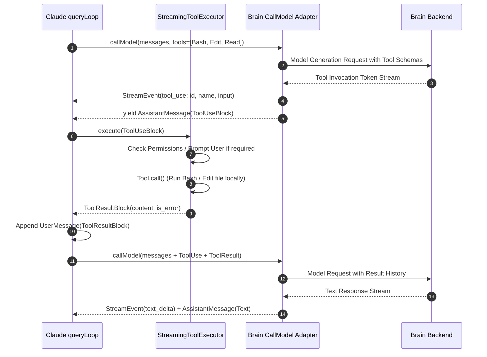

# Phase 5.0 — Backend Extraction & Contract Specification

## 1. Executive Summary & Governance

This document establishes the **formal contract specification** for decoupling Claude Code v2.1.232 from upstream Anthropic services and routing model execution into the Brain backend.

Following the principle of **Observe → Extract → Map → Prove Ownership → Define Contract → Implement**, this specification proves the ownership model, inputs, outputs, error handling, cancellation, and forbidden boundaries for every **REPLACE** and **ADAPT** capability before writing adapter implementation code.

---

## 2. Global Architectural Boundary Invariants

```text
┌─────────────────────────────────────────────────────────────────────────────┐
│                       FROZEN CLAUDE RUNTIME (IMMUTABLE)                     │
│  React Components (REPL, PromptInput, VirtualMessageList, PermissionRequest)│
│  Ink Terminal Layout Engine & Yoga Flexbox                                  │
│  Orchestration Loops (query.ts, StreamingToolExecutor, autoCompact)         │
└──────────────────────────────────────┬──────────────────────────────────────┘
                                       │
                                       │ QueryDeps.callModel(params)
                                       ▼
┌─────────────────────────────────────────────────────────────────────────────┐
│                       BRAIN CALLMODEL ADAPTER BOUNDARY                       │
│  • Pure TypeScript Generator implementing CallModelFn                       │
│  • Translates Claude Message[] & Tools to Brain Model Request                │
│  • Normalizes Brain StreamEvents to Claude StreamEvent & AssistantMessage    │
│  • Binds AbortSignal to Brain Stream Drop Token                             │
└──────────────────────────────────────┬──────────────────────────────────────┘
                                       │
                                       │ BrainRequest / StreamEventPayload
                                       ▼
┌─────────────────────────────────────────────────────────────────────────────┐
│                           BRAIN BACKEND RUNTIME                             │
│  • BrainBackendClient (Transport-Agnostic RPC Client)                       │
│  • Brain Rust Daemon / Relational Engine / Model Service                     │
│  • Brain Graph Session Memory & Relational Persistence                      │
└─────────────────────────────────────────────────────────────────────────────┘
```

### Seam Boundary Rules:

| Permitted Across Seam (`QueryDeps.callModel`) | Strictly Forbidden Across Seam |
| :--- | :--- |
| `Message[]` (User, Assistant, Progress) | React / Ink Component References |
| `SystemPrompt` (String / Instructions) | REPL Internal Reducer State (`AppState`) |
| `Tool[]` (Schemas & Names) | Terminal Styles, ANSI Escapes, Ink layout objects |
| `ThinkingConfig` (`mode`, `budgetTokens`) | Brain-specific UI DTOs or ViewModels |
| `AbortSignal` (Cancellation token) | Direct references to `vendor/claude/` inside Rust |
| `AsyncGenerator<StreamEvent \| AssistantMessage>` | Raw Anthropic HTTP wire format coupling |

---

## 3. Subsystem Contract Extractions

### 3.1. Model Invocation & Text Streaming (`REPLACE`)

#### A. Upstream Claude Contract (`CallModelFn`)
- **Invocation**: `QueryDeps.callModel(params: CallModelParams): AsyncGenerator<StreamEvent | AssistantMessage>`
- **Input Parameters**:
  ```typescript
  interface CallModelParams {
    messages: Message[];
    systemPrompt: SystemPrompt;
    tools?: Tool[];
    thinkingConfig?: ThinkingConfig;
    signal?: AbortSignal;
    options?: {
      model?: string;
      effortValue?: 'low' | 'medium' | 'high' | 'max';
      mcpTools?: Tool[];
      fallbackModel?: string;
      taskBudget?: { total: number; remaining: number };
    };
  }
  ```
- **Output Event Stream**:
  1. `stream_request_start`: `{ type: 'stream_request_start' }` (switches UI spinner to `'requesting'`).
  2. `message_start`: `{ type: 'stream_event', event: { type: 'message_start', message: { id, model, usage } } }`.
  3. `content_block_start`: `{ type: 'stream_event', event: { type: 'content_block_start', index, content_block: { type: 'text', text: '' } } }`.
  4. `content_block_delta`*: `{ type: 'stream_event', event: { type: 'content_block_delta', index, delta: { type: 'text_delta', text: string } } }`.
  5. `content_block_stop`: `{ type: 'stream_event', event: { type: 'content_block_stop', index } }`.
  6. `message_delta`: `{ type: 'stream_event', event: { type: 'message_delta', delta: { stop_reason: 'end_turn' }, usage } }`.
  7. `message_stop`: `{ type: 'stream_event', event: { type: 'message_stop' } }`.
  8. `AssistantMessage`: Final structured `AssistantMessage` object yielded at generator completion.

#### B. Brain Backend Equivalent
- **Source**: `crates/brain-services/src/agent/streaming.rs` & `crates/brain-core/src/events.rs`.
- **Brain Protocol**:
  - `StreamEventKind::Token(String)` $\longrightarrow$ Yields `content_block_delta` with `text_delta`.
  - `StreamEventKind::Progress` $\longrightarrow$ Maps to progress notifications.
  - `StreamEventKind::Finished { response }` $\longrightarrow$ Triggers `content_block_stop`, `message_stop`, and yields `AssistantMessage`.
  - `StreamEventKind::Error { message }` $\longrightarrow$ Yields `SystemAPIErrorMessage`.
  - `StreamEventKind::Cancelled` $\longrightarrow$ Aborts generator cleanly.

#### C. Adapter Translation Logic
- The adapter iterates over Brain's asynchronous event stream:
  ```text
  Brain Stream Token(t) ──► yield content_block_delta(t) ──► Claude typewriter queue drains
  Brain Stream Finished ──► yield AssistantMessage       ──► Claude REPL appends to messages
  ```

---

### 3.2. Reasoning & Thinking Streams (`REPLACE`)

#### A. Upstream Claude Contract
- **Input**: `thinkingConfig: { mode: 'adaptive' | 'enabled' | 'disabled', budgetTokens?: number }`.
- **Output Events**:
  1. `content_block_start`: `{ type: 'stream_event', event: { type: 'content_block_start', index: 0, content_block: { type: 'thinking', thinking: '' } } }`.
  2. `content_block_delta`*: `{ type: 'stream_event', event: { type: 'content_block_delta', index: 0, delta: { type: 'thinking_delta', thinking: string } } }`.
  3. `content_block_stop`: `{ type: 'stream_event', event: { type: 'content_block_stop', index: 0 } }`.
  4. (Followed by text `content_block_start` at index 1).

#### B. Brain Backend Equivalent
- **Source**: `crates/brain-core/src/reasoning/` (Reasoning candidate extractor & consolidation service).
- **Brain Protocol**: Emits reasoning tokens prior to final solution tokens.

#### C. Adapter Translation & Thinking Signature Policy
- **Signature Decision (`Tier C`)**: Non-Anthropic providers do not generate Anthropic-encrypted HMAC signatures. The adapter emits reasoning blocks with valid structural fields but omits fake signatures. Claude's `AssistantThinkingMessage` renders the live collapsible thinking box and duration stopwatch without requiring HMAC validation.

---

### 3.3. Tool Execution & Ownership (`ADAPT` / `KEEP`)

#### A. Ownership Proof (Architecture A vs B)
- **Architecture Selected**: **Architecture A (Claude owns the tool loop)**.



#### B. Why Architecture A is Verified & Proven:
1. **Preserves Security & Permissions**: Claude's native `PermissionRequest`, `TrustDialog`, and `permissionSetup.ts` handle confirmation dialogs locally on the user's terminal.
2. **Zero Tool Duplication**: Claude's 15+ built-in tools (`BashTool`, `FileEditTool`, `FileReadTool`, `GrepTool`, `GlobTool`, `LSRTool`, `MCPClient`) execute locally in Node/Bun. Brain does not duplicate tool execution.
3. **Turn Round-Trip History**: Claude standardizes tool results into `UserMessage` with `ToolResultBlock`. Brain consumes this history natively.

---

### 3.4. Stream Cancellation & Interruption (`ADAPT`)

#### A. Upstream Claude Contract
- **Trigger**: User presses `Ctrl+C` in terminal or enters new prompt during active generation.
- **Mechanism**: Claude calls `abortController.abort()`. `signal.aborted` becomes `true`, firing `signal.addEventListener('abort', ...)`.
- **Expectation**: Active stream generator terminates immediately; `queryLoop` cleans up transient tool states and restores prompt input.

#### B. Brain Backend Equivalent & Race Condition Handling
- The adapter registers an abort listener on `signal`:
  ```typescript
  signal?.addEventListener('abort', () => {
    brainClient.cancelStream(executionId);
  });
  ```
- **Race Condition Protections**:
  1. *Abort before first token*: Adapter immediately exits before initiating Brain RPC.
  2. *Abort during streaming*: Drops client subscription, sends cancellation signal to Brain daemon, breaks generator loop.
  3. *Abort after completion*: No-op; listener cleaned up in `finally` block.

---

### 3.5. Context Compaction & Summarization (`ADAPT`)

#### A. Upstream Claude Contract
- **Location**: `vendor/claude/services/compact/autoCompact.ts` & `query/deps.ts::QueryDeps.autocompact`.
- **Trigger**: Active message history exceeds model context window limit.
- **Mechanism**:
  - Claude calculates token count.
  - Claude calls `QueryDeps.autocompact(params)`.
  - Brain summarization model returns summarized context.
  - Claude creates `CompactBoundaryMessage` and prunes older `messages[]` in local state.

#### B. Ownership Division:
- **Claude Owns**: History slice selection, boundary insertion, `CompactBoundaryMessage` rendering.
- **Brain Owns**: Summarization LLM execution.

---

### 3.6. Session Persistence & Resume (`ADAPT`)

#### A. Upstream Claude Contract
- **Location**: `vendor/claude/services/SessionMemory/sessionMemory.ts` & `dialogLaunchers.ts::launchResumeChooser`.
- **Mechanism**: Reads/writes JSONL transcript files under `~/.claude/sessions/`.

#### B. Brain Equivalent:
- **Persistence Seam**: `SessionMemory` functions mapped to Brain's relational session store. Claude's `/resume` picker UI continues to render session titles, timestamps, and message previews.

---

### 3.7. Authentication Seam Isolation (`REPLACE`)

#### A. Seam Independence:
- **Auth Seam**: Located at `services/oauth/client.ts` and `commands/auth.ts`.
- **Invariant**: Authentication is **NOT** part of `CallModelFn`.
- **Brain Implementation**: Replaced by Brain daemon pairing and local auth token verification.

---

## 4. Phase 5 Implementation Gate & Execution Sequence

With Phase 5.0 Backend Extraction finalized and proved, the implementation sequence progresses through the verified gates:

```text
┌────────────────────────────────────────────────────────┐
│ Phase 5.1 — Deterministic Contract Test Harness       │
│ • Implement packages/brain-shell/src/test/             │
│   contractHarness.test.ts                              │
│ • Emits exact Claude stream events with mock backend   │
│ • Proves seam plumbing with zero Brain code            │
└──────────────────────────┬─────────────────────────────┘
                           │
┌──────────────────────────▼─────────────────────────────┐
│ Phase 5.2 — Brain Text Streaming Adapter               │
│ • Implement packages/brain-shell/src/adapter/          │
│   brainCallModel.ts                                    │
│ • Single-turn text streaming: Prompt → Chunk* → Done   │
│ • Multi-turn conversation accumulation                 │
└──────────────────────────┬─────────────────────────────┘
                           │
┌──────────────────────────▼─────────────────────────────┐
│ Phase 5.3 — Cancellation & Race Condition Verification │
│ • Ctrl+C mid-stream, submit while streaming            │
│ • Pre-token aborts & daemon disconnect handling        │
└──────────────────────────┬─────────────────────────────┘
                           │
┌──────────────────────────▼─────────────────────────────┐
│ Phase 5.4 — Tool Execution Round-Trip                  │
│ • Brain ToolUseBlock → Claude ToolExecutor →           │
│   ToolResultBlock → Brain text response                │
└──────────────────────────┬─────────────────────────────┘
                           │
┌──────────────────────────▼─────────────────────────────┐
│ Phase 5.5 — Thinking & Extended Reasoning              │
│ • thinking_delta* → text_delta* stream ordering        │
│ • Multi-turn continuation & signature policy           │
└──────────────────────────┬─────────────────────────────┘
                           │
┌──────────────────────────▼─────────────────────────────┐
│ Phase 5.6 — Compaction & Session Adaptation            │
│ • Context limit auto-compaction                        │
│ • Graph session loading in /resume                     │
└──────────────────────────┬─────────────────────────────┘
                           │
┌──────────────────────────▼─────────────────────────────┐
│ Phase 5.7 — Full Parity & UI Regression Gate           │
│ • Root qa/ test suite verification                     │
│ • Zero modifications to vendor/claude/                 │
│ • Zero modifications to Claude presentation components │
└────────────────────────────────────────────────────────┘
```
